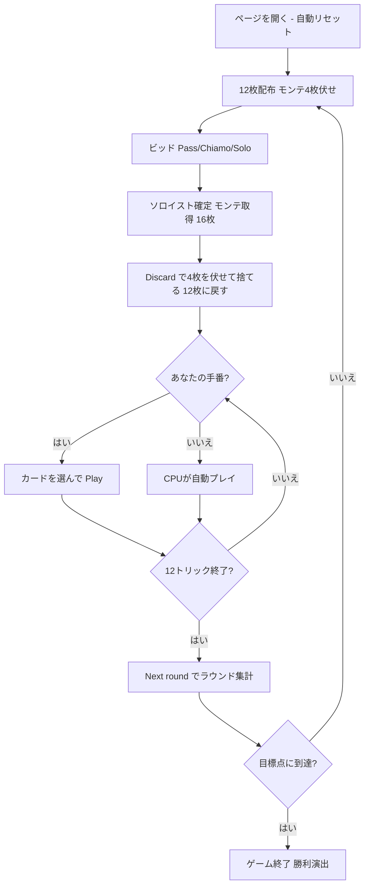

# カラブレセッラ（Web版）遊び方

## ゲーム概要

Calabresella（Terziglio / カラブレセッラ）はイタリア・カラブリア地方で親しまれている**トリックテイキングゲーム**です。Tressette 系の**切り札なし（ノートランプ）**ゲームで、40枚デッキを3人でプレイします。1人の**ソロイスト（soloist）**が残り2人の**連合（coalition）**を相手に戦います。オークションで最も高い宣言をしたプレイヤーがソロイストとなり、全体の**過半数（33サードのうち18以上）**を獲得すれば勝ちです。最初に目標点（既定21点）へ到達したプレイヤーがマッチ勝利です。あなたは席0としてプレイします。

## 起動方法

```sh
go run ./cmd/trumpcards web         # CLI経由でWebサーバーを起動
go run ./cmd/trumpcards web --open  # サーバー起動 + ブラウザを開く
go run ./cmd/server                 # 直接Webサーバーを起動
```

ブラウザで `http://localhost:8080` にアクセスし、ナビゲーションバーから「カラブレセッラ」を選択します。
ナビバーのJA/ENボタンで日本語・英語を切り替えられます。

## ルール

### デッキと配布

- **デッキ**: 40枚のイタリアンカード（A, 2, 3, 4, 5, 6, 7, J, Q, K × 4スート。8/9/10 は除外）
- **プレイヤー**: 3人（あなた = 席0、CPU1〜2）
- **配布**: 各プレイヤー12枚。残り**4枚はモンテ（monte）**として伏せられます。

### ビッド（オークション）

前手から順に、各プレイヤーは**パス**・**キアーモ（ステーク1）**・**ソロ（ステーク2）**のいずれかを宣言します。最も高い宣言をしたプレイヤーが**ソロイスト**になります。全員パスなら前手がキアーモを引き受けます。

Web では **「Pass」** **「Chiamo」** **「Solo」** のボタンで操作します。

### モンテ交換

ソロイストはモンテ4枚を引き取り（手札16枚）、不要な4枚を伏せて捨てて手札12枚に戻します。Web では捨てるカードを選んで **「Discard」** ボタンを押す操作を4回行います。

### フォロー義務・切り札

- このゲームに**切り札はありません（ノートランプ）**。
- リードスートを持っていれば**必ず従わなければなりません（must-follow）**。ボイド時は任意の札を出せます。

### カードの強さ・点数

- **強さ**: 3 > 2 > A > K > Q > J > 7 > 6 > 5 > 4。リードスートで最も強い札がトリックを取ります。
- **カード点（サード = 1/3点）**: A=3、2/3/J/Q/K=各1、4/5/6/7=0。最終トリック（ウルティマ）を取ると +1サード。合計 **33サード = 11点**。

### 得点計算と勝利条件

ソロイストが**過半数（18サード以上）**を取ればラウンド勝利、未満なら連合の勝利です。宣言のステーク（キアーモ=1／ソロ=2）に応じてソロイストと連合の間で点数が移動します。先に目標点（既定 **21**）に達したプレイヤーが勝利。

## ゲームの流れ



## 画面の操作方法

- **ビッド**: 「Pass」「Chiamo」「Solo」ボタンで宣言します。
- **モンテ交換**: 捨てる札を選んで「Discard」を4回押します。
- **プレイ**: プレイ可能な札がハイライトされるので、選んで「Play」します。
- **トリック／ラウンド進行**: 「Next」でトリック結果を確認、「Next round」で次のラウンドへ進みます。
- **その他**: 「Reset」で新規ゲーム、設定でヒントをONにすると推奨アクションが表示されます。

## 画面構成

- **ヘッダー**: ゲーム名・フェーズ表示（Bid / Monte / Play / …）・CLI 切り替え
- **情報サイドバー**: 各プレイヤーの累積得点・ソロイストバッジ・現在の宣言（キアーモ/ソロ）・獲得サード・ラウンド結果
- **中央**: 現在のトリック
- **フッター**: あなたの手札（プレイ可能札がハイライト）・アクションボタン（Pass/Chiamo/Solo/Discard/Play/Next/Next round/Reset）

## 遊び方のコツ

- 強い手（3・2・A が多い、長いスートがある）のときだけ高く宣言し、達成できそうにないときはパスしましょう。
- モンテ交換では点にならない 4・5・6・7 を捨て、高得点札の 3・2・A を手元に残します。
- 切り札がないため、リードスートの高札でトリックを制するのが基本です。
- 最終トリック（ウルティマ）の +1サードは接戦での鍵。終盤の1枚に気を配りましょう。
- 連合側のときは、もう1人の連合と協力してソロイストの過半数達成を阻止しましょう。
- ヒント（設定でON）は、ビッド・モンテ交換・プレイの各フェーズで推奨アクションを提示します。
