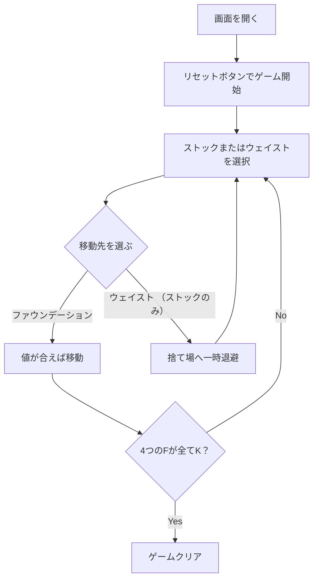

# カルキュレーション（Web版）遊び方

## ゲーム概要

1人用のソリティア系パズルゲームです。場に A, 2, 3, 4 の4枚をファウンデーション（組札）のベースとして置き、それぞれ「1ずつ増える」「2ずつ増える」「3ずつ増える」「4ずつ増える」という等差数列の規則（mod 13）に従って K まで積み上げます。Web版では画面上のカードをクリックすることで移動元・移動先を選び、4つのウェイストを自由に使って48枚のストックをすべて処理できればクリアです。

## 起動方法

```sh
go run ./cmd/trumpcards web  # CLI経由でWebサーバーを起動
go run ./cmd/server          # 直接Webサーバーを起動
```

ブラウザで `http://localhost:8080` にアクセスし、ナビゲーションバーから「カルキュレーション」を選択します。
ナビバーのJA/ENボタンで日本語・英語を切り替えられます。

## ルール

- 標準52枚のデッキを使用。最初にシャッフル後、A・2・3・4 を1枚ずつ取り出してファウンデーション（F0〜F3）のベースにする。残り48枚がストック。
- ファウンデーションの積み上げ規則（mod 13）:
  - F0（+1）: A→2→3→…→Q→K
  - F1（+2）: 2→4→6→8→10→Q→A→3→5→7→9→J→K
  - F2（+3）: 3→6→9→Q→2→5→8→J→A→4→7→10→K
  - F3（+4）: 4→8→Q→3→7→J→2→6→10→A→5→9→K
- ストック最上段（画面左）を選択 → ファウンデーションまたは任意のウェイストパイルをクリックして配置。
- ウェイストの最上段を選択 → 値が合うファウンデーションをクリックして送る（ウェイスト間の移動は不可）。
- 4つのファウンデーションすべてが K に到達すればクリア。
- ストックが空かつどのウェイスト最上段もファウンデーションに送れなくなったら手詰まり（GameOver）。

## ゲームの流れ



## 画面の操作方法

### プレイ中

1. **ストック最上段のカードを選択** – 画面左の「ストック」のカードをクリックすると、黄色いリングでハイライトされる（選択状態）。
2. **移動先を選ぶ**:
   - **ファウンデーション（F0〜F3）**: 値が一致すればカードが積み上げられる。
   - **ウェイスト（W0〜W3）**: 値制限なしで一時退避できる。
3. **ウェイスト最上段をファウンデーションへ**: ウェイストのカードを選択 → 合致するファウンデーションをクリック。
4. **キャンセル**: 選択したカードをもう一度クリック、または画面中央付近の「キャンセル」ボタンを押すと選択解除。

### ボタン

- **ヒント**: 現在ファウンデーションに置ける一番良い手を表示（ストック or ウェイストのいずれか）。
- **元に戻す**: 直前の移動を取り消す（履歴がある間のみ有効）。
- **オートコンプリート**: ストックが空のときに、可能なウェイスト→ファウンデーション移動を連続実行する。
- **ギブアップ**: 途中で中断して GameOver 相当。
- **リセット**: 新しいゲームを開始（確認ダイアログ）。
- **手詰まり脱出**: 手詰まり検出時に、プレイ可能な状態まで Undo をまとめて行う。

## 画面構成

```
┌────────────────────────────────────────────┐
│ NavBar: カルキュレーション (JA/EN 切替)        │
├────────────────────────────────────────────┤
│ PhaseIndicator: Playing / Clear / Over 手数  │
├────────────────────────────────────────────┤
│ [Foundations]                              │
│ [F0 +1][F1 +2][F2 +3][F3 +4]              │
│                                            │
│ [Stock/Waste]                              │
│ [Stock]  [W0][W1][W2][W3]                  │
│                                            │
│ ヒント / メッセージ / アクションログ          │
├────────────────────────────────────────────┤
│ [Reset] [Hint] [Undo] [AutoComplete] [Give]│
└────────────────────────────────────────────┘
```

## 遊び方のコツ

- ウェイストは「すぐ使う予定のカード」「中間待機」「どうしようもないカード」の3役割でゾーニングすると手詰まりを減らせる。
- F0 以外のファウンデーションでは K の1つ前（値によって異なる）に達したら K を最優先で置けるよう、温存カードに注意する。
- Undo は「このまま詰むか試す」用の探索にも使える。行き詰まる前に一手戻して別ルートを検討してみる。
- ヒントボタンは「今すぐファウンデーションに置ける最良の手」を教えてくれるので、判断に迷ったら押す。
