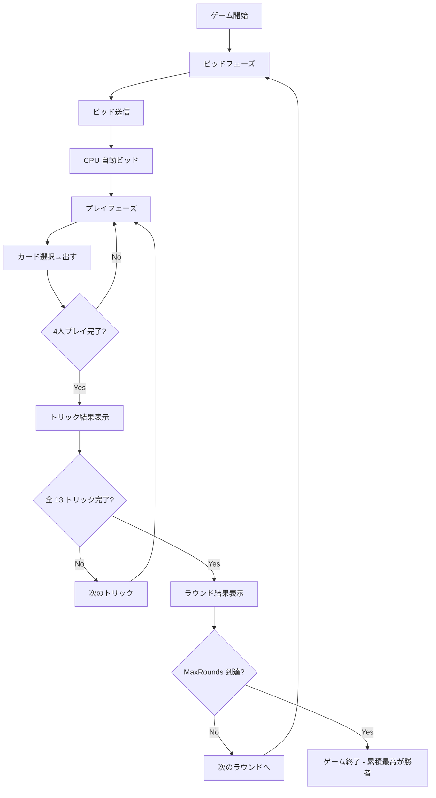

# コールブレイク（Web版）遊び方

## ゲーム概要

Call Break は 4 人プレイのトリックテイキングゲームで、Spades 系統の中でも南アジアで絶大な人気を誇るバリエーションです。スペードが常に切り札で、各プレイヤーが取れると思うトリック数を宣言し、達成度合いを小数点付きスコアで評価します。標準では 5 ラウンド固定で対戦し、累積スコアが最高のプレイヤーが勝者となります。

## 起動方法

```sh
go run ./cmd/trumpcards web  # CLI経由でWebサーバーを起動
go run ./cmd/server          # 直接Webサーバーを起動
```

ブラウザで `http://localhost:8080` にアクセスし、ナビゲーションバーから「コールブレイク」を選択します。
ナビバーのJA/ENボタンで日本語・英語を切り替えられます。

## ルール

### 基本ルール

- 4 人プレイ、52 枚デッキを各 13 枚配る。
- スペードが常に切り札。
- 各ラウンドの最初にビッドフェーズ。各プレイヤーは 1〜13 のビッドを宣言 (Nil ビッドは無し)。
- プレイフェーズではリードスートに従う必要がある。**リードスートを持たない (ボイド) 場合、スペードを持っていれば必ずスペードで切らなければならない**。スペードも持たない場合のみ、任意のカードを捨てられる。
- スペード未ブレイク時はリードでスペードを出せない (手札がスペードのみの場合を除く)。

### 得点 (小数点表示)

スコアは内部で整数 ×10 で管理されており、UI 上は `X.Y` 形式で表示される。

| 達成度 | 内部値の計算 | 表示例 |
|--------|--------------|--------|
| ビッド達成 (ぴったり) | `bid × 10` | bid=4 → `4.0` |
| ビッド達成 (超過) | `bid × 10 + overtricks` | bid=4, 5 取り → `4.1` |
| ビッド未達 | `-bid × 10` | bid=4, 3 取り → `-4.0` |

### ゲーム終了

- 標準では 5 ラウンド (設定可)。最後のラウンド終了時に累積スコアが最も高いプレイヤーが勝者。

## ゲームの流れ



## 画面の操作方法

- **ビッド入力**: 数値入力で 1〜13 を選び、「ビッド」ボタンで確定。
- **カードを出す**: 手札カードをタップ/クリックで選択し、「出す」ボタンで確定。ルール上出せないカード (リードスートを持っているのに違反、ボイドでスペードを切らない、など) は薄く表示され押せない状態となり、ツールチップで理由が示される。
- **次のトリック / 次のラウンド**: トリック/ラウンド終了時に表示されるボタンで次へ進む。
- **設定**: 上部の設定パネルで CPU 難易度と総ラウンド数を変更できる。変更を反映するにはゲームのリセットが必要。
- **CLI モード**: 右上の CLI トグルでターミナル風 UI に切替可能。

## 画面構成

- **ヘッダー**: ゲーム名、現在フェーズ、設定、CLI トグル、リセットボタン。
- **メインエリア (左)**: 現在のトリック表示。CPU が出したカードが順に並ぶ。
- **メインエリア (右)**: CPU の状況 (手札枚数・ビッド・累計/ラウンドスコア)、スコア表、ラウンドスコアアナウンス。
- **フッター**: あなたの手札 (横スクロール対応)、アクション ボタン (ビッド/出す/次へ/リセット)。

## 遊び方のコツ

- **ビッドは控えめに**: 超過は +0.1 点だが、未達ペナルティは -bid 点。確実に取れる枚数を読む。
- **スペード温存**: スペードはトランプ。終盤の勝ち札として温存し、不要なボイドカットには使わない。
- **必ずトランプ**: ボイドかつスペード保有時は必ず切らされるため、スペードの消費タイミングを意識する。
- **Hard 難易度**: Q をランダムでカウントするため、CPU のビッドにブラフが混じる。
