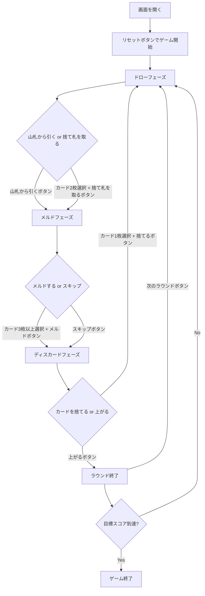

# カナスタ（Web版）遊び方

## ゲーム概要

カナスタは2人対戦のラミー系カードゲームです。2デッキ＋4枚のジョーカー（計108枚）を使用し、同ランクのカードを集めてメルド（3枚以上の組）を作り、7枚以上のメルド「カナスタ」の完成を目指します。先に目標スコア（デフォルト5000点）に到達したプレイヤーが勝利します。

## 起動方法

```sh
go run ./cmd/trumpcards web
# または
go run ./cmd/server
```

ブラウザで `http://localhost:8080` を開き、ナビゲーションから「カナスタ」を選択してください。

## ルール

### 基本ルール

- **デッキ**: 標準52枚×2デッキ＋ジョーカー4枚＝108枚
- **配布**: 各プレイヤーに15枚
- **ワイルドカード**: 2とジョーカーはワイルド
- **赤3**: ハート3・ダイヤ3は自動的に場に出される
- **黒3**: 捨てるだけ（メルド不可、相手のピックアップをブロック）

### メルド

- 同ランク3枚以上で構成
- ナチュラルカード最低2枚必要
- ワイルドカードは最大3枚まで
- カナスタ = 7枚以上のメルド

### 初回メルド最低点

| 累積スコア | 最低点 |
|-----------|--------|
| マイナス | 15点 |
| 0〜1499 | 50点 |
| 1500〜2999 | 90点 |
| 3000以上 | 120点 |

### 得点

| ボーナス | 点数 |
|----------|------|
| ナチュラルカナスタ | 500点 |
| ミックスカナスタ | 300点 |
| 上がりボーナス | 100点 |
| コンシールド上がり | 200点 |
| 赤3（1枚あたり） | 100点 |
| 赤3（4枚全部） | 800点 |

### CPU難易度

- Easy: ランダムプレイ
- Normal: 基本戦略
- Hard: 戦略的プレイ

## ゲームの流れ



## 画面の操作方法

### ドローフェーズ

1. 「山札から引く」ボタンをクリック
2. または、手札からナチュラルカード2枚を選択し「捨て札を取る」ボタンをクリック

### メルドフェーズ

1. 手札からメルドするカード3枚以上を選択し「メルド」ボタンをクリック
2. メルドしない場合は「スキップ」ボタンをクリック

### ディスカードフェーズ

1. 手札からカード1枚を選択し「捨てる」ボタンをクリック
2. カナスタがある場合は「上がる」ボタンで上がれます

### キーボードショートカット

| キー | アクション | 有効条件 |
|------|-----------|----------|
| ← → | カード選択移動 | 人間の手番 |
| Space | カード選択/解除 | 人間の手番 |
| Enter | 確定 | カード選択中 |
| Escape | 選択解除 | カード選択中 |

## 画面構成

```
┌──────────────────────────────────┐
│ ゲームタイトル / フェーズ表示     │
├──────────────────────────────────┤
│ 設定パネル (CPU難易度/目標スコア) │
├────────────────┬─────────────────┤
│ 捨て札エリア   │ スコアテーブル   │
│ メルド表示     │ CPU情報         │
│ 赤3表示       │                 │
├────────────────┴─────────────────┤
│ 手札エリア (カード選択)          │
│ アクションボタン                 │
└──────────────────────────────────┘
```

## 遊び方のコツ

- カナスタの完成を最優先にしましょう
- ナチュラルカナスタは500点のボーナス
- 捨て札の山が大きい時は積極的に取りましょう
- ワイルドカードを捨てると山がフリーズします
- 黒3で相手の山取りをブロックできます

