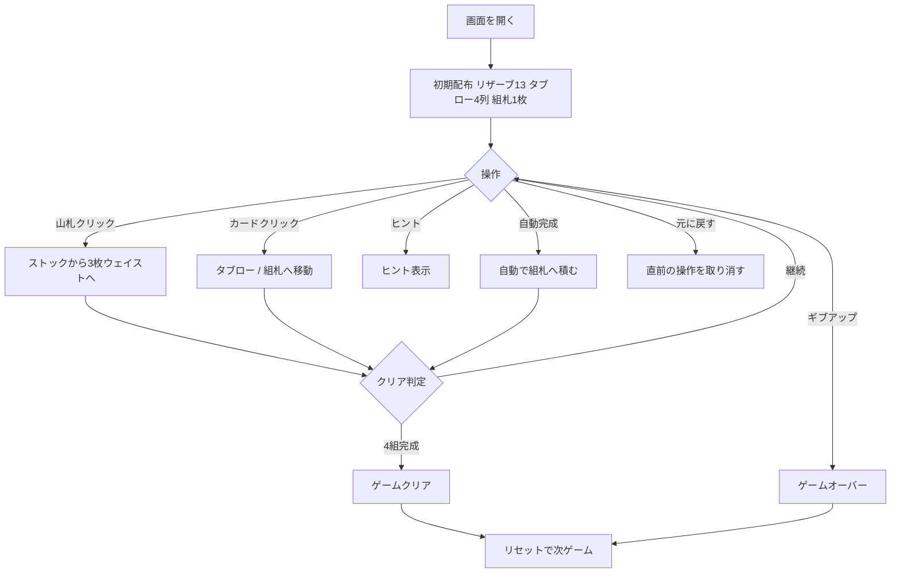

# キャンフィールド（Web版）遊び方

## ゲーム概要

キャンフィールド（Canfield）は1人用ソリティアで、リザーブ、4列のタブロー、組札を使用する難易度の高いソリティアとして知られる。4つの組札をベースランクから始めて13枚ずつ積み上げれば勝利。

## 起動方法

```sh
go run ./cmd/trumpcards web        # CLI経由でWebサーバーを起動
go run ./cmd/server                # 直接Webサーバーを起動
```

ブラウザで `http://localhost:8080` にアクセスし、ナビゲーションバーから「キャンフィールド」を選択します。
ナビバーのJA/ENボタンで日本語・英語を切り替えられます。

## ルール

### レイアウト

- **リザーブ**: 13枚の山。トップの1枚のみ場に出せる
- **タブロー**: 4列、それぞれ最初は1枚ずつ表向きで配布
- **組札**: 4つ。開始時に1枚が置かれ、その値がベースランクとなる
- **ストック / ウェイスト**: 残りのカード。3枚ずつめくる

### 移動ルール

- **タブロー**: 赤黒交互かつ降順で重ねる。K→A→Kのようにラップアラウンド可
- **組札**: 同じスート、ベースランクから昇順で13枚まで積む（ラップアラウンド）
- リザーブがある間、タブローの空列はリザーブから自動補充される

### ゲーム終了

- 4つの組札がすべて13枚積まれれば **ゲームクリア**
- ギブアップでゲームオーバー

## ゲームの流れ



## 画面の操作方法

### プレイフェーズ

1. **山札クリック**: ストックから3枚ウェイストへめくる
2. **ウェイスト / リザーブ / タブローのカードをクリック**: 移動元として選択
3. **移動先をクリック**: タブロー列または組札へ移動
4. **ヒント**: 次の一手を提示
5. **自動完成**: 残りがタブローのみの状態で自動的に組札へ積む
6. **元に戻す**: 直前の操作を取り消す
7. **ギブアップ**: 現在のゲームを終了
8. **リセット**: 新しいゲームを開始

## 画面構成

```
┌────────────────────────────────────────────┐
│  ストック  ウェイスト      組札×4 │
│                                            │
│  リザーブ                                   │
│                                            │
│  タブロー 列0  列1  列2  列3                 │
│                                            │
│  [ヒント] [自動完成] [元に戻す] [ギブアップ]   │
│  [リセット]                                 │
└────────────────────────────────────────────┘
```

- **ストック / ウェイスト**: 左上。山札をクリックしてウェイストにめくる
- **組札**: 右上。4組の組札
- **リザーブ**: 左中央。13枚の山札でトップのみ移動可能
- **タブロー**: 中央。4列でカードを重ねる
- **操作ボタン**: 下部フッター

## 遊び方のコツ

- ベースランクから昇順に積み上げるため、タブローとリザーブを優先的に崩して組札へ送る
- リザーブが尽きるまでは空列が自動補充されるので、積極的にリザーブを減らす
- ウェイストから直接組札へ送れる場合は逃さず送る
