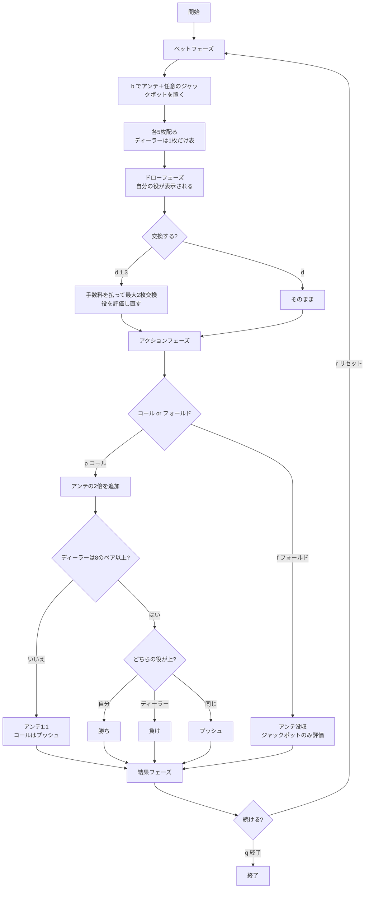

# カリビアンドローポーカー（Web版）遊び方

## ゲーム概要

5枚のカードでディーラーと勝負するカジノポーカーです。カリビアンスタッドに**ドロー（交換）**を足した卓で、勝負を決める前に手札のうち最大2枚を引き直せます。

交換は無料ではなく、アンテと同額の手数料がかかります。**タダなら常に引くのが正解になってしまう**ので、料金があることで「引くか、そのまま行くか」という判断に意味が出ます。

## 起動方法

```sh
go run ./cmd/trumpcards web   # CLI経由でサーバを起動
go run ./cmd/server           # サーバを直接起動
```

ブラウザで `http://localhost:8080/caribbeandraw` を開きます。

## ルール

### 基本ルール

- 52枚のトランプ（ジョーカーなし）を使用
- プレイヤーとディーラーにそれぞれ5枚ずつ配る。ディーラーは1枚だけ表向き
- **配られた後、最大2枚まで交換できる**（手数料はアンテと同額。交換しなければ無料）
- 交換後、コール（アンテの2倍を追加）かフォールド（アンテ没収）かを決める
- **ディーラーは「8のペア以上」でクオリファイ**する

### カリビアンスタッドとの違い

| | カリビアンスタッド | カリビアンドロー |
|---|---|---|
| 交換 | 無し | **最大2枚**（手数料 = アンテ） |
| クオリファイ条件 | ペア以上、または A-K ハイ | **8のペア以上** |
| フェーズ数 | 3（ベット→アクション→結果） | **4**（ベット→**ドロー**→アクション→結果） |

**A-K ハイはここではクオリファイしません。** スタッドの感覚で降りずに待つと、勝負に応じてもらえる回数が変わります。なおクオリファイ判定でエースは14として数えるので、エースのペアはきちんと通ります。

### 勝敗と配当

| 条件 | 結果 |
|------|------|
| ディーラーがクオリファイせず | アンテ1:1、コールはプッシュ（**必ずプラス**） |
| 自分の役 > ディーラーの役 | 勝ち（アンテ1:1、コールは役に応じた配当） |
| 自分の役 < ディーラーの役 | 負け（アンテ・コールとも没収） |
| 同じ役・同じキッカー | プッシュ（両方返却） |

ディーラーが降りた場合、アンテ・コールで3倍賭けて4倍戻るので、手がどれだけ悪くても取り分は増えます。結果表示も「勝ち」になります。

**コール配当（役に応じた倍率）:**

| 役 | 倍率 |
|----|------|
| ロイヤルフラッシュ | 50:1 |
| ストレートフラッシュ | 20:1 |
| フォーカード | 10:1 |
| フルハウス | 5:1 |
| フラッシュ | 4:1 |
| ストレート | 3:1 |
| スリーカード | 2:1 |
| ツーペア以下 | 1:1 |

引ける卓では役が完成しやすいので、スタッドより薄い配当表になっています。

**プログレッシブジャックポット（任意のサイドベット）:**

| 役 | 倍率 |
|----|------|
| ロイヤルフラッシュ | 10000:1 |
| ストレートフラッシュ | 2000:1 |
| フォーカード | 200:1 |
| フルハウス | 50:1 |
| フラッシュ | 25:1 |

**交換後の手で判定します。** 引いて完成させたロイヤルフラッシュも本物として払いますし、フォールドしても評価されます。

## ゲームの流れ



## 画面の操作方法

| 操作 | 説明 |
|------|------|
| アンテ入力 | チップ額を選んでアンテを設定（10以上の10の倍数） |
| ジャックポット入力 | 任意のサイドベット額。0なら賭けない |
| ベットボタン | ベットを確定してカードを配る |
| カードを選ぶ | 交換したい札をクリック（**最大2枚**）。もう一度押すと選択解除 |
| ドローボタン | 選んだ札を交換する。**押す前に手数料が表示される** |
| そのまま勝負 | 交換せずにアクションへ進む（無料） |
| コールボタン | アンテの2倍を追加して勝負する |
| フォールドボタン | 降りる。アンテを失うが、ジャックポットは評価される |
| リセットボタン | ゲームを最初からやり直す |
| ヒントのトグル | ドローとコール／フォールドの両方で助言を表示 |
| CLIモード | 画面上でコマンド入力に切り替える（`b`, `d`, `p`, `f`, `h`, `log`, `r`） |

CLIモードのドローは**1始まり**の札番号で指定します（`d 1 3`）。画面のクリック選択と同じ札を指しています。

## 画面構成

- **上部**: 現在のチップ額とフェーズ。ドローフェーズでは交換の上限枚数と手数料が併記されます
- **中央（プレイヤー）**: 自分の5枚と**現在の役**。配られた時点から表示され、交換するたびに更新されます —— これが「どれを捨てるか」を決める唯一の材料です
- **中央（ディーラー）**: 5枚のカード。**1枚だけ表向き**で、残りは結果フェーズまで裏向き
- **下部**: フェーズに応じたボタン（ベット / ドロー / コール・フォールド / リセット）
- **結果表示**: 勝敗メッセージと、アンテ・コール・ジャックポット・**交換手数料**・合計の内訳。手数料は配当ではないので合計払戻しには含まれません
- **アクションログ**: そのラウンドの操作履歴
