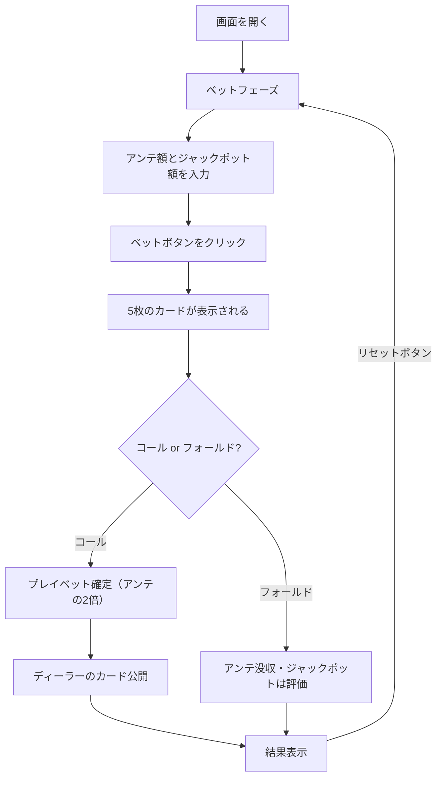

# カリビアンスタッドポーカー（Web版）遊び方

## ゲーム概要

5枚のカードでディーラーと勝負するカジノポーカーです。アンテベットとオプションのプログレッシブジャックポットサイドベットを組み合わせてプレイします。コール時はアンテの2倍を追加で賭けます。

## 起動方法

```sh
go run ./cmd/trumpcards web   # CLI経由でWebサーバーを起動
go run ./cmd/server           # 直接Webサーバーを起動
```

ブラウザで `http://localhost:8080` にアクセスし、ナビゲーションバーから「カリビアンスタッドポーカー」を選択します。

## ルール

### 基本ルール

- 52枚のトランプ（ジョーカーなし）を使用
- プレイヤーとディーラーにそれぞれ5枚ずつ配る
- プレイヤーはアンテベット後、自分の手札を見てコール（プレイ）またはフォールドを選択
- ディーラーは「Aと Kを含む」または「ペア以上」で「クオリファイ（資格あり）」

### 手札ランキング（強い順）

| ランク | 説明 |
|--------|------|
| ロイヤルフラッシュ | 同じスートのA-K-Q-J-10 |
| ストレートフラッシュ | 同じスートの連続5枚 |
| フォーカード | 同じランク4枚 |
| フルハウス | スリーカード+ペア |
| フラッシュ | 同じスートの5枚 |
| ストレート | 連続する5枚 |
| スリーカード | 同じランク3枚 |
| ツーペア | ペア2組 |
| ワンペア | 同じランク2枚 |
| ハイカード | 上記以外 |

### ベットタイプと配当

**アンテ/プレイベット:**

| 条件 | アンテ配当 | プレイ配当 |
|------|-----------|------------|
| ディーラー不資格 | 1:1 | プッシュ（返却） |
| プレイヤー勝ち | 1:1 | 役に応じて支払い |
| ディーラー勝ち | 没収 | 没収 |
| 引き分け | プッシュ | プッシュ |

**プレイ配当倍率（プレイヤー勝ち時、コール額の倍率）:**

| 役 | 配当 |
|----|------|
| ロイヤルフラッシュ | 100:1 |
| ストレートフラッシュ | 50:1 |
| フォーカード | 20:1 |
| フルハウス | 7:1 |
| フラッシュ | 5:1 |
| ストレート | 4:1 |
| スリーカード | 3:1 |
| ツーペア | 2:1 |
| ワンペア以下 | 1:1 |

**プログレッシブジャックポット（サイドベット、勝敗に関係なく支払い）:**

| 役 | 配当 |
|----|------|
| ロイヤルフラッシュ | 20000x |
| ストレートフラッシュ | 5000x |
| フォーカード | 500x |
| フルハウス | 100x |
| フラッシュ | 50x |

## ゲームの流れ



## 画面の操作方法

### ベットフェーズ

1. **アンテ額**: 数値入力欄でアンテベット額を設定（10刻み、最低10）
2. **ジャックポット額（任意）**: ジャックポットサイドベット額を設定（0で無効）
3. **「ベット」ボタン**: クリックでベットを確定し、カードが配られる

### アクションフェーズ

1. プレイヤーの5枚のカードと役名が表示されます
2. **「コール」ボタン**: アンテの2倍のプレイベットを置いてディーラーと勝負
3. **「フォールド」ボタン**: アンテを放棄（ジャックポットは評価される）

### 結果フェーズ

1. プレイヤーとディーラーのカードが表示されます
2. ディーラーの資格有無が表示されます
3. 結果メッセージと各配当（アンテ、プレイ、ジャックポット）が表示されます
4. **「リセット」ボタン**: 新しいラウンドを開始
5. **「棋譜を見る」ボタン**: アクションログを表示

### キーボードショートカット

| キー | アクション | 有効条件 |
|------|-----------|---------|
| `b` | ベット | ベットフェーズのみ |
| `p` | コール | アクションフェーズのみ |
| `f` | フォールド | アクションフェーズのみ |
| `r` | リセット | 結果フェーズのみ |

## 遊び方のコツ

- 基本戦略では、ディーラーが資格を得る確率（約56%）を考慮し、A-K高以上の手札ではコールするのが基本
- ジャックポットはハウスエッジが高めですが、高配当の夢があります
- ペア以上の手札は迷わずコールしましょう
