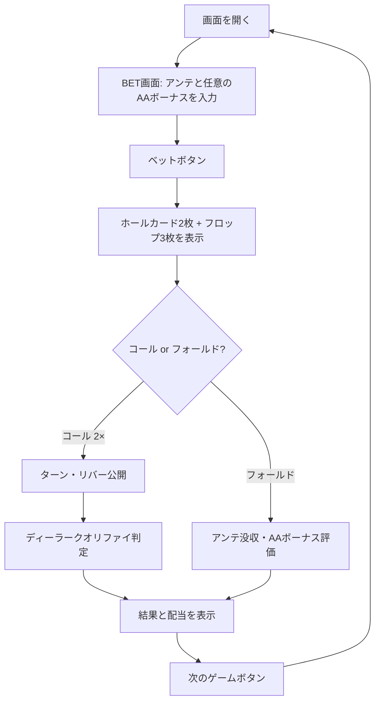

# カジノホールデム（Web版）遊び方

## ゲーム概要

ディーラーと1対1で対戦するカジノ版テキサスホールデムの簡易版です。プレイヤーとディーラーは2枚のホールカードを受け取り、5枚のコミュニティカードを使って最良の5枚役を作ります。アンテベットの後、フロップ（3枚）を見た時点でコール（アンテの2倍）かフォールドの2択。コールするとターン・リバーが一気に公開されてショーダウンとなります。

## 起動方法

```sh
go run ./cmd/trumpcards web  # CLI経由でWebサーバーを起動
go run ./cmd/server          # 直接Webサーバーを起動
```

ブラウザで `http://localhost:8080` にアクセスし、ナビゲーションバーから「カジノホールデム」を選択します。
ナビバーのJA/ENボタンで日本語・英語を切り替えられます。

## ルール

### 基本ルール

- 52枚のトランプ（ジョーカーなし）使用
- アンテベット必須＋任意のAAボーナスサイドベット
- ベット後、ホールカード2枚＋フロップ3枚が同時に公開
- 「コール（アンテの2倍）」または「フォールド」を選択
- コールするとターン・リバーが一括公開されてショーダウン
- ディーラーは「ペア4以上」でクオリファイ。クオリファイしないと、アンテはハンドランクに応じた配当を支払い、コールはプッシュ

### アンテ配当

| ハンド | 配当 |
|--------|------|
| ロイヤルフラッシュ | 100:1 |
| ストレートフラッシュ | 20:1 |
| フォーカード | 10:1 |
| フルハウス | 3:1 |
| フラッシュ | 2:1 |
| その他 | 1:1 |

### コールベット配当

クオリファイ＆勝利時のみ 1:1、クオリファイなしならプッシュ。

### AAボーナス配当

プレイヤー2枚＋フロップ3枚で評価。エースペア以上で配当。

| ハンド | 配当 |
|--------|------|
| ロイヤルフラッシュ | 100:1 |
| ストレートフラッシュ | 50:1 |
| フォーカード | 40:1 |
| フルハウス | 30:1 |
| フラッシュ | 20:1 |
| ストレート | 10:1 |
| スリーカード | 8:1 |
| ツーペア | 7:1 |
| エースペア | 7:1 |

## ゲームの流れ



## 画面の操作方法

### ベットフェーズ

- アンテ額（10〜10000、10刻み）を数値入力
- AAボーナス額（0または10〜10000、10刻み）を数値入力
- 「ベット」ボタンでホールカードとフロップを開く

### フロップフェーズ

- 「コール (2×)」でアンテの2倍を追加ベットし、ターン・リバーを公開
- 「フォールド」でアンテを没収し終了（AAボーナスはこの時点の5枚で評価される）

### 結果フェーズ

- ディーラークオリファイの有無、配当内訳、合計払い戻しを表示
- 「次のゲーム」ボタンでリセット
- 「ログを見る」ボタンで棋譜を確認

### キーボードショートカット

| キー | アクション | 有効条件 |
|------|-----------|---------|
| `b` | ベット | BETフェーズ |
| `c` | コール | FLOPフェーズ |
| `f` | フォールド | FLOPフェーズ |
| `r` | リセット | ENDフェーズ |

## 画面構成

```
┌────────────────────────────────────────────┐
│  NavBar: チップ表示 / CLI トグル           │
├────────────────────────────────────────────┤
│  フェーズインジケーター                    │
├────────────────────────────────────────────┤
│  ヒントトグル + ヒントツールチップ         │
│                                            │
│  🃏 BOARD（コミュニティカード）            │
│  🔴 DEALER（ホール、ショーダウンまで伏せ） │
│  🟡 PLAYER（自分のホールカード）           │
│                                            │
│  配当ブレークダウン（END）                 │
├────────────────────────────────────────────┤
│  Footer:                                   │
│  - BETフェーズ: アンテ／AAボーナス入力     │
│  - FLOPフェーズ: コール／フォールド        │
│  - ENDフェーズ: 次のゲーム／ログを見る     │
└────────────────────────────────────────────┘
```

## 遊び方のコツ

- ペア以上ならコール推奨（ヒント機能ON時にも案内されます）
- ノーペア・ドローなしならフォールドが堅実
- AAボーナスはエンタメ用途。長期的にはマイナス期待値です
