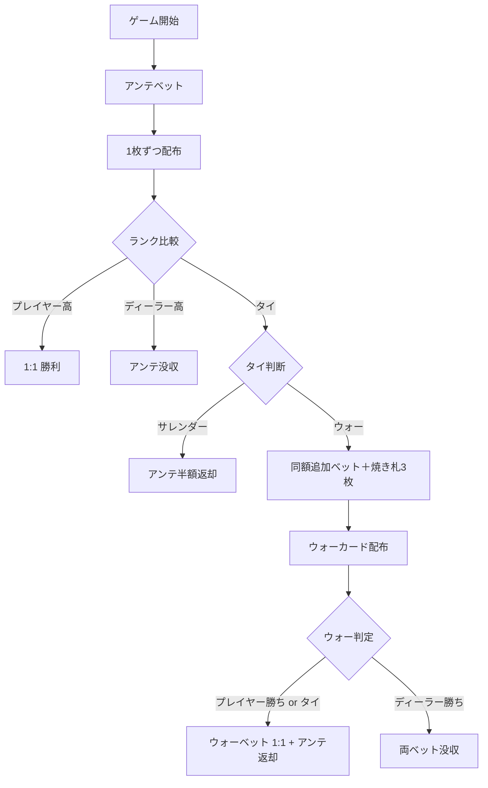

# カジノウォー（Web版）遊び方

## ゲーム概要

カジノウォー（Casino War）は、プレイヤー対ディーラーのシンプルなカジノカードゲームです。1枚ずつ配られたカードのランクが高い方が勝ちで、引き分けの場合は「サレンダー」か「ウォー」を選択します。ルールが簡単なため、カジノゲームの入門に最適です。

## 起動方法

```sh
go run ./cmd/trumpcards web  # CLI経由でWebサーバーを起動
go run ./cmd/server          # 直接Webサーバーを起動
```

ブラウザで `http://localhost:8080` にアクセスし、ナビゲーションバーから「カジノウォー」を選択します。
ナビバーの JA/EN ボタンで日本語・英語を切り替えられます。

## ルール

### 基本ルール

1. アンテをベットします（最低 10、10 単位）。
2. プレイヤーとディーラーに 1 枚ずつ表向きに配られます。
3. ランクが高い方が勝ち（A=14 が最強、2 が最弱）。スートでは順位がつきません。
4. **プレイヤー > ディーラー** の場合、アンテに対して 1:1 を獲得します。
5. **プレイヤー < ディーラー** の場合、アンテを没収されます。
6. **タイ（同ランク）** の場合は次の選択肢から選びます。
   - **サレンダー**: アンテの半額を取り戻し、半額を没収して終了。
   - **ウォー**: アンテと同額を追加ベットし、焼き札 3 枚をはさんでもう 1 枚ずつ配ります。

### ウォー後の判定

| ウォー後 | 配当 |
|----------|------|
| プレイヤー > ディーラー | ウォーベットに 1:1（アンテはプッシュ） |
| プレイヤー = ディーラー | プレイヤー勝利扱い。ウォーベットに 1:1（アンテはプッシュ） |
| プレイヤー < ディーラー | アンテとウォーベットを没収 |

## ゲームの流れ



## 画面の操作方法

- **ベット入力**: チップ額を入力して「ベット」ボタンをクリック。
- **サレンダー**: タイ判断時にアンテの半額を取り戻して終了。
- **ウォー**: タイ判断時に同額を追加ベットし、再勝負。
- **リセット**: 結果フェーズで「リセット」をクリックして新規ゲームへ。
- キーボードショートカット: `b` ベット、`s` サレンダー、`w` ウォー、`r` リセット。

## 画面構成

- **フェーズ表示**: 現在のフェーズとチップ残高
- **初手カード**: プレイヤーとディーラーのカード（左右並び）
- **焼き札**: ウォー宣言時に伏せて表示される 3 枚
- **ウォーカード**: ウォー後にプレイヤーとディーラーに配られた追加カード
- **配当表示**: 結果フェーズで合計配当を表示
- **ヒント**: タイ判断時にウォー推奨を表示（オプション）

## 遊び方のコツ

- 数学的にはサレンダー（ハウスエッジ約 3.7%）よりウォー（同 約 2.88%）が有利です。常にウォーを選ぶのが基本戦略です。
- アンテは 10 の倍数のみ受け付けます（半額返却での端数を防ぐため）。
- ヒントを有効にするとタイ時の最適な選択肢が表示されます。
