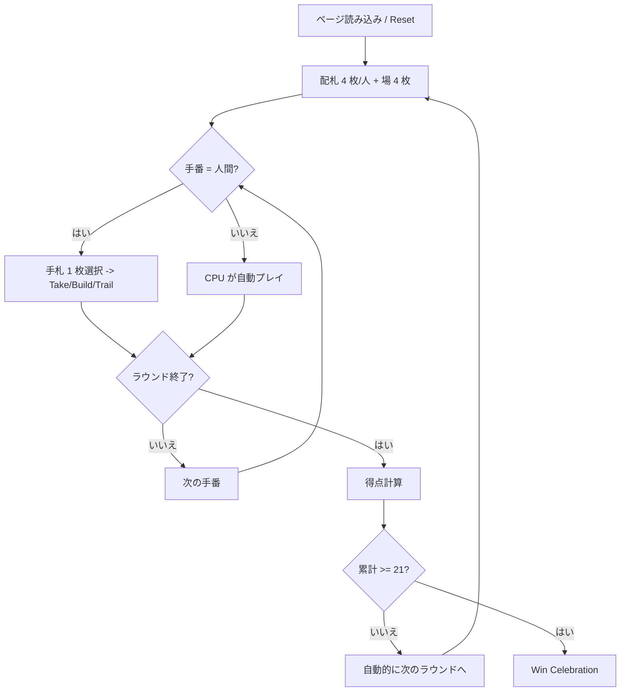

# カッシーノ（Web版）遊び方

## ゲーム概要

カッシーノ (Cassino) は 4 人用の「フィッシング系」カードゲーム。Web 版は React クライアントから REST API (POST `/cassino/exec`) 経由で Go サーバーにコマンドを送り、ブラウザ上でビジュアル表示します。累計 21 点を先取したプレイヤーが勝ちです。

## 起動方法

```sh
go run ./cmd/trumpcards web  # CLI経由でWebサーバーを起動
go run ./cmd/server          # 直接Webサーバーを起動
```

ブラウザで `http://localhost:8080` にアクセスし、ナビゲーションバーから「カッシーノ」を選択します。
ナビバーのJA/ENボタンで日本語・英語を切り替えられます。

## ルール

CUI 版と同じです。詳細は [`cassino.md`](../cui/cassino.md) を参照してください。特記事項:

- ラウンド終了・ゲーム終了は Web UI 上でメッセージボックスに表示されます。
- チュートリアル (初回訪問) は `TutorialButton` で再実行できます。
- ヒント機能はトグルでオン／オフ可能です (獲得点の高い take を推奨)。

## ゲームの流れ



## 画面の操作方法

1. 手札から 1 枚を選ぶ (クリック)。
2. 場札から捕獲したい札を複数クリック (数札のみ、合計値 = 手札値)。必要なら場のビルドもクリック選択。
3. 画面下のアクションボタンで Take / Build / Trail を選択。Build の時は左隣の `宣言値` プルダウンで値を指定。
4. [Reset] でゲームを最初からやり直します。

## 画面構成

- **上部**: CPU プレイヤーの手札枚数と累計得点。
- **中央**: 場札エリア (選択可) とビルドエリア。
- **下部**: あなたの手札 (1 枚選択)。
- **最下部**: アクションバー (Take / Build / Trail / Reset / ログ / チュートリアル / CLI トグル)。

## 遊び方のコツ

- **得点札 (10♦ / 2♠ / A / ♠) 優先**: 相手に渡さないよう先に取る。
- **スイープボーナス**: 場を空にすれば +1 点。
- **ビルドはリスクあり**: 同値の手札を保持しないとビルドは作れない。奪われたら相手のご褒美になる。
- **弱いカードから trail**: 強い札を場に置かない。相手に easy take を与えない。
