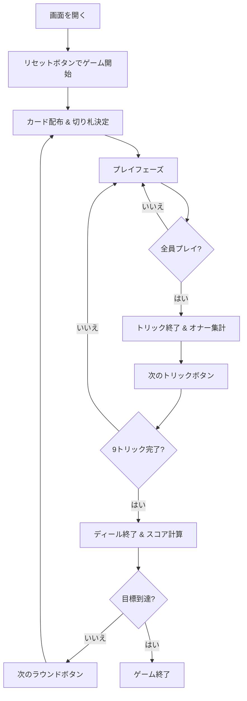

# キャッチ・ザ・テン（Web版）遊び方

## ゲーム概要

スコットランド発祥の36枚デッキを使う4人プレイ（あなた + CPU3人）の2vs2パートナー戦トリックテイキングゲームです。スコッチ・ホイスト（Scotch Whist）とも呼ばれます。ビッドフェーズはなく、毎ディール決まる切り札（トランプ）と、トリックで捕獲した切り札のオナー（名誉札）の合計で得点します。先に目標ポイントに到達したチームが勝利します。

## 起動方法

```sh
go run ./cmd/trumpcards web   # CLI経由でWebサーバーを起動
go run ./cmd/server           # 直接Webサーバーを起動
```

ブラウザで `http://localhost:8080` にアクセスし、ナビゲーションバーから「キャッチ・ザ・テン」を選択します。
ナビバーのJA/ENボタンで日本語・英語を切り替えられます。

## ルール

### 基本ルール

- 36枚のカード（各スート 6・7・8・9・10・J・Q・K・A）を4人に9枚ずつ配ります
- ディーラーの最後のカードのスートがそのディールの切り札（トランプ）になります
- フォロースート必須（リードされたスートのカードを持っていればそれを出す）
- 切り札は常にリードスートに勝ちます

### カードの強さ

- **切り札スート**: J が最強で、続いて A・K・Q・10・9・8・7・6 の順（Jだけが特別に最上位）
- **その他のスート**: A が最強で、K・Q・10・9・8・7・6 と下がります

### チーム

- 席0と席2がチーム0（あなたはチーム0）
- 席1と席3がチーム1

### 得点

トリックを取ったプレイヤーは、そのトリックに含まれる**切り札のオナー**を獲得します（切り札以外のカードは0点）。

| 切り札のカード | 点 |
|----------------|----|
| J（ジャック） | 11 |
| 10（テン） | 10 |
| A（エース） | 4 |
| K（キング） | 3 |
| Q（クイーン） | 2 |

- 各ディールで配分されるオナーは合計30点です
- 複数ディールを行い、先に目標ポイント（デフォルト41）に到達したチームが勝利
- 両チームが同じディールで目標に到達した場合は合計が高い方が勝ち。完全に同点の場合は引き分け

### CPU難易度

| レベル | 説明 |
|--------|------|
| Easy | ランダムにカードを選択 |
| Normal | 基本的な戦略に基づくプレイ |
| Hard | パートナーシップを考慮した高度な戦略 |

## ゲームの流れ



## 画面の操作方法

### プレイフェーズ

1. 手札からカードをクリックして選択
2. 「出す」ボタンをクリック
3. CPUが自動的にカードを出します

### トリック終了

- 「次のトリック」ボタンで次のトリックへ進みます

### ラウンド終了

- 「次のラウンド」ボタンでスコア計算後、次のディールへ進みます

## 画面構成

```
┌────────────────────────────────────────────┐
│  ナビゲーションバー                          │
├────────────────────────────────────────────┤
│  切り札表示 / チームスコア / ラウンド情報      │
├──────────────────┬─────────────────────────┤
│  CPUプレイヤー    │  現在のトリック           │
│  (3人分)         │                         │
├──────────────────┴─────────────────────────┤
│  あなたの手札                               │
│  [操作ボタン]                               │
└────────────────────────────────────────────┘
```

## 遊び方のコツ

- 切り札の J と 10 は最大の得点源です。確実に取れる場面で出すか、相手に取られないよう温存しましょう
- パートナーが勝っているトリックには、切り札のオナーを重ねて得点を上乗せできます
- 切り札では J が最強なので、A や K でリードしても J でさらわれる点に注意しましょう
- リードポジションでは高いカードで確実にトリックを取り、オナーを回収しましょう
