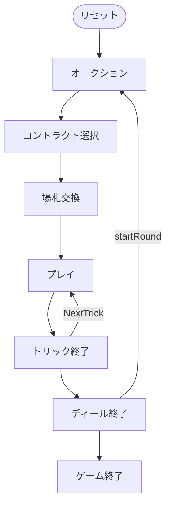

# チェゴ（Web版）遊び方

## ゲーム概要

Cego（チェゴ）はドイツ・バーデン地方の4人用**タロックゲーム（トリックテイキング）**です。54枚のタロックデッキ（4スート × 8枚、切り札21枚、スキュース）を使い、あなたは**席0**としてプレイします。オークションで決まった**デクレアラー（declarer）**が、**チェゴ（Cego）**か**ハントシュピール（Handspiel）**のコントラクトを選び、1人で残り3人と**1対3**で戦います。パートナーシップ（王呼び）はありません。

## 起動方法

```sh
go run ./cmd/trumpcards web         # CLI経由でWebサーバーを起動
go run ./cmd/trumpcards web --open  # サーバー起動 + ブラウザを開く
go run ./cmd/server                 # 直接Webサーバーを起動
```

ブラウザで `http://localhost:8080` にアクセスし、ナビゲーションバーから「チェゴ」を選択します。
ナビバーのJA/ENボタンで日本語・英語を切り替えられます。

## ルール

### デッキと配布

- **デッキ**: 54枚。
  - **スート札**: ♠♥♦♣ の4スート × 各8枚（1〜4、J=ジャック／C=カヴァリエ／Q=クイーン／K=キング）。
  - **切り札（タロック）**: 番号1〜21の21枚（紫の ✦ 表示）。数字が大きいほど強い。
  - **スキュース（Sküs）**: ★ 表示の特殊札1枚（金色）。**最強の切り札**として振る舞います。
- **プレイヤー**: 4人（あなた = 席0、CPU1〜3）。各11枚。
- **場札（チェゴ / blind）**: 場に伏せた10枚の札。中身は公開されません（枚数のみ表示）。

### トゥルル（Trull）

**切り札の1（パガット）**・**切り札の21（XXI）**・**スキュース**の3枚を**トゥルル**と呼び、特に価値の高い名誉札です（各5点）。

### オークション（入札）

各プレイヤーは順番に、パスするか**プレイを宣言**します。最初にプレイを宣言した人が**デクレアラー**です。全員がパスした場合はディーラーの左隣が強制デクレアラーになります。

### コントラクト選択

デクレアラーは次の2つから選びます。

- **チェゴ（Cego）**: 手札11枚から**1枚だけ残し**、残り10枚を伏せて自分の得点山に置き、**10枚の場札をすべて手に取って**新しい手札を作ります。伏せた札の得点は自分側に計上される**勝負手**です。
- **ハントシュピール（Handspiel）**: 配られた11枚を**そのまま**使います。場札10枚は対戦側の得点山に渡ります。

### 場札交換（チェゴを選んだ場合のみ）

チェゴを選ぶと、手札から**手元に残す1枚**を選びます。残り10枚は伏せられ、10枚の場札を手に取って新しい11枚の手札になります。

### プレイ

リードされたスートに**マストフォロー**。フォローできない場合は**切り札を出さなければなりません**。切り札も持っていない場合は任意の札を出せます。

- トリックは、切り札が出ていれば最も高い切り札、なければリードスートの最も高い札を出したプレイヤーが取ります。
- **スキュース**は最強の切り札として扱われます。

### 得点

デクレアラー単独の獲得カードポイントが**過半（54点以上）**なら**契約成功**、届かなければ**失敗**です。ゼロサム（1対3）で精算され、規定ディール数を戦って累計得点が最も高いプレイヤーが勝者です（同点は引き分け）。

## ゲームの流れ

ゲームの進行は `internal/domain/Cego.go` のフェーズ機械そのものです。各ノードは同ファイルの `CegoPhase` 定数、矢印ラベルはその遷移を行うメソッド名です。



## 画面の操作方法

- **入札**: 「プレイ宣言」または「パス」ボタン。
- **コントラクト選択**: 「チェゴ」または「ハントシュピール」ボタン。
- **場札交換**: 手元に残す1枚を選び「残す」ボタン。
- **プレイ**: 出せるカードをクリックして「出す」ボタン。
- **次のトリック／次のディール**: フェーズ終了後にボタンで進みます。
- **ヒント**: 設定でヒントを有効にすると、推奨アクションが表示されます。
- **CLIモード**: 画面右上のトグルでコマンド入力モードに切り替えられます。

## 画面構成

上から順に、ページのコンポーネント構成そのままの並びです。

```
┌──────────────────────────────────────────────────┐
│  チェゴ                                         │
│  ディール: 1  トリック: 0  コントラクト: -
├──────────────────────────────────────────────────┤
│  設定パネル（CPU難易度・目標点など）             │
├──────────────────────────────────────────────────┤
│  場（現在のトリック）                            │
│    CPU1 [♠A]   CPU2 [♠9]   CPU3 [♠8]             │
│  直前のトリック（勝者つき）                      │
├──────────────────────────────────────────────────┤
│  メッセージ / ヒント                             │
├──────────────────────────────────────────────────┤
│  棋譜（アクションログ）                          │
├──────────────────────────────────────────────────┤
│  あなたの手札                                    │
│  [♠K][♠Q][♣Q][♣10][♥J][♥10][♥9][♥7][♦J]        │
│  [入札] [パス] [Cego] [Handspiel] [カードを出す] [次へ]
│  [リセット]                                      │
└──────────────────────────────────────────────────┘
```

- **ヘッダー**: ディール数・トリック数と確定したコントラクト（未確定なら `-`）
- **設定パネル**: CPU 難易度
- **場**: 現在のトリックと直前のトリック
- **入札 / コントラクト選択**: `Cego`（場札10枚と入れ替える）か `Handspiel`（配られた手札のまま戦う）を選びます
- **手札**: `T1`〜`T21` がタロック（切り札）、`Sküs` が最強札- **メッセージ / ヒント**: 直前の操作の結果と、ヒントボタンを押したときの推奨手
- **棋譜（アクションログ）**: これまでの手の履歴。折りたたみ式
- **あなたの手札**: 出せるカードだけが押せます。出せない札は淡く表示されます
- **リセット**: 新しいゲームを開始します
- **CLIモード切替**: 画面右上のトグルで、CUI 版と同じテキスト表示に切り替えられます（`CliToggle` / `CliTerminal`）
