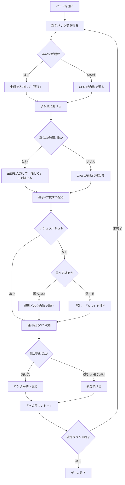

# シュマン・ド・フェール（Web版）遊び方

## ゲーム概要

シュマン・ド・フェール（Chemin de Fer）はバカラの原型にあたるフランスのバンキングゲームです。6デッキ312枚のシューを使い、6席（席0があなた、他はCPU）で遊びます。

**ハウスではなく席の1つが親（バンカー）になります。** 親は自分の資金でバンク額を張り、他の席（子＝ポンテ）がそれを分け合って賭けます。親は勝っている限り親を続けられ、負けるとバンクが隣の席へ渡ります。

現在広まっているバカラ（プント・バンコ）との決定的な違いは**3枚目の引き方**です。プント・バンコでは親も子も引き方が表で固定されていますが、シュマン・ド・フェールで固定されているのは**子の0〜4（必ず引く）と6〜7（必ず立つ）だけ**。合計5の子と、**どの合計であっても親**は自分で決めます。

## 起動方法

```sh
go run ./cmd/trumpcards web  # CLI経由でWebサーバーを起動
go run ./cmd/server          # 直接Webサーバーを起動
```

サーバ起動後、ブラウザで `http://localhost:8080/chemindefer` を開きます。`--open` を付けるとブラウザが自動で開きます。

```sh
go run ./cmd/trumpcards web --open
```

## ルール

- 合計値は**各札の点の合計の下1桁**（mod 10）で、9に近いほうが勝ちです。
  - A = 1点、2〜9 = 額面どおり、10・J・Q・K = 0点
- 親が張ったバンク額を、子が親の右隣から順に分け合って賭けます。賭けの総額はバンク額を超えません。
- 賭けの**最高額を出した子が代表**となり、子側の判断を行います（同額なら親に近い席）。
- 親と子側に2枚ずつ配ります。どちらかが**8か9（ナチュラル）なら即決着**で、3枚目はありません。
- ナチュラルが出なければ3枚目の判断に入ります。
  - **子側**: 0〜4は必ず引く / 5は自由 / 6〜7は必ず立つ
  - **親**: どの合計でも自由（引いても立ってもよい）
- 合計を比べ、大きいほうの勝ちです。同点は引き分け（égalité）で、チップは動きません。
- 親が勝てば親を続けます。**子側が勝てばバンクは隣の席へ**渡ります。引き分けなら親のままです。
- 卓のチップ総額は最初から最後まで変わりません（ゼロサム）。

## ゲームの流れ



## 画面の操作方法

| 操作 | 説明 |
|------|------|
| 金額入力 ＋「張る」 | あなたが親のとき、バンク額を決めます。入力できる範囲は画面に表示されます |
| 金額入力 ＋「賭ける」 | あなたの賭け番のとき、賭ける額を決めます。上限は未消化のバンク額と手持ちの少ないほうです |
| 「降りる」 | 賭けずに見送ります（賭け額0と同じ） |
| 「引く」 | 3枚目を引きます。**選べる場面でのみ押せます** |
| 「立つ」 | 3枚目を引きません。**選べる場面でのみ押せます** |
| 「バンクを渡す」 | 親を自分から降りて、バンクを隣の席へ渡します |
| 「次のラウンドへ」 | 決着後、次のラウンドを始めます |
| ヒントボタン | いまの合計に対する定石を表示します |
| 棋譜ボタン | これまでの行動ログを表示します |
| リセットボタン | ゲームを最初からやり直します |

子側に選択の余地がない合計（0〜4、6〜7）のときは、ボタンは出ずに規則どおり自動で進みます。**押しても意味のない選択を求めない**設計です。

## 画面構成

- **フェーズ表示**: `STAKE`（張り）/ `BET`（賭け）/ `PUNTER DRAW`（子の判断）/ `BANKER DRAW`（親の判断）/ `ROUND END`（決着）
- **席一覧**: 6席それぞれの名前・持ちチップ・賭け中の額。親には親マーク、子側の代表には代表マークが付きます
- **バンク情報**: 親の席、バンク額、子が賭けた総額、まだ覆われていない額
- **場**: 子側と親の手札、およびそれぞれの合計値（mod 10）
- **メッセージ欄**: エラーや決着（親の勝ち／子側の勝ち／引き分け）を表示します
- **設定パネル**: ラウンド数と初期チップを変更してやり直せます

## 遊び方のコツ

- **親のときが考えどころです。** 子側と違って親はどの合計でも自由に選べます。子が3枚目を引いたかどうか、引いたならその札が何だったかが最大の手掛かりです。
- 子側の代表になれるのは最高額を賭けた席だけです。判断に参加したいなら厚く賭ける必要があります。
- 親は勝ち続ける限り続けられますが、バンク額は自分の持ちチップから出します。張りすぎると1回の負けで大きく減ります。
- ヒントはいまの合計に対する定石を教えます。ただし**親が定石に従う義務はありません**——そこがこのゲームの面白さです。
