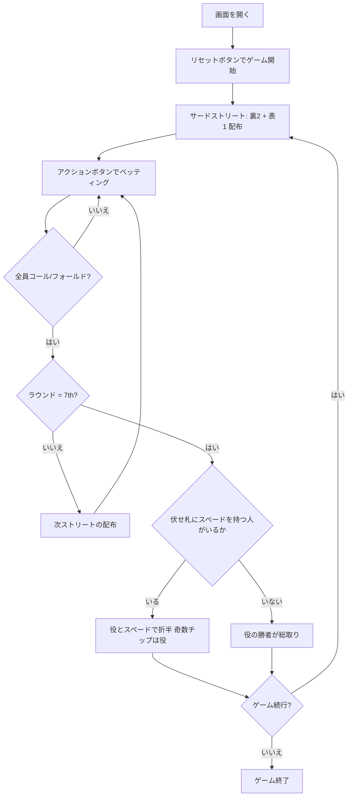

# シカゴ（Web版）遊び方

## ゲーム概要

シカゴ（Chicago）はセブンカード・スタッドのポット分割版です。**ポットの半分は通常どおり最強の役へ、残り半分は「伏せ札の中で最も高いスペード」を持つ人**へ渡ります。分割の基準がハイローとは根本的に違い、半分は**たった1枚のカード**、しかも他の誰にも見えていない札で決まります。

## 起動方法

```sh
go run ./cmd/trumpcards web  # CLI経由でWebサーバーを起動
go run ./cmd/server          # 直接Webサーバーを起動
```

ブラウザで `http://localhost:8080` にアクセスし、ナビゲーションバーから「シカゴ」を選択します。
ナビバーのJA/ENボタンで日本語・英語を切り替えられます。

## ルール

### 基本ルール

- 52枚のトランプを使用
- コミュニティカードなし — 各プレイヤーに個別にカードが配られる
- 合計7枚（裏向き3枚 + 表向き4枚）から**最強5枚**を選ぶ（通常のポーカー役）
- **ポットの半分は伏せ札（裏向きの3枚）の中で最も高いスペード**を持つ人へ
- **A♠ が最高**、以下 K♠ > Q♠ > J♠ > 10♠ > … > 2♠ の順
- **表向きのスペードは数えません**（全員に見えている札で半分を主張できてしまうため）
- 伏せ札にスペードが1枚も無い人はスペード側の分配に参加できない
- **誰も伏せ札にスペードを持っていなければ、役の勝者がポットを総取り**
- ポットを折半するとき、**奇数チップは役の側**に付く（ポーカー慣例）
- ブリングインは最も高いドアカードのプレイヤーが支払う

### ゲームの進行

1. **アンティ**: 全プレイヤーがアンティを支払う
2. **サードストリート**: 裏向き2枚 + 表向き1枚配布。ブリングインを投入
3. **フォースストリート**: 表向き1枚追加
4. **フィフスストリート**: 表向き1枚追加
5. **シックスストリート**: 表向き1枚追加
6. **セブンスストリート**: 裏向き1枚追加。最後のベッティングラウンド
7. **ショーダウン**: 役の最強者と伏せ札の最高スペードを持つ人でポットを折半

## ゲームの流れ



## 画面の操作方法

### アクションの実行

自分の手番が来ると、画面下部にアクションボタンが表示されます。

**ベットが出ていない場合:**
- **「ベット」**: ベット額を入力してベットする
- **「チェック」**: パスする

**ベットが出ている場合:**
- **「コール」**: 現在のベット額に合わせる
- **「レイズ」**: ベット額を入力してレイズする

**常に選択可能:**
- **「フォールド」**: 降りる
- **「オールイン」**: 全チップを賭ける

### ショーダウンの読み方

ポットが割れると、**分割の内訳バッジ**が表示されます。

- **「役」バッジ**: 役でポットの半分を取った人と獲得額
- **「スペード」バッジ**: 伏せ札の最高スペードで半分を取った人と獲得額、**そのスペードのカード**
- **両取り（スクープ）バッジ**: 同じ人が両方を取った場合
- 誰も伏せ札にスペードを持っていなければ、「役の勝者がポットを総取りします」と表示されます

### キーボードショートカット

| キー | アクション | 有効条件 |
|------|-----------|---------|
| `c` | コール | アクションフェーズ（ベットがある場合） |
| `r` | レイズ / ベット | アクションフェーズ |
| `k` | チェック | アクションフェーズ（ベットがない場合） |
| `f` | フォールド | アクションフェーズ |
| `a` | オールイン | アクションフェーズ |

## 画面構成

```
┌──────────────────────────────────────────────┐
│  フェーズ表示 / チュートリアル・マニュアル   │
├──────────────────────────────────────────────┤
│  CPUエリア（表向きドアカード + チップ）      │
│                                              │
│  ポット表示                                   │
│  ショーダウン時: [役 +150][スペード +150 (♠A)]│
│                                              │
│  あなたの手札（裏向き + 表向き）             │
├──────────────────────────────────────────────┤
│  [フォールド][チェック/コール][ベット/レイズ]│
│  [オールイン]          [リセット]            │
└──────────────────────────────────────────────┘
```

- 自分の裏向きホールカードは自分にのみ見えます。**スペード側の半分はここだけで決まります。**
- CPUのドアカードは全員に公開されます。表向きのスペードは半分の根拠になりません。

## 遊び方のコツ

- **A♠ を1枚伏せているだけで半分の権利があります。** 役が弱くても降りる理由にはなりません
- 逆に、伏せ札にスペードが無いなら**役で勝つしかありません**
- 相手のドアカードにスペードが多く出ているほど、伏せ札に残っているスペードは少なくなります。**低いスペードでも半分を取れる可能性が上がります**
- スペードを引いたのが7枚目（裏向き）なら、その時点まで誰も気づきません
- 役とスペードの両取り（スクープ）が最大の利益です
