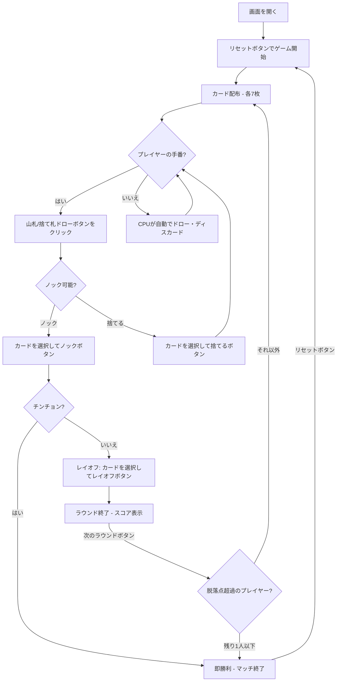

# チンチョン（Web版）遊び方

## ゲーム概要

スペイン生まれのジンラミー系カードゲームです。2〜4人（プレイヤー1人 + CPU 1〜3人）で遊びます。8・9・10を抜いた40枚のラテンデッキを使い、各自7枚の手札でメルド（セットやラン）を作り、デッドウッド（メルドに含まれないカード）の合計点を減らします。ノックしてラウンドを終え、デッドウッドが最も少ない者がそのラウンドの勝者です。累積点が脱落点に達したプレイヤーは退場となり、最後まで残ったプレイヤーが勝者です。

## 起動方法

```sh
go run ./cmd/trumpcards web  # CLI経由でWebサーバーを起動
go run ./cmd/server          # 直接Webサーバーを起動
```

ブラウザで `http://localhost:8080` にアクセスし、ナビゲーションバーから「チンチョン」を選択します。
ナビバーのJA/ENボタンで日本語・英語を切り替えられます。

## ルール

### 基本ルール

- 8・9・10を抜いた40枚のラテンデッキを使用、2〜4人プレイ
- 各プレイヤーに7枚ずつ配り、1枚を表向きにして捨て札の山を開始、残りは山札（ストック）
- 手番ではまず山札または捨て札の山からカードを1枚ドローする
- その後、手札からカードを1枚捨てるか、その1枚を捨ててノックする

### メルドとデッドウッド

- **メルド**: セット（同ランク3枚以上）またはラン（同スート3枚以上の連番）
- **連番のルール**: 8・9・10がないため、A,2,3,4,5,6,7,J,Q,K を連続したランクとして扱う（**7とJは隣接**）
- **デッドウッド**: メルドに含まれない手札の合計点（J/Q/K=10点、A=1点、その他=額面）

### ノック

- **ノック**: 捨てる1枚を選び、その後のデッドウッド合計がノック上限（デフォルト5点）以下のときにノックできる
- ノック後、ほかのプレイヤーはノッカーのメルドにカードをレイオフ（付け足し）できる
- ラウンド終了時、デッドウッドが最少のプレイヤーがそのラウンドの勝者

### チンチョン（即勝利）

- **チンチョン**: 同じスートの7枚すべてが連番（例: ♠A-2-3-4-5-6-7、または7とJを跨ぐ並び）になると、その場で即勝利

### 脱落とゲーム終了

- 各ラウンドの終了時、デッドウッド点が累積得点に加算される
- 累積得点が脱落点（デフォルト100点）を超えたプレイヤーは退場
- 最後まで残ったプレイヤーがマッチの勝者

### CPU難易度

- **Easy**: ランダムにカードを出す
- **Normal**: 基本的なメルド戦略（デフォルト）
- **Hard**: 戦略的なプレイ（相手の捨て札を分析等）

## ゲームの流れ



## 画面の操作方法

### ドローフェーズ

1. **「山札からドロー」** ボタンでストックから1枚引く
2. **「捨て札からドロー」** ボタンで捨て札の山のトップカードを引く

### ディスカード/ノックフェーズ

1. 手札のカードをクリックして選択（1枚）
2. **「捨てる」** ボタンで選択したカードを捨てる
3. **「ノック」** ボタンで選択カードを捨ててノック（デッドウッド≤上限の場合のみ有効）
   - デッドウッドインジケーターが上限以下になるとノックボタンが強調表示されます

### レイオフフェーズ

1. ほかのプレイヤーがノックした場合、ノッカーのメルドにカードを付け足せる
2. 手札のカードをクリックして選択し、**「レイオフ」** ボタンで付け足す（不要なら「スキップ」）

### ラウンド終了

1. **「次のラウンド」** ボタンで次のラウンドに進む

## 画面構成

```
┌────────────────────────────────────────────┐
│  ▶ 設定 (クリックで展開)                   │
│    CPU難易度:    [Normal▼]                 │
│    プレイヤー人数: [2▼]                    │
│    脱落点数:     [100▼]                    │
├────────────────────────────────────────────┤
│              CPU エリア                     │
│  CPU 1: 7枚 | 累計: 10 | ラウンド: 3       │
├────────────────────────────────────────────┤
│              ゲーム情報                     │
│  ラウンド 2 | 山札: 24枚                   │
│  捨て札トップ: ♥7                          │
├────────────────────────────────────────────┤
│         フッター: あなた                     │
│  デッドウッド: 4点（ノック上限 5）          │
│  [♠A][♠5][♠6][♠7][♥J]...                  │
│  [リセット] [山札ドロー] [捨て札ドロー]      │
│  [捨てる] [ノック]                          │
└────────────────────────────────────────────┘
```

- **設定パネル（▶ 設定）**:
  - 「CPU難易度」セレクト: Easy / Normal / Hard から選択
  - 「プレイヤー人数」: 2〜4人から選択
  - 「脱落点数」: 退場となる累積得点の上限を設定
  - 次のリセット時に設定が適用される
- **CPUエリア**: 各CPUの手札枚数とスコア（脱落者は取り消し線）
- **ゲーム情報**: 現在のラウンド、山札残り枚数、捨て札トップ
- **フッター（あなたの手札）**:
  - クリックで選択（緑枠 + 上に浮き上がる）
  - デッドウッド合計点とノック上限を表示
- **スコアテーブル**: 各プレイヤーのラウンドスコアと累積スコア（脱落者は取り消し線）

## 遊び方のコツ

- 序盤は捨て札からドローして、メルドを素早く作りましょう
- 8・9・10がないため、7とJが隣接する連番に注意しましょう
- デッドウッドの高いカード（J/Q/K=10点）は早めに処理するのが有効です
- ノック上限が低いので、メルドを2組以上そろえてからノックを狙いましょう
- 相手のノックに備えて、レイオフできるカード（相手のメルドに付け足せるカード）を意識しておきましょう
- 同スート7枚連番のチンチョンが狙えるなら、一気の即勝利を目指しましょう
