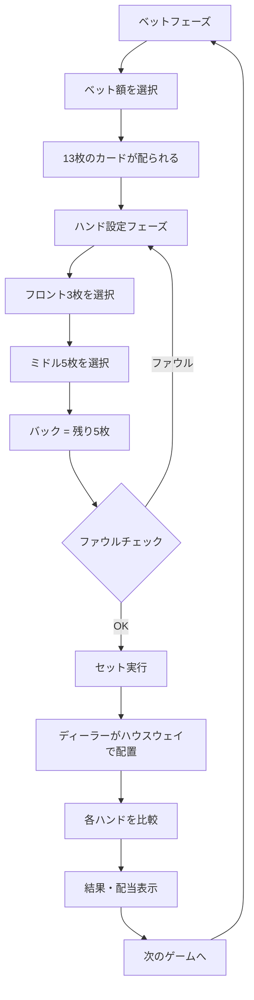

# チャイニーズポーカー（Web版）遊び方

## ゲーム概要

13枚のカードをフロント（3枚）、ミドル（5枚）、バック（5枚）の3つのハンドに分割し、ディーラーと各ハンドを比較するカジノポーカーゲームです。バック ≧ ミドル ≧ フロント の順に強いハンドを配置する制約があります。

## 起動方法

Web GUI サーバーを起動してブラウザでアクセスします。

```
go run ./cmd/trumpcards web
go run ./cmd/server
```

## ルール

- 52枚のカード（ジョーカーなし）を使用します。
- プレイヤーとディーラーに13枚ずつ配ります。
- 13枚をフロント（3枚）、ミドル（5枚）、バック（5枚）に分割します。
- **ファウル制約**: バックの役 ≧ ミドルの役 ≧ フロントの役 でなければなりません。違反するとファウル（無効）になります。
- 各ハンド（フロント同士、ミドル同士、バック同士）をディーラーと比較します。
- タイ（同じ強さ）の場合、ディーラーの勝ちとなります。
- 3勝: スクープ（3:1 配当）
- 2勝: 通常勝ち（1:1 配当）
- 1勝以下: 負け
- ロイヤリティ（ボーナスポイント）: 特定の強い役にはボーナスが付きます。

### ハンドの強さ

**フロント（3枚ポーカー）**: ストレートフラッシュ > スリーカード > ストレート > フラッシュ > ペア > ハイカード

**ミドル・バック（5枚ポーカー）**: ロイヤルフラッシュ > ストレートフラッシュ > フォーカード > フルハウス > フラッシュ > ストレート > スリーカード > ツーペア > ワンペア > ハイカード

## ゲームの流れ



## 画面の操作方法

1. **ベットフェーズ**: ベット額を入力し「ベット」ボタンをクリック
2. **ハンド設定フェーズ**: カードをクリックしてフロント（青枠）とミドル（緑枠）に振り分け、「セット」ボタンで確定
3. **結果フェーズ**: 各ハンドの勝敗とロイヤリティ、配当を確認。「次のゲーム」で再開

## 画面構成

- **ヘッダー**: チップ残高、現在のフェーズ
- **カードエリア**: 13枚のカードが表示され、選択状態が色で示される
- **ハンド表示**: フロント・ミドル・バックの3つのハンドと役名
- **結果エリア**: 各ハンドの勝敗、ロイヤリティ、総合結果

## 遊び方のコツ

- バックに最も強い役を、フロントに最も弱い役を配置するのが基本です。
- ミドルに中程度の役を残しつつ、フロントのペアを確保すると勝率が上がります。
- ロイヤリティボーナスを狙える手配りの場合、積極的に狙いましょう。
- ファウルにならないよう、必ずバック ≧ ミドル ≧ フロント を確認してからセットしてください。
