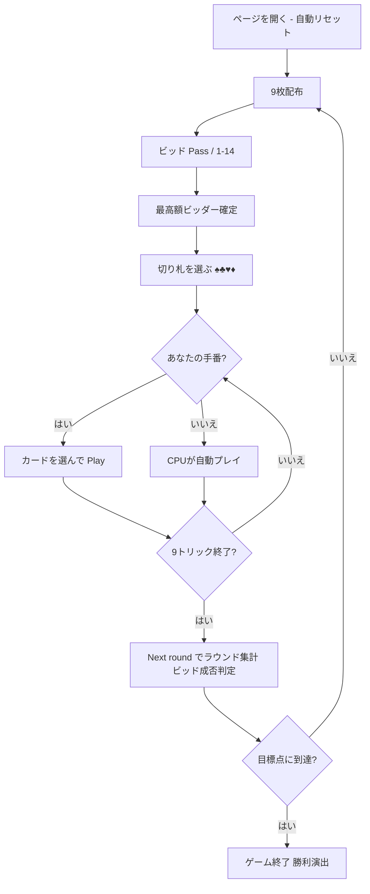

# チンチ（Web版）遊び方

## ゲーム概要

Cinch（チンチ / Double Pedro / High Five）は、All-Fours（Pitch / Seven Up）系の**ビッド式トリックテイキングゲーム**です。標準52枚デッキを4人（あなた＋CPU3人）で個人戦としてプレイします。各プレイヤーに9枚ずつ配り、最高額をビッドしたプレイヤーが切り札を宣言してリードします。1ディールで動く得点は合計**14点**で、切り札の 5（ライト・ペドロ）と同色の 5（レフト・ペドロ）がそれぞれ **5点**の大物です。ビッド側は宣言額以上を獲得できなければ**セットバック（宣言額のマイナス）**となります。先に目標点（既定21点）へ到達したプレイヤーが勝ちです。あなたは席0としてプレイします。

## 起動方法

```sh
go run ./cmd/trumpcards web         # CLI経由でWebサーバーを起動
go run ./cmd/trumpcards web --open  # サーバー起動 + ブラウザを開く
go run ./cmd/server                 # 直接Webサーバーを起動
```

ブラウザで `http://localhost:8080` にアクセスし、ナビゲーションバーから「チンチ」を選択します。
ナビバーのJA/ENボタンで日本語・英語を切り替えられます。

## ルール

### デッキと配布

- **デッキ**: 標準52枚（A〜2 × 4スート）。
- **プレイヤー**: 4人（あなた = 席0、CPU1〜3）。個人戦で各自が得点します。
- **配布**: 各プレイヤー9枚。

### ビッド

各プレイヤーは順番に **0（パス）** または **1〜14** をビッドします。直前の最高額を上回る額のみ宣言できます。最高額をビッドしたプレイヤーが切り札を宣言し、最初のトリックをリードします。Web ではビッド額ボタン（Pass / 1〜14）で操作します。

### 切り札宣言

ビッド勝者は切り札スートを選びます（♠スペード / ♣クラブ / ♥ハート / ♦ダイヤ）。Web ではスートボタンで選択します。

### 得点カード（1ディール14点）

- **High**（切り札の A）=1、**King**（切り札の K）=1、**Ten**（切り札の 10、"Game"）=1、**Jack**（切り札の J）=1。
- **Right Pedro**（切り札の 5）=**5**、**Left Pedro**（切り札と同色の 5）=**5**。
- **レフト・ペドロ**は切り札の 5 のすぐ下の強さを持つ**切り札扱い**です（フォロー・勝敗判定でも切り札）。
- 1ディールで動く点数は合計 **14点**。

### フォロー義務・トリック

- リードスートを持っていれば**必ず従わなければなりません（must-follow）**。ボイド時は任意の札を出せます。
- 切り札が出たトリックは最強の切り札が取り、切り札が出なければリードスートの最高札が取ります。1ディールは **9トリック**。

### 得点計算と勝利条件

ビッド勝者は獲得した得点カードが**宣言額以上**ならその点を加算、**未達ならセットバック**で宣言額をマイナスされます。ビッド勝者以外は自分が取った得点カードの点をそのまま加算します。先に目標点（既定 **21**）へ到達したプレイヤーが勝利します。

## ゲームの流れ



## 画面の操作方法

- **ビッド**: 「Pass」または「1」〜「14」のボタンでビッドします。
- **切り札宣言**: ビッド勝者になったら ♠♣♥♦ のスートボタンで切り札を選びます。
- **プレイ**: プレイ可能な札がハイライトされるので、選んで「Play」します。
- **トリック／ラウンド進行**: 「Next」でトリック結果を確認、「Next round」で次のラウンドへ進みます。
- **その他**: 「Reset」で新規ゲーム、設定でヒントをONにすると推奨アクション（ビッド額・切り札・出す札）が表示されます。

### キーボードショートカット

| キー | アクション | 有効条件 |
|------|-----------|---------|
| `Enter` | 次へ進む（Next / Next round） | トリック結果・ラウンド結果表示中 |
| `R` | リセット | 常時 |

## 画面構成

```
┌────────────────────────────────────────────┐
│ Cinch (チンチ)   Phase = Play   Trump = ♠   │ ← ヘッダー
├──────────────┬─────────────────────────────┤
│ P1 (CPU)     │                             │
│ Score 0 Bid- │      現在のトリック          │
│ P2 (CPU)     │   P0 ♠A   P1 ♠K   ...       │
│ Score 0 Bid4 │                             │
│ P3 (CPU)     │   Bid winner = P0  Bid = 6  │
│ Score 0 Bid- │                             │
├──────────────┴─────────────────────────────┤
│ あなたの手札（プレイ可能札をハイライト）      │ ← フッター
│ [♠A][♠5][♥5][♦K]...   [Play][Next][Reset]  │
└────────────────────────────────────────────┘
```

- **ヘッダー**: ゲーム名・フェーズ表示（Bid / NameTrump / Play / …）・切り札・CLI 切り替え。
- **情報サイドバー**: 各プレイヤーの累積得点・現在のビッド（pass または額）・ビッド勝者バッジ・ラウンド結果（達成 / セットバック）。
- **中央**: 現在のトリック（場札とリードプレイヤー）。
- **フッター**: あなたの手札（プレイ可能札がハイライト）・アクションボタン（ビッド／切り札／Play／Next／Next round／Reset）。

## 遊び方のコツ

- ライト・ペドロ（切り札の 5）とレフト・ペドロ（同色の 5）はそれぞれ 5 点。合計 10 点が動くため、これを取るか守るかが最重要です。
- 切り札にしたいスートの A・K・J・10・5 を多く持ち、長いスートがあるときだけ高くビッドしましょう。届かないとセットバックで宣言額を失います。
- レフト・ペドロ（同色の 5）は切り札扱い。フォロー時にうっかり出さないよう注意しましょう。
- 自分がビッド勝者でないときは、切り札の高札で相手のペドロを刈り取り、セットバックを狙いましょう。
- ヒント（設定でON）は、ビッド・切り札宣言・プレイの各フェーズで推奨アクションを提示します。
