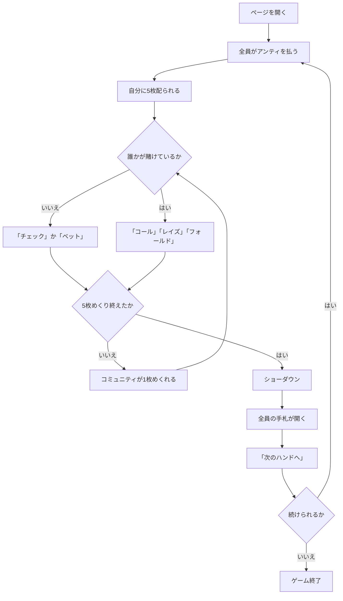

# シンシナティ（Web版）遊び方

## ゲーム概要

シンシナティは、アメリカのホームポーカーの定番バリアントです。テキサスホールデムの原型のひとつとも言われます。

**各自の手札は 5 枚**、場のコミュニティも **5 枚**。この 10 枚から最良の 5 枚を選んで役を作ります。

ホールデムとの一番の違いは 2 つです。

1. **手札が 5 枚あるので、場を 1 枚も使わずに役が完成することがあります。** 逆に、場の 5 枚だけで役ができることもあります。
2. **コミュニティは 1 枚ずつ、5 回に分けてめくります。** そのたびにベットラウンドが入ります。

## 起動方法

```sh
go run ./cmd/trumpcards web  # CLI経由でWebサーバーを起動
go run ./cmd/server          # 直接Webサーバーを起動
```

サーバ起動後、ブラウザで `http://localhost:8080/cincinnati` を開きます。

## ルール

- 標準 52 枚。2〜7 席（既定 4 席）で、席 0 があなた、残りは CPU です。
- 開始時に全員がアンティ（既定 10）を払います。
- 各自に **5 枚**を伏せて配ります。コミュニティ 5 枚も伏せて置かれます。
- **コミュニティを 1 枚めくるたびにベットラウンド**が入ります（計 5 回）。
  - 誰も賭けていなければ **チェック** または **ベット**
  - 誰かが賭けていれば **コール** / **レイズ** / **フォールド**
  - **レイズは 1 ラウンド 3 回まで**です。
- 5 枚すべてが公開され、最後のベットラウンドが終わるとショーダウンです。
- **手札 5 枚 + コミュニティ 5 枚の 10 枚から、最良の 5 枚**で役を比べます。
- いちばん強い役の席がポットを取ります。同じ役なら山分けし、端数は若い席から配ります。
- チップが尽きた席は脱落し、あなたが賭けられなくなるか、残り 1 席になったら終了です。

## ゲームの流れ



## 画面の操作方法

| 操作 | 説明 |
|------|------|
| 「チェック」 | 賭けずに次へ。誰も賭けていないときだけ押せます |
| 「コール」 | 現在の賭け額に合わせます。必要額が表示されます |
| 「ベット」＋額入力 | 誰も賭けていないときに賭けます |
| 「レイズ」＋額入力 | 上乗せします。**1ラウンド3回まで**で、上限に達すると押せません |
| 「フォールド」 | 降ります |
| 「次のハンドへ」 | ショーダウン後、次のハンドを始めます |
| ヒントボタン | いまの場面の定石を表示します |
| 棋譜ボタン | これまでの行動ログを表示します |
| リセットボタン | ゲームを最初からやり直します |

**押せる手はサーバが決めています。** チェックできるか、レイズが残っているかは場況で変わるので、押せないときはボタンが出ません。

## 画面構成

- **フェーズ表示**: `BETTING`（ベット）/ `SHOWDOWN`（ショーダウン）/ `GAME END`（終了）
- **場**: 表向きのコミュニティと「あと何枚めくれるか」。残りの回数だけベットラウンドがあります
- **自分の手札**: 5 枚。常に表示されます
- **CPU の席**: **ショーダウンまで手札は伏せたまま**です。チップ・賭け額・降りたかどうかは見えます
- **ポット**と**コールに必要な額**
- **ショーダウン**: 全員の手札と、**役名と選ばれた最良の 5 枚**、獲得額。5 枚の手札だけで成立する役も普通にあるので、なぜその配当になったのかがここで読めます

## 遊び方のコツ

- **手札 5 枚で完成している役は強いです。** ホールデムの感覚だと場を使いたくなりますが、手札だけで組んだ役が最良になる場面が普通にあります。
- **1 枚目で降りる判断ができます。** 役になっていない手を 5 回ぶんのベットに付き合わせるのがいちばん高くつきます。
- **場が育つと全員が強くなります。** コミュニティは共有なので、自分だけが強い状況ではなくなります。
- **レイズの上限（3 回）を覚えておいてください。** 上限に達すると押し切れません。
