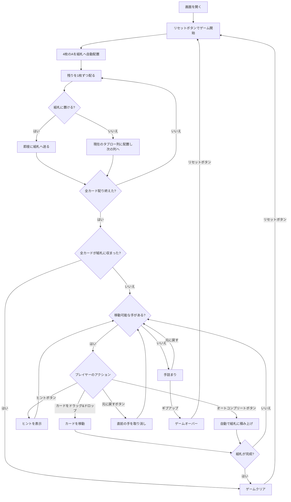

# シタデル（Web版）遊び方

## ゲーム概要

1人用のソリティアカードゲームです。1デッキ（52枚）を使用し、開始時に4枚のAが組札（ファンデーション）に置かれます。残りのカードは1枚ずつ配られますが、そのカードが組札に置ける場合は即座に組札へ送られ、置けないカードのみが8列のタブローに順に表向きで配られます（そのため列の枚数は基礎へ流れた分だけ不揃いになり、基礎札もAより進んだ状態で始まることがあります）。ストックやウェイストはありません。中央の組札（城）の左右に4列ずつ並ぶタブロー（包囲軍）から、組札へA→Kの順に積み上げきればクリアです（配り切っただけでクリアになることもあります）。

## 起動方法

```sh
go run ./cmd/trumpcards web  # CLI経由でWebサーバーを起動
go run ./cmd/server          # 直接Webサーバーを起動
```

ブラウザで `http://localhost:8080` にアクセスし、ナビゲーションバーから「シタデル」を選択します。
ナビバーのJA/ENボタンで日本語・英語を切り替えられます。

## ルール

### 基本ルール

- 1デッキ（52枚、ジョーカーなし）を使用
- 4枚のAは開始時に各スートの組札へ自動的に配置される
- 残りのカードを1枚ずつ配る際、組札へ置けるカードは即座に組札へ送られ、置けないカードのみが8列のタブローへ順に表向きで配られる（各列の枚数は最大6枚で、基礎へ流れた分だけ不揃いになる）
- 初期配りだけで全カードが組札に収まった場合はその時点でゲームクリアとなる
- 4つの組札（ファンデーション）はスート別にA→Kの順に積み上げる
- タブローではスート関係なく、ランクが1つ下のカードに重ねる（例: ♠5の上に♣4または♦4または♥4）
- 移動できるのは1枚ずつのみ（複数枚の同時移動は不可）
- **空の列には任意のカードを置ける**

### ゲームクリア

- 4つの組札すべてにA→Kまで13枚ずつ積み上げるとゲームクリア

### ゲームオーバー

- これ以上移動可能な手がない場合は手詰まり（アンドゥやオートコンプリートで打開可能）

## ゲームの流れ



## 画面の操作方法

### カードを移動する

1. 移動元のカード（タブロー列の最上段）をクリックまたはドラッグして選択します
2. 移動先のカード（またはエリア）をクリックまたはドロップして移動を確定します
3. ランクが1つ下のカードにのみ重ねられます（スートは問わない）
4. 空のタブロー列には任意のカードを置けます
5. 1枚ずつしか移動できません

### アンドゥ（元に戻す）

**「元に戻す」** ボタンまたは `z` キーで直前の操作を取り消せます。何度でも元に戻せます。

### ヒント・オートコンプリート

1. **「ヒント」** ボタンをクリックすると、次に可能な手を提案します
2. **「オートコンプリート」** ボタンをクリックすると、組札に安全に移動できるカードを自動で移動します

### キーボードショートカット

ゲーム中、以下のキーボードショートカットが使用できます。

| キー | アクション | 有効条件 |
|------|-----------|---------|
| `z` | 元に戻す（アンドゥ） | プレイ中 |
| `h` | ヒント | プレイ中 |
| `a` | オートコンプリート | プレイ中 |
| `g` | ギブアップ | プレイ中 |

※ テキスト入力欄にフォーカスがある場合、ショートカットは無効になります。

## 画面構成

```
┌────────────────────────────────────────────────┐
│  手数: 0                                       │
├────────────────────────────────────────────────┤
│  左ウィング 4列  │  組札  │  右ウィング 4列   │
│  [1][2][3][4]    │ ♠ ♣ ♥ ♦│  [5][6][7][8]    │
│  ♠K ♣K ♥K ♦K    │  2 5 3 3│  ♠Q ♥J ♦Q ♥5    │
│  ♠8 ♥8 ♣10 ♠J   │         │  ♣J ♠10 ♣Q ♦J   │
│  ♥Q ♦9 ♠9 ♥9    │         │  ♦10 ♣9 ♥10 ♠3   │
│  ♣8 ♥7 ♦8 ♣7    │         │  ♥6 ♠5 ♠7 ♦6    │
│  ♦7 ♠6 ♣6       │         │  ♦4 ♥4 ♦5        │
│        ♠4       │         │                  │
├────────────────────────────────────────────────┤
│  [元に戻す] [ヒント] [オートコンプリート]      │
│  [ギブアップ] [リセット]                       │
└────────────────────────────────────────────────┘
```

- **組札エリア（中央）**: 4つのスート別の組札（開始時に4枚のAが配置され、配る途中で置けたカードも自動配置される）
- **タブロー（左右4列ずつ）**: 8列のカード列（すべて表向き。組札に置けなかったカードが順に配られるため列によって枚数が異なり、最大6枚）
  - 最上段カード: クリックまたはドラッグで選択・移動
- **ボタン**:
  - 「元に戻す」: 直前の操作を取り消す
  - 「ヒント」: 次の一手を提案
  - 「オートコンプリート」: 自動で組札へ移動
  - 「ギブアップ」: 現在のゲームを終了
  - 「リセット」: 新しいゲームを開始

## 遊び方のコツ

- すべてのカードが表向きで、配る途中で組札へ移動したカードにより基礎札が進んだ状態で始まるため、盤面の状況を素早く把握できます
- 空列は任意のカードを置けるため、戦略的に列を空けると非常に強い手になります
- ランク13（K）はタブロー間移動の終端になりやすいので、Kの真下に控えるカードを早めに展開しましょう
- ヒントボタンで詰まった時のアドバイスを得られます
- 手詰まりになったら「元に戻す」で戻ってリトライしましょう
