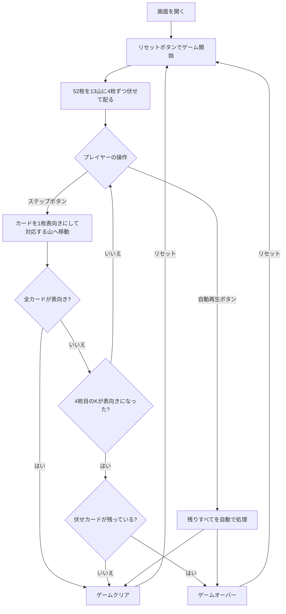

# クロックソリティア（Web版）遊び方

## ゲーム概要

1人用の完全自動ソリティアカードゲームです。52枚のカードを時計の文字盤に見立てた13箇所（1〜12時の位置＋中央のK置き場）に4枚ずつ伏せて配り、カードを1枚ずつ表向きにして対応する位置に移動させます。4枚目のKが表向きになる前に全カードを表向きにするとクリアです。

## 起動方法

```sh
go run ./cmd/trumpcards web     # CLI経由でWebサーバーを起動
go run ./cmd/server              # 直接Webサーバーを起動
```

ブラウザで `http://localhost:8080` にアクセスし、ナビゲーションバーから「クロックソリティア」を選択します。
ナビバーのJA/ENボタンで日本語・英語を切り替えられます。

## ルール

### 基本ルール

- 52枚のトランプ（ジョーカーなし）を使用
- 13箇所の山に4枚ずつ伏せて配る
  - 位置1〜12 = 時計の1時〜12時の位置
  - 位置13（中央）= Kの置き場
- ゲームは完全自動で進行（シャッフル後にプレイヤーの選択はなし）

### カードの移動ルール

- 現在の山のトップカードを表向きにし、そのランクに対応する山の一番下へ移動させる
  - A = 位置1（1時）
  - 2〜10 = 位置2〜10
  - J = 位置11（11時）
  - Q = 位置12（12時）
  - K = 中央（位置13）
- 移動先の山が次の「現在の山」になる

### ゲームクリア

- 4枚目のKが表向きになる前に全52枚が表向きになるとクリア
- 画面にクリア演出が表示されます

### ゲームオーバー

- 4枚目のKが表向きになった時点で、まだ伏せカードが残っていればゲームオーバー
- Kは全て中央の山に集まるため、4枚目のKが出ると中央以外への移動ができなくなる

## ゲームの流れ



## 画面の操作方法

### プレイフェーズ

| 操作 | 説明 |
|------|------|
| ステップボタン | カードを1枚表向きにして対応する山へ移動する |
| 自動再生ボタン | 残りのカードをすべて自動で処理してゲームを完了させる |
| リセットボタン | 確認ダイアログ後に新しいゲームを開始 |

### ゲーム終了後

| 操作 | 説明 |
|------|------|
| リセットボタン | 新しいゲームを開始 |

### キーボードショートカット

| キー | アクション | 有効条件 |
|------|-----------|---------|
| `s` | ステップ（カードを1枚進める） | プレイ中 |
| `a` | 自動再生（残り全カードを処理） | プレイ中 |
| `r` | リセット | 常時 |

## 画面構成

```
┌────────────────────────────────────────────┐
│  ナビゲーションバー                          │
│  クロックソリティア  [JA] [EN]              │
├────────────────────────────────────────────┤
│                                            │
│         [  12  ]                           │
│   [ 11 ]       [  1  ]                     │
│  [ 10 ]    [K]    [  2  ]                  │
│   [  9 ]       [  3  ]                     │
│        [ 8 ] [ 4 ]                         │
│          [ 7 ] [ 5 ]                       │
│              [ 6 ]                         │
│                                            │
│  表向き: 2 / 52    手数: 2                  │
│  最後のカード: ♠8                           │
├────────────────────────────────────────────┤
│  [ステップ]  [自動再生]  [リセット]          │
└────────────────────────────────────────────┘
```

- **時計エリア**: 13山を時計の文字盤に配置して表示。各山は伏せカード（裏面）と表向きカードで構成される
- **中央（K）**: Kカードが集まる中央の山
- **情報エリア**: 表向きカード枚数、手数、直前に動かしたカードを表示
- **操作ボタン**: ステップ・自動再生・リセット

## 遊び方のコツ

- このゲームはシャッフル後の運だけで決まる純粋な確率ゲームです
- クリア確率は約1/13（約7.7%）と言われています
- 「自動再生」ボタンを押すと一気にゲームを完了させられます
- 「ステップ」ボタンで1手ずつ確認しながら、ゲームの仕組みを学べます
- 何度もリセットして挑戦してみましょう
