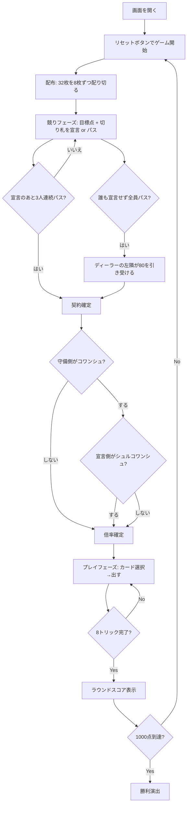

# コワンシュ（Web版）遊び方

## ゲーム概要

Coinche（コワンシュ）はベロートに**競り**と**倍化**を足したフランスの発展形です。32枚デッキを4人2チームで対戦し、切り札のJ（=20点）を最強とする独自の得点体系で、先に1000点を取ったチームが勝利します。

既存の `belote` との違いは 2 つです。**32枚を配り切ってから目標点と切り札を競り上げる**こと、そして**勝敗はカード点の多寡ではなく、宣言した点に届いたかで決まる**ことです。相手より多く取っていても、宣言に 1 点足りなければ落ちます。

## 起動方法

```sh
go run ./cmd/trumpcards web  # CLI経由でWebサーバーを起動
go run ./cmd/server          # 直接Webサーバーを起動
```

ブラウザで `http://localhost:8080` にアクセスし、ナビゲーションバーから「コワンシュ」を選択します。
ナビバーのJA/ENボタンで日本語・英語を切り替えられます。

## ルール

### 基本ルール

- 4プレイヤー2チーム制（あなた + パートナー vs CPU2人組）。
- 32枚デッキ（7,8,9,10,J,Q,K,A × 4スート）。
- 各ラウンド8トリック、先に1000点（設定で変更可）に到達したチームが勝利。

### 競りフェーズ

1. **32枚を4人に8枚ずつ配り切ります。** ターンアップも山札の残りもありません。
2. ディーラーの左隣から順に、**目標点と切り札スート**を宣言するかパスします。
3. 目標点は **80から10刻みで160**、その上が **Capot（250）= 全8トリック**。宣言は今出ている契約を必ず上回らなければならず、**上回れない点は選択肢に出ません**。
4. 誰かが宣言したあと3人が続けてパスすると競りが閉じます。
5. 誰も宣言しないまま全員がパスしたら、ディーラーの左隣が最低契約（80）を引き受けます。配り直しはしません。

開幕の配りではあなたが最初に話すので、12の契約すべてから選べます。

### コワンシュ（倍化）フェーズ

競りが閉じたら、**守備側**は「コワンシュ (x2)」で賭けを倍にできます。倍化されたら、**宣言側**が「シュルコワンシュ (x4)」で返せます。どちらの立場でもないボタンは表示されません。倍率は精算の係数そのもので、成功しても失敗しても同じ倍率が掛かります。

### カードの強さと得点

- 切り札: J=20, 9=14, A=11, 10=10, K=4, Q=3, 8=0, 7=0
- 非切り札: A=11, 10=10, K=4, Q=3, J=2, 9=0, 8=0, 7=0
- 1ラウンドのカード合計は 152点 + Dix de Der 10点 = 162点。

### プレイ義務

- リードスートを持っていれば必ず出す（フォロースート義務）。
- リードスートを持たないなら切り札があれば必ず出す（obligation à couper）。
- 切り札を出すなら可能な限りオーバートランプする（obligation à monter）。
- パートナーが現在の勝者の場合、切り札義務は免除される。

### スコアと特別ボーナス

- 通常: 取得トリックのカード点合計をチームスコアに加算。
- 最終トリックの勝者に Dix de Der +10。
- K+Q of trumps を両方持つプレイヤーが両方を出すと **Belote/Rebelote +20**。
- **勝敗は契約に届いたかで決まります。** 宣言側のカード点が目標点以上なら成功、届かなければ **dedans（失敗）**。
- 成功: 宣言側に **(契約点 + 取ったカード点) × 倍率**。守備側は 0。
- dedans: 守備側に **(162 + 契約点) × 倍率**。宣言側は 0。
- **Capot 契約（250）はトリック数が条件**です。全8トリックを取らなければ、カード点を全部取っていても落ちます。
- Belote/Rebelote の +20 は契約の成否と無関係に、宣言した側のチームに残ります。

## ゲームの流れ



## 画面の操作方法

### 競りフェーズ（あなたの番）

- フッターに「目標点」のプルダウンと、4つの切り札スートボタン、「パス」ボタンが並びます。
- **先に目標点を選んでからスートを押します。** 契約は「点 + 切り札」の対なので、点を選ぶまでスートボタンは押せません。
- プルダウンには**上回れる点だけ**が出ます。先に高い契約が出ていれば、選べる範囲はその分狭くなります。

### コワンシュフェーズ（あなたの番）

- 守備側なら「コワンシュ (x2)」、コワンシュされた宣言側なら「シュルコワンシュ (x4)」が出ます。
- どちらでもなければ「そのまま進む」だけが出ます。

### プレイフェーズ（あなたの番）

- 手札の中からカードを1枚クリックして選択。
- 「出す」ボタンで確定。
- 「ヒント」ボタンでバックエンドAIによるおすすめ手を表示できます。
- フロントエンドヒントを設定でONにすると、選択時に推奨理由をツールチップで表示します。

### トリック終了 / ラウンド終了

- 「次のトリック」「次のラウンド」ボタンで次へ進みます。
- ラウンド終了時はスコア演出が表示されます。

### キーボードショートカット

| キー | アクション | 有効条件 |
|------|-----------|---------|

（コワンシュ専用ショートカットはありません。共通のESCで設定パネルなどを閉じることができます。）

## 画面構成

```
+--------------------------------------------------+
| NavBar [コワンシュ]   [JA/EN] [チュートリアル] etc |
+--------------------------------------------------+
| 設定パネル: CPU難易度 / ターゲットスコア /       |
|   ベロート・ルベロート / フロントエンドヒント     |
+--------------------------------------------------+
| ラウンド 1 トリック 1  切り札: ♠ スペード        |
| 契約: 110点（チーム0 / 倍率 x1）                 |
+--------------------------------------------------+
| CPU 1 / CPU 2 / CPU 3 (チーム + 残カード数 +     |
|                       獲得トリック数)            |
+--------------------------------------------------+
|                  [現在のトリック]                 |
|             (4方向にプレイされたカード)           |
+--------------------------------------------------+
| チームスコア                                     |
|   チーム0: 245   チーム1: 198                   |
|   ラウンド: 62点  ラウンド: 90点                |
|   ベロート/ルベロート +20 (適用時のみ表示)       |
+--------------------------------------------------+
| メッセージ / フロントエンドヒント / 棋譜          |
+--------------------------------------------------+
| あなたの手札 (横並び8枚, クリックで選択)         |
| [取る][パス] or [♠][♣][♦][パス] or [出す]         |
|                  [ヒント] [リセット]              |
+--------------------------------------------------+
```

## 遊び方のコツ

- **いくらで宣言するか**: 切り札にしたいスートの J・9 を持っているかがすべて。J + 9 が揃えば 100 以上、片方だけなら 80〜90 が目安です。
- **届かない宣言は倍にされると一気に沈みます**: dedans の失点は (162 + 契約点) × 倍率。高く宣言するほど落ちたときの傷が深くなります。
- **コワンシュの判断**: 高い契約ほど倒しやすいので、相手が 140 以上を宣言していて自分の手札がその切り札に強ければ倍にする価値があります。
- **オーバートランプ義務を意識**: 切り札を出すなら一番強いのを「必ず」出さなければいけない場面が多い。
- **Belote/Rebelote**: K+Q of trumps を握ったらできるだけ早く順番に出して +20 を確定させる。
- **Dix de Der の取り合い**: 最終トリックで強い切り札を残しておくと逆転チャンスがある。
