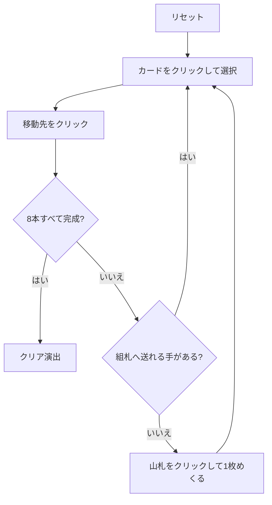

# コロラド（Web版）遊び方

## ゲーム概要

イギリスの古典的な一人用ソリティア。52 枚 2 組の 104 枚を、20 山の場札と 8 本の組札で捌く。

判断は実質ひとつ — **めくった札をどの山に置くか**。捨て札の札はスートも数字も問わずどの山にも置けるが、置けばその下の札は掘り出すまで使えない。組札の半分が K からの降順なので、A も K も同じくらい欲しい札になる。

## 起動方法

```sh
go run ./cmd/trumpcards web  # CLI経由でWebサーバーを起動
go run ./cmd/server          # 直接Webサーバーを起動
```

ブラウザで `http://localhost:8080` にアクセスし、ナビゲーションバーから「コロラド」を選択します。
ナビバーのJA/ENボタンで日本語・英語を切り替えられます。

## ルール

- 52 枚 2 組（104 枚）。**20 山の場札に 1 枚ずつ**配り、残り 84 枚が山札
- **組札は 8 本**。↑ の 4 本は各スート A から K への昇順、↓ の 4 本は各スート K から A への降順。8×13 = 104 枚がちょうど収まる
- 山札は 1 枚ずつ捨て札へめくる。**めくり直しは無い（1 巡のみ）**
- **捨て札の一番上**は組札へ送るか、**どの場札の山にも置ける**
- **場札の札は組札へしか送れない**。場札同士の移動は無い
- 空いた山は山札から直接埋められる
- 8 本すべてが 13 枚になれば勝ち

## ゲームの流れ



## 画面の操作方法

| 操作 | 説明 |
|------|------|
| 山札をクリック | 1枚めくって捨て札に置く |
| 「空き山へ」ボタン | 山札を移動元に選ぶ（空き山があるときだけ出ます） |
| 捨て札・場札の山をクリック | 移動元として選択する（もう一度押すと解除） |
| 組札をクリック | 選択中のカードをその組札に置く |
| 場札の山をクリック（捨て札を選択中に） | 捨て札をその山に置く |
| ヒントボタン | 打てる手を1つ提示する |
| 元に戻すボタン | 直前の1手を取り消す |
| オートコンプリートボタン | 送れるカードを自動で組札へ送る |
| リセットボタン | 確認ダイアログのうえで最初からやり直す |
| CLI トグル | 同じゲームをコマンド入力で操作するモードに切り替える |

## 画面構成

- **上部**: フェーズ表示（プレイ中 / クリア）、手数
- **中央上**: 8 本の組札。`↑F0`〜`↑F3` が昇順、`↓F4`〜`↓F7` が降順で、`n/13` と次に必要なランクを表示
- **中央**: 山札の残り枚数と捨て札の一番上
- **中央下**: 20 山の場札。各山は最上段と `(n)` の枚数を表示
- **下部**: アクションログ、設定、操作ボタン

## 遊び方のコツ

- **同じ数字の札は 2 枚あります。** 1 枚は昇順の組札へ、もう 1 枚は降順の組札へ入るので、置ける方に置いて構いません
- **どこに捨てるかがすべて。** 置く先の山の一番上が「組札に必要になるまで一番遠い」山を選びます。ヒントもこの基準です
- **空き山は山札から埋める。** 捨て札を経由させると山札の 1 巡が 1 枚分早く減ります
- 山札はめくり直しが無いので、組札へ送れるものは送っておく
- 手詰まりになるのは山札と捨て札の両方が尽きたときだけです

