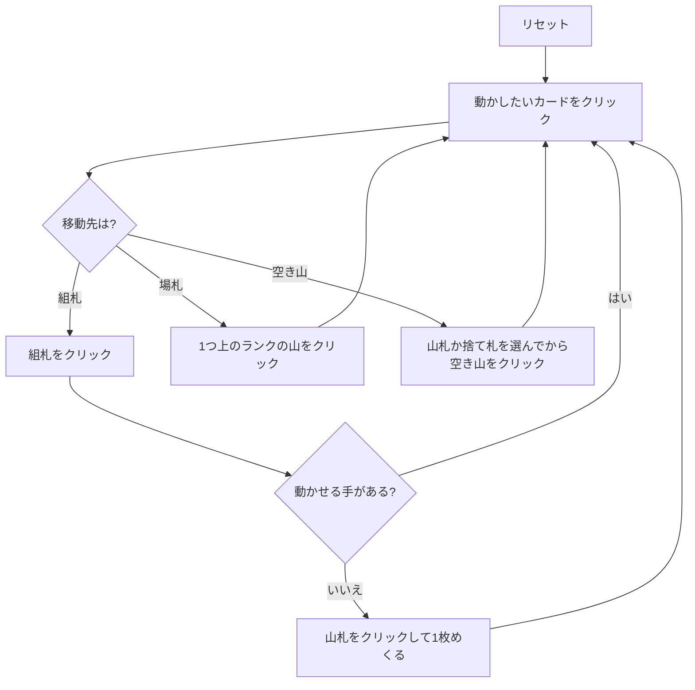

# コングレス (Congress) — Web マニュアル

## ゲーム概要

52 枚 2 組（104 枚）で遊ぶイギリス発祥のソリティア。中央に 8 つの基礎札を置き、その左右に **4 つずつ計 8 つのタブロー山**を並べる。タブローには**最初 1 枚ずつ**しか配らず、残り 96 枚が山札になる。

基礎札は**最初は空**で、A が出てきたときにそこへ置き、同スートで K まで 13 枚積む。8×13 = 104 枚すべてを積み切ればクリア。

## 起動方法

1. `go run ./cmd/trumpcards web` でサーバーを起動する
2. ブラウザで `http://localhost:8080` を開く
3. ゲーム一覧または左サイドバーから「コングレス」を選ぶ

## ルール

- 52 枚 2 組（104 枚）。タブローは 8 山に **1 枚ずつ**、残り 96 枚が山札
- **基礎札**: 8 つ。最初は空で、A が出たら置く。以降は同スートで昇順、K で完成
- **タブロー**: **スートも色も無視した降順**。**1 枚ずつしか動かせない**。A の上には何も置けない
- **空き山**: **山札か捨て札からしか埋められない**（画面にも「山/捨」と表示される）
- 山札は 1 枚ずつ捨て札へ。**めくり直しは無い**

## ゲームの流れ

## 画面の操作方法

| 操作 | 説明 |
|------|------|
| 山の一番上のカードをクリック | そのカードを移動元として選択する（下のカードは選べない） |
| 捨て札をクリック | 一番上の札を移動元として選択する |
| 山札をクリック（何も選択していないとき） | 1 枚めくって捨て札へ送る |
| 山札をクリック（選択中のとき） | **山札を移動元として選択する**（空き山へ直接置くため） |
| 組札をクリック | 選択中のカードをその組札に置く |
| 別の山をクリック | 選択中のカードをその山に置く |
| ドラッグ＆ドロップ | クリック 2 回と同じ移動をドラッグでも行える |
| ヒントボタン | 組札 → 場札 → めくる の順に手を 1 つ提示する |
| 自動完成ボタン | 組札へ送れる札がなくなるまで自動で送る（**場札の組み替えは行わない**） |
| 元に戻す / 手詰まり脱出ボタン | 1 手戻す / 脱出に必要な手数だけまとめて戻す |
| ギブアップ / リセットボタン | 確認ダイアログのうえで投了 / やり直す |
| CLI トグル | 同じゲームをコマンド入力で操作するモードに切り替える |

キーボードショートカット: `d` めくる / `h` ヒント / `a` 自動完成 / `z` 元に戻す / `g` ギブアップ（確認あり）。

## 画面構成

- **上部**: フェーズ表示と手数
- **中央上段**: 8 つの組札（空のときは「A」と表示）、山札と捨て札
- **中央下段**: 8 つの山。番号 `#0`〜`#7` はヒント表示の番号と一致する。空き山は「山/捨」と表示され、そこに置けるのが山札か捨て札だけであることを示す
- **下部**: ヒント表示、アクションログ、設定、キーボードショートカット一覧

## 遊び方のコツ

- **空き山は「場を組み替える道具」ではなく「山札・捨て札の受け皿」。** 場札から空き山へは動かせない
- **山札は 1 巡しか回らない。** めくる前に置き場所を考える
- 空き山があるうちは、山札を選んでから空き山をクリックすると捨て札を経由せずに置ける
- タブローはスート無視で繋がりやすいが、**1 枚ずつしか動かせない**
- A は出たらすぐ組札へ
- 詰まったら元に戻すで分岐をやり直す
