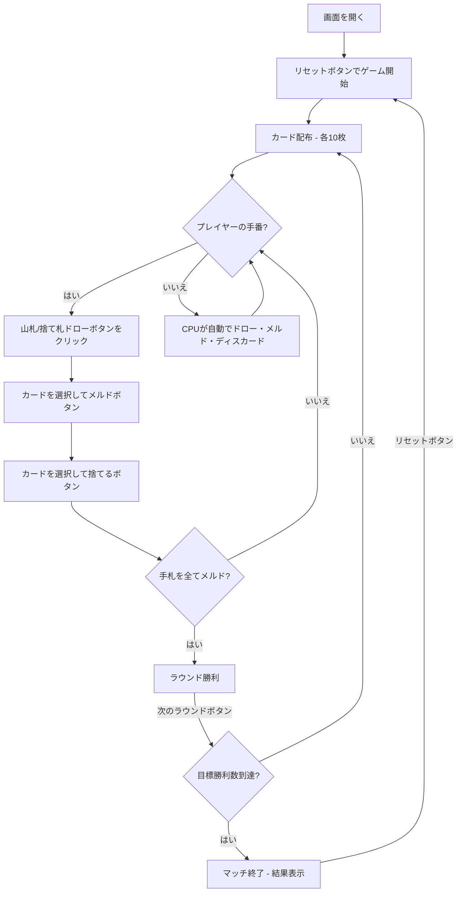

# コンキャン（Web版）遊び方

## ゲーム概要

2人（プレイヤー1人 + CPU 1人）で遊ぶ、ラミーの祖先とされるメキシコ生まれのカードゲームです。40枚のラテンデッキ（8・9・10を抜いた構成）を使い、手札のカードをすべてテーブルメルド（セットやラン）として並べ切ったプレイヤーがそのラウンドの勝者になります。先に目標勝利数（デフォルト3）に達したプレイヤーがマッチに勝利します。

## 起動方法

```sh
go run ./cmd/trumpcards web  # CLI経由でWebサーバーを起動
go run ./cmd/server          # 直接Webサーバーを起動
```

ブラウザで `http://localhost:8080` にアクセスし、ナビゲーションバーから「コンキャン」を選択します。
ナビバーのJA/ENボタンで日本語・英語を切り替えられます。

## ルール

### 基本ルール

- 40枚のラテンデッキを使用（各スートから 8・9・10 を除く）、2人プレイ
- 各プレイヤーに10枚ずつ配り、1枚を表向きにして捨て札を開始、残りは山札（ストック）
- 手番ではまず山札または捨て札からカードを1枚ドローする
- 捨て札から引いたカードは、その手番ですぐにメルドへ使わなければならない
- ドローのあとメルドを並べ、最後に手札から1枚捨てて手番を終える

### メルド

- **セット**: 同ランク3枚以上
- **ラン**: 同スートの連続する3枚以上。7とJは隣り合うものとして扱う（…6・7・J・Q…）
- メルドはプレイヤーごとに表向きでテーブルに並ぶ

### ラウンドとマッチの終了

- 手札をすべてメルドし切った（手札0枚になった）プレイヤーがそのラウンドの勝者
- 山札が尽きると引き分けで次のラウンドへ
- 先に目標勝利数（デフォルト3）に達したプレイヤーがマッチに勝利

### CPU難易度

- **Easy**: ランダムにカードを出す
- **Normal**: 基本的なメルド戦略（デフォルト）
- **Hard**: 戦略的なプレイ

## ゲームの流れ



## 画面の操作方法

### ドローフェーズ

1. **「山札から引く」** ボタンでストックから1枚引く
2. **「捨て札から引く」** ボタンで捨て札のトップカードを引く（必ずメルドに使用）

### メルドフェーズ

1. 手札のカードをクリックして選択（3枚以上）
2. **「メルドする」** ボタンで選択したカードをテーブルに並べる
3. 手札を1枚だけ選ぶと、**自分のテーブルメルドがレイオフ先として押せる**ようになります（枠が付きます）。足したいメルドを直接クリックすると、そのメルドへ延長されます。「レイオフ」ボタンを押した場合は、これまでどおり最初に延長できるメルドが選ばれます
4. 不要なカードを1枚選択し、**「捨てる」** ボタンで手番を終える
5. 捨て札から引いた場合は「捨て札を引いたカードは必ずメルドに使ってください」の案内が表示される

### ラウンド終了

1. **「次のラウンド」** ボタンで次のラウンドに進む

## 画面構成

```
┌────────────────────────────────────────────┐
│  ▶ 設定 (クリックで展開)                   │
│    CPU難易度:   [Normal▼]                  │
│    目標勝利数:  [3▼]                       │
├────────────────────────────────────────────┤
│              CPU エリア                     │
│  🂠🂠🂠🂠🂠🂠🂠🂠🂠🂠 (裏向き)                │
│  勝利: 0                                   │
├────────────────────────────────────────────┤
│              ゲーム情報                     │
│  ラウンド 2 | 山札: 28枚                   │
│  捨て札: ♥7                                │
│  テーブルメルド: {♣4,♣5,♣6}               │
├────────────────────────────────────────────┤
│         フッター: あなたの手札               │
│  [♠A][♣4][♣5][♥J][♦Q]...                  │
│  [リセット] [山札から引く] [捨て札から引く]   │
│  [メルドする] [捨てる]                       │
└────────────────────────────────────────────┘
```

- **設定パネル（▶ 設定）**:
  - 「CPU難易度」セレクト: Easy / Normal / Hard から選択
  - 「目標勝利数」: マッチに勝つために必要なラウンド勝利数を設定
  - 次のリセット時に設定が適用される
- **CPUエリア**: CPUの手札（裏向き）と勝利数
- **ゲーム情報**: 現在のラウンド、山札残り枚数、捨て札トップ、テーブルメルド
- **フッター（あなたの手札）**: クリックで選択（緑枠 + 上に浮き上がる）
- **勝利数テーブル**: 各プレイヤーのラウンド勝利数

## 遊び方のコツ

- 捨て札から引いたカードは必ずメルドに使う必要があるため、取るときは即メルドできるか確認しましょう
- 7とJが隣り合うランの特性を利用して、ランを伸ばすチャンスを見逃さないようにしましょう
- セットとランのどちらに組み込むか、手札全体の組み立てを意識しましょう
- 手札を1枚も残さずメルドし切ることがラウンド勝利の条件です
