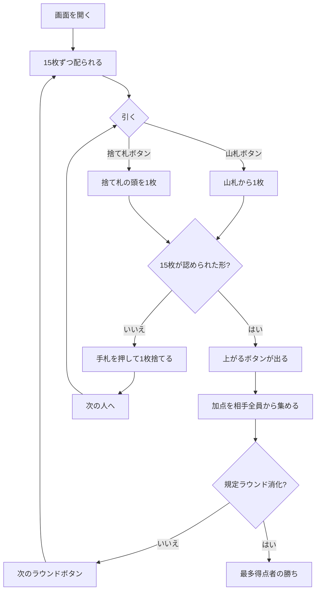

# コンチネンタル・ラミー（Web版）遊び方

## ゲーム概要

コンチネンタル・ラミー（Continental Rummy）はヨーロッパで遊ばれた古典的なラミーで、**セットが一切メルドにならない**のが他のラミーとの決定的な違いです。手札 15 枚を**すべて同スートの連番（シーケンス）だけ**で組み、一度に並べて上がります。

本実装は人間 1 人 + CPU 3 人の 4 人卓。**2 組 + ジョーカー 2 枚（106 枚）**を使い、1 人 15 枚を 3 枚ずつ 5 回で配ります。

## 起動方法

```sh
go run ./cmd/trumpcards web  # CLI経由でWebサーバーを起動
go run ./cmd/server          # 直接Webサーバーを起動
```

ブラウザで `http://localhost:8080` にアクセスし、ナビゲーションバーから「コンチネンタル・ラミー」を選択します。
ナビバーのJA/ENボタンで日本語・英語を切り替えられます。

## ルール

### シーケンス

**3〜5 枚・同じスート・連番**が 1 本のシーケンスです。

- **同ランクの組（セット）は 1 つも数えません。** ♠7 ♥7 ♣7 は何にもなりません。
- ジョーカーはどの札の代わりにもなります。
- A は上端でも下端でもよいですが、**両方は兼ねません**（K-A-2 は繋がりません）。

### 上がれる形（3 通りだけ）

| 形 | 内訳 |
|------|-----|
| **3+3+3+3+3** | 3 枚 5 組 |
| **4+4+4+3** | 4 枚 3 組 + 3 枚 1 組 |
| **5+4+3+3** | 5 枚 1 組 + 4 枚 1 組 + 3 枚 2 組 |

**5 枚 3 組（5+5+5）は合計 15 枚でも上がりになりません。** 合計が合えばよいのではなく、この 3 通りだけです。

### 手番

1. **山札から 1 枚引く**（`stock`）か、**捨て札の一番上を取る**（`take`）。
2. **上がれるなら `goout <番号>`**、そうでなければ `discard <番号>` で 1 枚捨てる。

**途中でメルドを場に出すことはできません。** 15 枚を一度に並べて上がるか、何も出さないかのどちらかです。

### 上がったときの点

**負けた側の残り札は数えません。** 上がった人が**相手 1 人ずつから**下の合計を受け取ります。

| 加点 | 点 |
|------|-----|
| 上がり | 1 |
| ジョーカー 1 枚につき | 2 |
| 最初の手番で上がり | 7 |
| **配られた 15 枚のまま上がり** | **10** |
| ジョーカーを 1 枚も使わない | 10 |
| 15 枚すべて同じスート | 10 |

「配られた 15 枚のまま」は**一度も引かずに**上がったとき（`gooutdeal` / 「引かずに上がる」ボタン）、「最初の手番で」は 1 回引いて上がったときです。**引いてしまうと 10 点が 7 点に落ちる**ので、配られた手はまず見てください。

### 山札が尽きたら

**捨て札を裏返して山に積み直します**（一番上の 1 枚は場に残します）。積み直しは 1 ラウンドに 3 回まで。それでも決まらなければそのラウンドは流れます。

> 原典は山が尽きたときのことを書いていません。実測すると、そこで流局にした場合 **200 局のうち 161 局が誰も上がれずに流れました**。届かない目標を出し続けるより、ラミー系で普通に行われる積み直しを採っています。

### 勝敗

設定したラウンド数（既定 3、1〜10）を打ち切った時点で、**一番多く集めた人の勝ち**です。

## ゲームの流れ



## 画面の操作方法

- **引く**: 「山札から引く」「捨て札を取る」の 2 つのボタンから選びます。**どちらを引いたかで手が変わる**ので、捨て札の頭は常に見えています。
- **捨てる**: 手札を押すとその 1 枚を捨てます。
- **引かずに上がる**: 配られた 15 枚がそのまま形になっていれば、引く前に「引かずに上がる」ボタンが出ます。**これが最も重い上がりで 10 点** ── 引いてしまうと 7 点に落ちます。
- **上がる**: 15 枚が認められた形になると「上がる」ボタンが出ます。**判定はサーバが解く**ので、自分で 5 組を数え直す必要はありません。
- **次のラウンド**: 決着を読んだら押して次へ進みます。
- **設定**: CPU難易度、ラウンド数（1〜10）、ヒントの ON/OFF を切り替えられます。

## 画面構成

- **ヘッダー**: ゲーム名・フェーズ表示・**ラウンドと山札の残り**・CLI 切り替え
- **中央上**: 上がれる 3 通りの形（5+5+5 が無いこと）、捨て札の頭、山札の枚数
- **中央**: 各席の手札枚数と得点、上がった人が並べたシーケンス
- **決着ブロック**: 加点の内訳と、相手 1 人あたり／合計の取り立て額
- **フッター**: あなたの手札・引く／捨てる／上がるのボタン

## 画面の見方（CLI モード）

```
ラウンド 1 / 3
山札 42 枚　捨て札の頭: ♦2
上がれる形: 3+3+3+3+3 / 4+4+4+3 / 5+4+3+3　（**セットは組になりません**）
あなた: 手札 15 枚　得点 0　(親)　← 手番
CPU 1: 手札 15 枚　得点 0
[0]♥10 [1]♥2 [2]♦J [3]♥K [4]♥J [5]♣8 [6]♣6 [7]♥A [8]♣Q [9]♦6 [10]♣J [11]♣8 [12]♦9 [13]♦9 [14]♥7
stock ... 山札から引く / take ... 捨て札の頭を取る
```

**「上がれる形」の行は常に出ています。** 15 枚をどう割るかがこのゲームの全部で、**5+5+5 がそこに無い**ことが肝です。

**相手の手札は枚数だけ見えます。**
