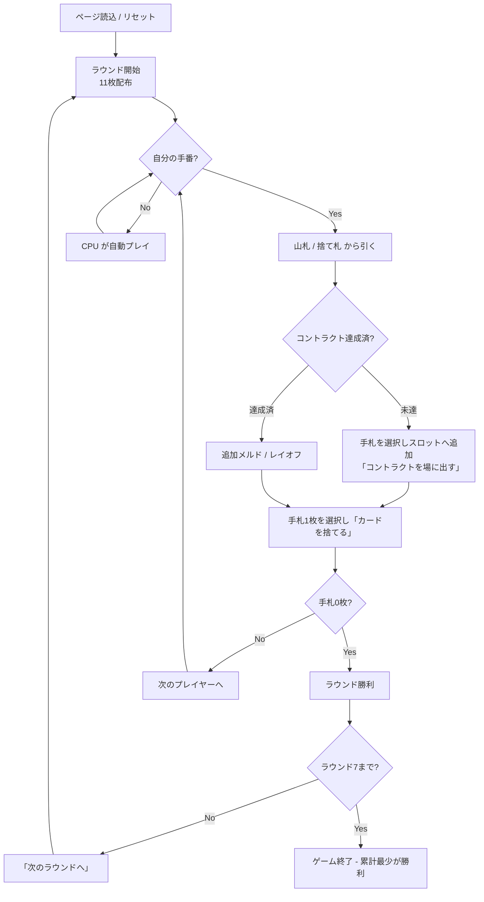

# コントラクトラミー（Web版）遊び方

## ゲーム概要

人間1人＋CPU2人の3人プレイヤーで進行するラミー系ゲーム。全7ラウンドにわたり、ラウンドごとに「達成すべきメルドの組み合わせ（コントラクト）」が段階的に厳しくなる。手札ペナルティの累計が最も少ないプレイヤーが勝利する。

## 起動方法

```sh
go run ./cmd/trumpcards web         # CLI経由でWebサーバーを起動
go run ./cmd/trumpcards web --open  # サーバー起動 + ブラウザを開く
go run ./cmd/server                 # 直接Webサーバーを起動
```

ブラウザで `http://localhost:8080` にアクセスし、ナビゲーションバーから「コントラクトラミー」を選択します。
ナビバーのJA/ENボタンで日本語・英語を切り替えられます。

## ルール

### 基本ルール

- 2デッキ（104枚、ジョーカー無し）を使用。
- 初期配布: 各プレイヤーに11枚ずつ。残りは山札、最初の1枚を捨て札に。
- 各ターン: 山札 or 捨て札トップから1枚引く → コントラクト達成 / 追加メルド / レイオフ → 1枚捨ててターン終了。
- 自分のコントラクトを達成（オープン）するまでレイオフ・追加メルドはできない。
- 手札を全て出し切るとラウンド勝利（上がり）。

### コントラクト一覧

| ラウンド | コントラクト |
|----------|--------------|
| 1 | 2つのセット（同ランク3枚）×2 |
| 2 | セット3枚 + ラン4枚（同スート連続） |
| 3 | ラン4枚 ×2 |
| 4 | セット3枚 ×3 |
| 5 | セット3枚 ×2 + ラン4枚 |
| 6 | セット3枚 + ラン4枚 ×2 |
| 7 | ラン4枚 ×3 |

### 得点

- 上がったプレイヤー: 0点。
- 他プレイヤー: 手札に残ったカードのペナルティが累計に加算（A=15、2-9=額面、10-K=10）。
- コントラクト未達: 追加で「コントラクト未達ペナルティ（既定: 25点）」が加算される。

### ゲーム終了

7ラウンド終了時点で累計ペナルティが最少のプレイヤーが勝利。

## ゲームの流れ



## 画面の操作方法

- **ドローフェーズ**: 「山札から引く」「捨て札を取る」のいずれかをクリック。
- **プレイフェーズ（コントラクト未達）**:
  1. 手札からカードをクリックして選択（複数選択可）。
  2. 「スロットに追加」を押して、コントラクトの1スロットぶんを確定。
  3. 全スロットを組成したら「コントラクトを場に出す」を押す。
  4. 不要な手札1枚を選択して「カードを捨てる」でターン終了。
- **プレイフェーズ（コントラクト達成済）**:
  - 追加メルドは手札から3枚以上を選択 → 「追加メルド」。
  - レイオフはまず他プレイヤーのメルドをクリック → 自分の手札1枚を選択 → 「レイオフ」。
- **ラウンド終了**: 「次のラウンドへ」を押すと次のコントラクトが配布される。

## 画面構成

- **画面上部**: 現在のラウンド / 全ラウンド数、コントラクト、山札残枚数、捨て札トップ。
- **中段**: 各プレイヤーのカード枚数、累計スコア、達成済みメルド一覧。
- **手札エリア**: 自分の手札がカード画像で表示される。クリックで選択／解除。
- **アクションボタン**: 現在のフェーズに応じて操作可能なボタンが表示される。
- **フッター**: リセット、棋譜表示など。

## 遊び方のコツ

- 序盤は捨て札トップを積極的に使って必要カードを揃える。
- A は15点ペナルティなので、未達成時は早めに捨てる。
- 終盤ラウンドは早期オープンが有利（レイオフで一気に手札を減らせる）。
