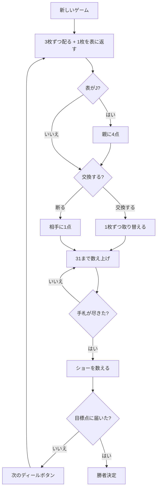

# コストリー・カラーズ（Web版）遊び方

## ゲーム概要

コストリー・カラーズ（Costly Colours）は 17 世紀イギリス・シュロップシャー地方の 2 人用カードゲームで、**Cribbage の祖先**にあたります。1674 年、チャールズ・コットンの『The Compleat Gamester』が最初の記録です。

**Cribbage と違うのは「クリブが無い」ことだけではありません。** 配るのは 3 枚だけ、数え上げは **15・25・31** の 3 か所で点になり、ショーではフィフティーンやフラッシュではなく **色とスートの梯子**を数えます。その梯子の一番上が「**コストリー・カラーズ**」で、ゲーム名の由来です。

## 起動方法

```sh
go run ./cmd/trumpcards web
# または
go run ./cmd/server
```

ブラウザで `http://localhost:8080` にアクセスし、ナビゲーションバーから「コストリー・カラーズ」を選択します。
ナビバーのJA/ENボタンで日本語・英語を切り替えられます。

## ルール

### 配りと表の 1 枚

各プレイヤーに **3 枚**ずつ配り、**次の 1 枚を表に返します**。これが「トランプ」で、ショーでも数えます。

**表に返ったのが J なら、親に 4 点**（"for his heels"）。打ち始める前に入ります。

### 交換（mog）

打ち始める前に、**互いに 1 枚ずつ取り替える**かを決めます。手札は 3 枚のままです。

**断ると相手に 1 点**入ります。色役が既にできているなら、崩さず断るほうが得なこともあります。

### 数え上げ（31 まで）

交互に 1 枚ずつ出し、累計を言います。**31 を超える札は出せません。**

| 節目 | 点 |
|------|-----|
| **15** | 作った枚数ぶん |
| **25** | 作った枚数ぶん |
| **31 ちょうど** | 作った枚数ぶん |

**25 で点が入るのは Cribbage にはありません。**

そのほか、出した直後に:

| 役 | 点 |
|------|-----|
| ペア（同位 2 枚） | 2 |
| **プライアル（同位 3 枚）** | **9** |
| **ダブルプライアル（同位 4 枚）** | **18** |
| 階段（連番 3 枚以上） | 枚数ぶん |

**プライアルは 9、ダブルプライアルは 18 です。** Cribbage の 6 / 12 ではありません。階段は並び順を問いません（5-7-6 でも 3 枚）。

31 を超えずに出せる札が無い側は「**ゴー**」となり、**相手に 1 点**入って出せる限り続けます。31 に届かず打ち切った最後の札には **1 点**（"the latter"）。

### ショー（色とスートの梯子）

打ち終わったら、**自分の 3 枚 + 表の 1 枚**の 4 枚で数えます。

| 役 | 点 |
|------|-----|
| 3 枚同色 | 2 |
| 3 枚同スート | 3 |
| 4 枚同色・2 枚同スート | 4 |
| 4 枚同色・3 枚同スート | 5 |
| **4 枚同スート＝コストリー・カラーズ** | **6** |

さらに:

- **手札の J / 2 がトランプと同じスートなら 4 点、それ以外なら 2 点**
- 同位役（ペア 2 / プライアル 9 / ダブルプライアル 18）。**J と 2 はここでは数えません**（上で数えているので二重取りしない）
- **表に返った J は手札の J として数えません**（既に親の 4 点になっています）

### 勝敗

**61 点**（コットン版）に先に届いた側の勝ちです。設定で **121 点**（パーレット版）も選べます。**点は打っている最中にも入る**ので、ディールの途中で決まることがあります。

## ゲームの流れ



## 画面の操作方法

- **交換**: ディールの頭に「交換する / 断る」を選びます。**断ると相手に 1 点**入ります。
- **手札を選ぶ**: **31 を超えない札だけ**が押せます。押すとそのまま出ます。
- **ゴー**: 出せる札が 1 枚も無いときは自動で相手に手番が渡ります。
- **次のディール**: ショーを読んだら押して次へ進みます。
- **設定**: CPU難易度、目標点（31〜121。61=コットン版 / 121=パーレット版）、ヒントの ON/OFF を切り替えられます。

## 画面構成

- **ヘッダー**: ゲーム名・フェーズ表示・**ディールと表の 1 枚**・CLI 切り替え
- **中央**: 表に返した「トランプ」、今の数え上げと累計
- **情報サイドバー**: 各席の手札枚数と通算得点、ショーの内訳（J と 2 / 同位役 / 色とスート）と名指しの色役
- **フッター**: あなたの手札・アクションボタン

## 画面の見方（CLI モード）

```
ディール 1（61 点勝負）
表の 1 枚（トランプ）: ♣10
あなた （非親）: 手札 3 枚　得点 0
[0]♣9  [1]♠6  [2]♥2（点札）
CPU 1 （親）: 手札 3 枚　得点 0
----------
数え上げ: （まだ何も出ていません）　累計 0
交換（mog）しますか？ 断ると相手に 1 点入ります。
mog ... 応じる / nomog ... 断る
```

**表の 1 枚は常に見えています。** これがトランプで、ショーの色役も J / 2 の 4 点もこれ次第です。

**J と 2 には（点札）の印**が付きます。持っているだけで点になるので、数え上げで気軽に切ると損をします。

数え上げが始まると「出せる札」の行が出ます。**31 を超える札はそこに並びません** ── 並ばないときは「ゴー」で、相手が続けます。
