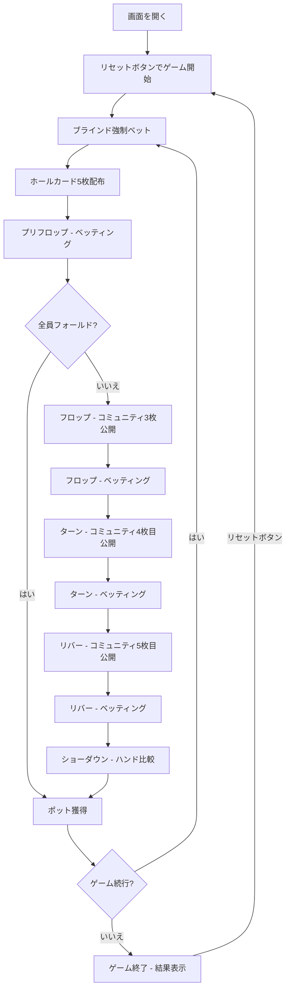

# クールシュヴェル（Web版）遊び方

## ゲーム概要

クールシュヴェルはフランス発祥のポーカーで、5カードオマハ（Big O）のバリアントです。配られる枚数も、役を「**ホールカードから必ず2枚**、**コミュニティカードから必ず3枚**」で作る規則も Big O と同じ。**違うのは公開の時刻だけで、フロップの1枚目が最初のベットの前にすでに表向きになっています。**

この1枚が効きます。通常のオマハのプリフロップは「見えない場に対して手札5枚をどう評価するか」ですが、クールシュヴェルでは「**見えている1枚と噛み合っているか**」を問われます。答えられる問いなので、**最初のラウンドから降りる根拠が手に入ります** —— 通常のオマハにはほとんど無いものです。

テーブルサイズは4-max（デフォルト、1人+CPU 3人）、6-max（1人+CPU 5人）、9-max（1人+CPU 8人）から選択できます。各CPUは異なるプレイスタイル（TAG/LAP/TAP/LAG/GTO）を持ち、ブラフを含む戦略的なプレイをします。サイドポットにも対応しています。

## 起動方法

```sh
go run ./cmd/trumpcards web  # CLI経由でWebサーバーを起動
go run ./cmd/server          # 直接Webサーバーを起動
```

ブラウザで `http://localhost:8080` にアクセスし、ナビゲーションバーから「クールシュヴェル (Courchevel)」を選択します。
ナビバーのJA/ENボタンで日本語・英語を切り替えられます。

## ルール

### 基本ルール

- 52枚のトランプを使用
- 各プレイヤーに**5枚**のホールカード（手札）が配られる
- 場にコミュニティカード（共有カード）が最大5枚公開される
- **1枚目は最初のベットの前に公開される**（フロップでは残り2枚が開き、場は合計3枚になる）
- **ホールカードから必ず2枚**、**コミュニティカードから必ず3枚**を使って5枚の役を作る（オマハと同じルール）
- 最も強い役を持つプレイヤーがポットを獲得する

### ゲームの進行

1. **ブラインド**: ディーラーの左隣がスモールブラインド（デフォルト5）、その左隣がビッグブラインド（デフォルト10）を強制ベット
2. **プリフロップ**: ホールカード5枚配布と**コミュニティカード1枚目の公開**の後、最初のベッティングラウンド
3. **フロップ**: コミュニティカードが**3枚になるまで残り2枚**を公開後、ベッティングラウンド
4. **ターン**: コミュニティカード4枚目公開後、ベッティングラウンド
5. **リバー**: コミュニティカード5枚目公開後、最後のベッティングラウンド
6. **ショーダウン**: 残ったプレイヤーのハンドを比較

### ベッティングリミット

- **Fixed Limit**: レイズ額が固定
- **Pot Limit**: ポット額までレイズ可能（デフォルト）
- **No Limit**: 全チップまでレイズ可能

### ゲーム終了

- チップが0になったプレイヤーは脱落（トーナメントモードではリバイ可能）
- 最後の1人になったらゲーム終了

### CPU難易度

- 各CPUは異なるプレイスタイル（TAG/LAP/TAP/LAG/GTO）を持つ
- ブラフを含む戦略的なプレイを行う

## ゲームの流れ



## 画面の操作方法

### ベッティング

1. **「コール」** ボタン: 相手のベットに合わせる
2. **「レイズ」** ボタン: ベット額を上げる（スライダーで金額指定）
3. **「ベット」** ボタン: 最初にベットする
4. **「チェック」** ボタン: パスする（ベットなしで次へ）
5. **「フォールド」** ボタン: 降りる
6. **「オールイン」** ボタン: 全チップを賭ける

### ショーダウン

1. **「ショー」** ボタン: 手札を公開する
2. **「マック」** ボタン: 手札を伏せる

### キーボードショートカット

| キー | アクション | 有効条件 |
|------|-----------|---------|
| `C` | コール | ベッティング中 |
| `R` | レイズ / ベット | ベッティング中 |
| `K` | チェック | ベッティング中 |
| `F` | フォールド | ベッティング中 |
| `A` | オールイン | ベッティング中 |

### 学習モード

画面下部のトグルで学習モードを有効にすると、エクイティ（勝率）とポットオッズが表示されます。

## 画面構成

```
┌────────────────────────────────────────────┐
│  ▶ 設定 (クリックで展開)                   │
│    ベッティングリミット: [Pot Limit▼]       │
│    トーナメントモード:   [OFF▼]             │
│    テーブルサイズ:       [4-max▼]           │
│    SB/BB: [5] / [10]                       │
├────────────────────────────────────────────┤
│           CPU プレイヤーエリア              │
│ ┌──────────┐ ┌──────────┐ ┌──────────┐    │
│ │ CPU 1    │ │ CPU 2    │ │ CPU 3    │    │
│ │ 980chips │ │ 1200chips│ │ 820chips │    │
│ │ TAG      │ │ LAP      │ │ TAP      │    │
│ │ HUD stats│ │ HUD stats│ │ HUD stats│    │
│ └──────────┘ └──────────┘ └──────────┘    │
├────────────────────────────────────────────┤
│       コミュニティカード & ポット            │
│  [♠A] [♥K] [♣9] [??] [??]  ポット: 120   │
│  フェーズ: フロップ                         │
├────────────────────────────────────────────┤
│     フッター: あなた (1500chips) [D]         │
│  [♠Q] [♥J] [♣10] [♦8] [♣2]               │
│  HUD: VPIP 45% / PFR 20% / 3Bet 8%       │
│  [フォールド][チェック][コール][レイズ ▼]    │
│  [リセット]  学習モード: [ON/OFF]           │
└────────────────────────────────────────────┘
```

- **設定パネル（▶ 設定）**:
  - ベッティングリミット、トーナメントモード、テーブルサイズ、ブラインド額を設定
  - `cpuMetaAI`: メタAI（CPUがプレイスタイルを学習）
  - `humanPlayMs`: アクション実行時の迷い時間（自動計測）
  - 次のリセット時に設定が適用される
- **CPU プレイヤーエリア**: 各 CPU のチップ、プレイスタイル、HUD統計を表示
- **コミュニティカード & ポット**: 公開されたコミュニティカードとポット額
- **フッター（あなたの手札）**:
  - ホールカード5枚、チップ、HUD統計を表示
  - ベッティングボタンで操作

## 遊び方のコツ

- **1枚目と噛み合わない手は、最初のラウンドで降りられます。** これがこのゲームの一番の違いです。通常のオマハはプリフロップの根拠が薄くて降りにくいのですが、ここでは見えている1枚を基準に判断できます。
- **見えている1枚は全員が使えます。** 自分だけの有利ではありません。その1枚でフラッシュやストレートの目が立つなら、相手にも同じ目が立っています。
- **「必ず手札から2枚」の縛りを忘れないでください。** 場に強い並びが出ても、手札2枚を使えなければ役になりません。ホールデムの感覚で読むと外します。
- **フロップで開くのは残り2枚だけです。** 場が一気に3枚増えるわけではないので、フロップ後の情報の増え方は通常のオマハより穏やかです。
