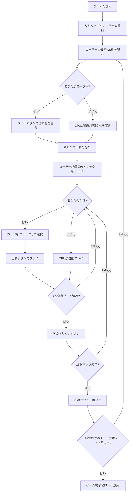

# コートピース (Rang)（Web版）遊び方

## ゲーム概要

Court Piece（コートピース / Rang）は南アジアで広く親しまれている4人2チーム（席0&2 vs 席1&3）のトリックテイキングゲームです。各ラウンドの最初に**コーラー（Hakim）**が最初の5枚を見て**切り札スート**を宣言します。その後、52枚のデッキを各自13枚で13トリック争います。13トリックのうち**7トリック以上**を取ったチームがそのラウンドに勝利し、**Sar（+1点）**を獲得します。連勝や全13トリックの独占（Court）には**ボーナス（+2点）**が付きます。先に**ポイント上限（初期値7）**へ達したチームの勝利です。あなたは席0（チームA）としてプレイします。

## 起動方法

```sh
go run ./cmd/trumpcards web         # CLI経由でWebサーバーを起動
go run ./cmd/trumpcards web --open  # サーバー起動 + ブラウザを開く
go run ./cmd/server                 # 直接Webサーバーを起動
```

ブラウザで `http://localhost:8080` にアクセスし、ナビゲーションバーから「コートピース (Rang)」を選択します。
ナビバーのJA/ENボタンで日本語・英語を切り替えられます。

## ルール

### デッキと配布

- **デッキ**: 52枚（2〜A × 4スート）
- **プレイヤー**: 4人2チーム（あなた = 席0・チームA、席0&2 vs 席1&3）
- **配布**: 各プレイヤー13枚、計13トリック

### トランプ宣言（コーラー / Hakim）

- コーラーは最初に配られた5枚を見て、**切り札スート**（♠♣♥♦）を1つ宣言します。
- 宣言後に残りのカードが配られ、トリックプレイが始まります。

### トリック・テイキング

- **スートフォロー義務**: リードされたスートのカードを持っている場合は必ず出さなければなりません。
- 切り札はすべての非切り札を上回り、スート内はA>K>Q>J>...>2の順です。

### 勝利条件

- 1ラウンド（13トリック）のうち**7トリック以上**取ったチームが勝利し **Sar（+1点）** を獲得。
- 連勝、または全13トリックを独占すると **Court ボーナス（+2点）**。
- 勝利チームはコーラー役を維持し、敗北すると次の席へコーラーが移ります。
- 先に**ポイント上限（初期7点）**へ達したチームがマッチ勝利。

## ゲームの流れ



## 画面の操作方法

### TRUMPフェーズ（トランプ宣言フェーズ）

あなたがコーラー（Hakim）のとき、手札の下に♠♣♥♦の4つのスートボタンが表示されます。

- 最初に配られた5枚を確認し、いずれかのスートボタンをクリックして切り札を宣言します。
- 宣言後に残りのカードが配られ、トリックプレイが始まります。

### PLAYフェーズ（トリックフェーズ）

- あなたの手番のとき、手札のカードをクリックして選択します。
- **「出す」ボタン**: 選択したカードをプレイします。スートフォロー義務に従う必要があります（義務に反するカードは選択できません）。
- **「次のトリック」ボタン**: トリックが解決したら次へ進みます。
- **「次のラウンド」ボタン**: 13トリック終了後にポイントを集計して次のラウンドへ進みます。

## 画面構成

```
┌─────────────────────────────────────────────────────────┐
│  Court Piece / Rang (コートピース) [JA/EN] [CLI]         │
├─────────────────────────────────────────────────────────┤
│  ラウンド: 1  トリック: 0  フェーズ: TRUMP               │
│  切り札: -  コーラー: あなた                             │
│  チームA(あなた)=0  チームB=0                            │
├──────────┬──────────────────────────────────────────────┤
│  CPU1    │                                               │
│  (チームB)│     現在のトリック表示エリア                  │
│  CPU2    │     （各プレイヤーの出したカード）             │
│  (チームA)│                                               │
│  CPU3    │                                               │
│  (チームB)│                                               │
├──────────┼──────────────────────────────────────────────┤
│  獲得トリック数 / メッセージ・結果表示                   │
├──────────┴──────────────────────────────────────────────┤
│  あなたの手札（クリックで選択）                           │
│  [A♠][K♠][Q♥][10♥][7♣] ...                              │
│  [♠][♣][♥][♦]                ← TRUMPフェーズ            │
│  [出す] [次のトリック] [次のラウンド] ← PLAYフェーズ     │
└─────────────────────────────────────────────────────────┘
```

- **ヘッダー**: ゲーム名・フェーズ表示・言語切り替えトグル・CLI切り替えトグル。
- **ラウンド／トリック表示**: 現在のラウンド番号・トリック番号・フェーズ・切り札スート（宣言前は「-」）・コーラー。
- **ポイント**: 両チームの累積ポイントをリアルタイムで表示。
- **プレイヤー表示エリア（左）**: CPU各プレイヤーの手札枚数・チームを表示。
- **トリック表示エリア（中央）**: 場に出ているカードと出したプレイヤー名。
- **メッセージボックス**: フェーズ・ラウンド結果（獲得トリック数・ポイント情報）・勝敗の案内。
- **フッター（手札エリア）**: あなたの手札と操作ボタン（TRUMPフェーズはスートボタン4種、PLAYフェーズは出す／次のトリック／次のラウンド）。

## 遊び方のコツ

- **長いスートを切り札に**: コーラーのときは、最も枚数の多いスートを切り札に選ぶとトリックを取りやすくなります。
- **切り札の温存**: 序盤は切り札を温存し、相手の得点トリックを切り札で奪う展開を狙いましょう。
- **7トリックを意識**: ラウンド勝利には13トリック中7トリック以上が必要です。確実に取れるトリックを数えながらプレイしましょう。
- **Court ボーナスを狙う**: 連勝中は次ラウンドの勝利で +2点。全13トリック独占でも +2点。優位な手札のときは大量得点を狙えます。
- **チームメイトとの連携**: チームメイト（席2のCPU）が勝っているトリックでは無理に強いカードを使わず、温存しましょう。
