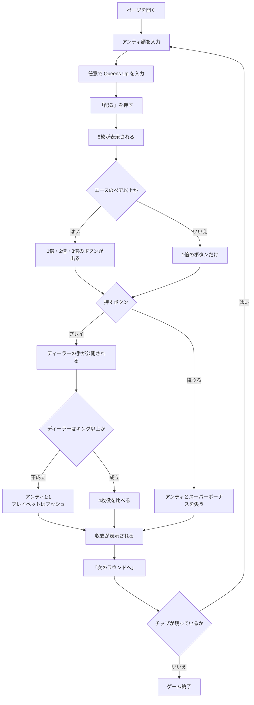

# クレイジー4ポーカー（Web版）遊び方

## ゲーム概要

クレイジー4ポーカー（Crazy 4 Poker）はアメリカのカジノで定番のテーブルポーカーです。標準52枚のデッキを使い、プレイヤーとディーラーに5枚ずつ配って、**それぞれ最良の4枚**で勝負します。

名前の由来は独自のプレイベット規則です。プレイベットは通常アンティと同額しか置けませんが、**エースのペア以上を持っていれば3倍まで乗せられます**。つまり「倍率を動かせること自体が強い手の特典」で、ここがこのゲームの本体です。

## 起動方法

```sh
go run ./cmd/trumpcards web  # CLI経由でWebサーバーを起動
go run ./cmd/server          # 直接Webサーバーを起動
```

サーバ起動後、ブラウザで `http://localhost:8080/crazyfourpoker` を開きます。`--open` を付けるとブラウザが自動で開きます。

## ルール

- **アンティとスーパーボーナスは同額で必須**です。アンティを置くと自動的に同額のスーパーボーナスが付きます。
- **Queens Up** は任意のサイドベットです。自分の4枚役だけで決まり、ディーラーの手にも降りたかどうかにも左右されません。
- 5枚ずつ配られたら、プレイベットを置くか降りるかを決めます。
  - 通常は**アンティと同額**のみ
  - **エースのペア以上**なら1〜3倍から選べます
  - 降りるとアンティとスーパーボーナスを失います
- **ディーラーはキング以上で成立（クオリファイ）**します。成立しなければアンティは1:1、プレイベットはプッシュです。
- ディーラーが成立して勝てばアンティとプレイベットが1:1、引き分けはプッシュ、負ければ両方没収です。
- **スーパーボーナスの3分岐**:
  - エースのペア以上 → **勝敗に関係なく**配当表どおり支払い
  - それ未満で勝ち・引き分け → 賭け金の返却
  - それ未満で負け → 没収
- 4枚役の強さは 4カード > ストレートフラッシュ > スリーカード > フラッシュ > ストレート > ツーペア > ワンペア > ハイカードです。

## ゲームの流れ



## 画面の操作方法

| 操作 | 説明 |
|------|------|
| アンティ入力 | 10 刻みで指定します。同額のスーパーボーナスが自動で付きます |
| Queens Up 入力 | 任意のサイドベット。0 のままなら置きません。**すぐ下に役ごとの配当表**が出ます |
| 「配る」 | アンティを確定して5枚ずつ配ります |
| 「1倍」ボタン | アンティと同額のプレイベットを置きます |
| 「2倍」「3倍」ボタン | **エースのペア以上のときだけ表示されます** |
| 「降りる」 | アンティとスーパーボーナスを失って降ります |
| 「次のラウンドへ」 | 決着後、次のラウンドを始めます |
| ヒントボタン | いまの手に対する定石を表示します |
| 棋譜ボタン | これまでの行動ログを表示します |
| リセットボタン | ゲームを最初からやり直します |

**置ける倍率はサーバが決めています。** 画面はその値に従うだけなので、エース未満のときに3倍のボタンが出ることはありません。

## 画面構成

- **フェーズ表示**: `BET`（賭け）/ `DECIDE`（判断）/ `RESULT`（決着）
- **あなたの手**: 配られた5枚と、そのうち**最良の4枚**、役名
- **ディーラーの手**: **決着するまで表示されません**。5枚から4枚を選ぶゲームなので、見えていると判断がまるごと変わってしまうためです（サーバも決着前は送っていません）
- **賭けの表示**: アンティ / スーパーボーナス / Queens Up / プレイベット
- **収支**: そのラウンドで戻ってきた額から賭けた総額を引いた値
- **チップ**: 現在の持ちチップ

## 遊び方のコツ

- **エースのペア以上が出たら倍率を上げる場面です。** 出現率は約18.6%——5〜6回に1回は来ます。
- キング以上のハイカードがあれば同額で乗るのが基本です。ディーラーもキング以上でしか成立しないので、降りるとアンティとスーパーボーナスを確実に失います。
- **スーパーボーナスは「強い手なら負けても報われる」賭け**です。エースのペア以上さえあれば、ディーラーに負けても配当表どおり支払われます。
- Queens Up は自分の役だけで決まるので、降りても生きています。ハウスエッジは4.52%です。
