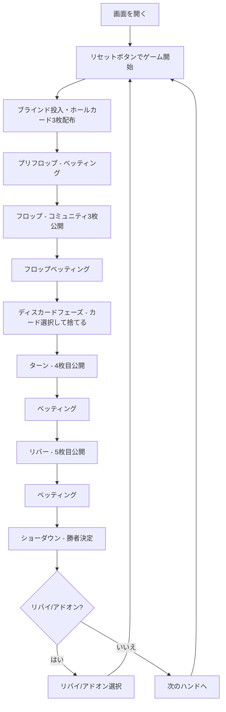

# クレイジーパイナップル（Web版）遊び方

## ゲーム概要

クレイジーパイナップル（Crazy Pineapple）は、Pineapple Poker のバリアントです。各プレイヤーに3枚のホールカードが配られ、**フロップベッティング終了後**に1枚をディスカードします（通常の Pineapple はフロップ公開直後にディスカード）。残り2枚とコミュニティカード5枚から最強の5枚で役を作ります。テーブルサイズは4-max（デフォルト）、6-max、9-max から選択可能です。

## 起動方法

```sh
go run ./cmd/trumpcards web     # CLI経由でWebサーバーを起動
go run ./cmd/server              # 直接Webサーバーを起動
```

ブラウザで `http://localhost:8080` にアクセスし、ナビゲーションバーから「クレイジーパイナップル」を選択します。
ナビバーのJA/ENボタンで日本語・英語を切り替えられます。

## ルール

### 基本ルール

- 52枚のトランプを使用
- 各プレイヤーに3枚のホールカード（手札）が配られる
- 場にコミュニティカード（共有カード）が最大5枚公開される
- **フロップベッティング終了後**、各プレイヤーは1枚をディスカード（捨てる）
- 残り2枚のホールカード + コミュニティカード5枚の計7枚から、最強の5枚の組み合わせで役を作る

### 役一覧（強い順）

Royal Flush > Straight Flush > Four of a Kind > Full House > Flush > Straight > Three of a Kind > Two Pair > One Pair > High Card

### CPUプレイスタイル

TAG（タイトアグレッシブ）、LAP（ルースパッシブ）、TAP（タイトパッシブ）、LAG（ルースアグレッシブ）、GTO（ゲーム理論最適）の5種類。

## ゲームの流れ



## 画面の操作方法

### プリフロップ・フロップ・ターン・リバーフェーズ

ベッティングアクションボタンが表示されます:

- **フォールド**: 手札を捨てて降りる
- **チェック**: パスする（未ベット時のみ）
- **コール**: 現在のベット額に合わせる
- **ベット**: 金額を入力してベットする
- **レイズ**: 金額を入力してレイズする
- **オールイン**: 全チップを賭ける

### ディスカードフェーズ

**フロップベッティングが完了した後**、手札の3枚から捨てるカードを選びます:

1. 手札の中から捨てたい1枚をクリックして選択
2. 「ディスカード」ボタンをクリックして確定

CPUは自動的にディスカードを行います。

### ショーダウン

勝者が決定され、チップが配分されます。負けた場合はマック（手札を伏せる）またはショー（公開）を選択できます。

### キーボードショートカット

| キー | アクション | 有効条件 |
|------|-----------|---------|
| `f` | フォールド | ベッティングフェーズ |
| `c` | コール | ベッティングフェーズ |
| `k` | チェック | ベッティングフェーズ（未ベット時） |

## 画面構成

```
┌────────────────────────────────────────────┐
│  ナビゲーションバー (ゲーム選択・言語切替)     │
├────────────────────────────────────────────┤
│  ゲーム情報 (ブラインド・ハンド数・ポット)      │
├────────────────────────────────────────────┤
│  CPUプレイヤー表示エリア                      │
│  (チップ・ベット額・HUD・カード枚数)           │
├────────────────────────────────────────────┤
│  コミュニティカード (最大5枚)                  │
├────────────────────────────────────────────┤
│  プレイヤー手札 (3枚→ディスカード後2枚)        │
│  チップ・ベット額・HUD統計                    │
├────────────────────────────────────────────┤
│  アクションボタン / ディスカードボタン          │
│  (フェーズに応じて表示が切り替わる)            │
├────────────────────────────────────────────┤
│  メッセージ・CPU行動ログ                      │
└────────────────────────────────────────────┘
```

## 遊び方のコツ

- 3枚のホールカードがあり、フロップベッティングを経験してからディスカードできるため、Pineapple よりも多くの情報に基づいた判断が可能です
- フロップベッティングで相手のアクションを観察し、コミュニティカードとの相性を確認してから弱いカードを捨てましょう
- フラッシュドロー・ストレートドローが完成している場合、ドロー維持に必要な2枚を残します
- 相手も3枚から情報アドバンテージを持って2枚を選ぶため、平均的なハンド強度は Pineapple より高くなりやすいです
- ディスカード後はホールデムと同じ2枚なので、ターン以降の戦略はホールデムと共通です
