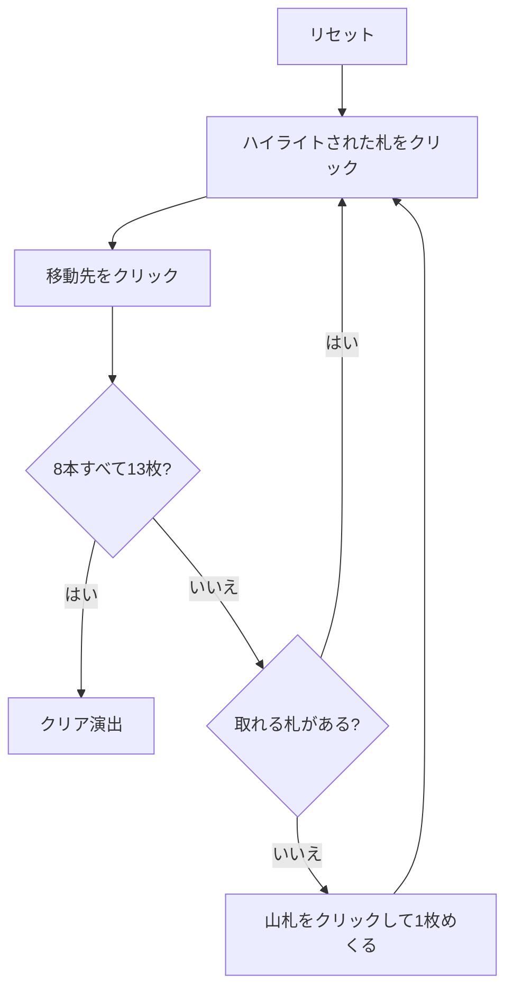

# クレイジーキルト（Web版）遊び方

## ゲーム概要

イギリス発祥の 2 デッキソリティア。インディアンカーペットとも呼ばれる。8×8 の「キルト」に並べた 64 枚を崩しながら、8 本の組札に積み上げる。

肝は**取れる札の条件**。カードは縦置きと横置きを交互に敷いてあり、**短辺が空いている札だけ**が取れる。縦置きなら上か下、横置きなら左か右。**長辺が空いていても取れない**ので、取れる札はハイライトで示している。

## 起動方法

```sh
go run ./cmd/trumpcards web  # CLI経由でWebサーバーを起動
go run ./cmd/server          # 直接Webサーバーを起動
```

ブラウザで `http://localhost:8080` にアクセスし、ナビゲーションバーから「クレイジーキルト」を選択します。
ナビバーのJA/ENボタンで日本語・英語を切り替えられます。

## ルール

- 52 枚 2 組（104 枚）。**各スートの A と K を 1 枚ずつ、計 8 枚を先に抜いて組札に据える**
- 残り 96 枚のうち **64 枚を 8×8 のキルト**に並べ、残り **32 枚が山札**
- 組札は 8 本。前半 4 本は A から K への昇順、後半 4 本は K から A への降順（どちらも同スート）
- **取れるのは短辺が空いている札だけ。** 縦置きは上下、横置きは左右。盤の外は空き扱い
- キルトの札は組札へ送るほか、**捨て札の一番上と数字が 1 つ違いなら捨て札へも置ける**（スートは問わない）
- 山札は 1 枚ずつ捨て札へめくる。**尽きたら捨て札を伏せて 1 度だけ組み直せる**
- 8 本すべてが 13 枚になればクリア

## ゲームの流れ



## 画面の操作方法

| 操作 | 説明 |
|------|------|
| 山札をクリック | 1枚めくって捨て札に置く（尽きたら組み直し） |
| キルトの札をクリック | 移動元として選択する（取れる札だけ押せます） |
| 捨て札をクリック | 移動元として選択する |
| 組札をクリック | 選択中のカードをその組札に置く |
| 捨て札をクリック（キルト選択中に） | キルトの札を捨て札へ置く（数字が1つ違いのとき） |
| ヒントボタン | 打てる手を1つ提示する |
| 元に戻すボタン | 直前の1手を取り消す |
| オートコンプリートボタン | 送れるカードを自動で組札へ送る |
| リセットボタン | 確認ダイアログのうえで最初からやり直す |
| CLI トグル | 同じゲームをコマンド入力で操作するモードに切り替える |

## 画面構成

- **上部**: フェーズ表示（プレイ中 / クリア）、手数
- **中央上**: 8 本の組札（`↑` が A 始まり、`↓` が K 始まり）と、山札・捨て札・組み直しの残り回数
- **中央**: 8×8 のキルト。**取れる札だけがハイライトされ、押せます**
- **下部**: アクションログ、設定、操作ボタン

## 遊び方のコツ

- **長辺が空いても意味が無い。** 縦置きの札は左右がいくら空いても取れません。ハイライトを見るのが確実です
- **1 枚どけると隣の短辺が開きます。** どの順で崩すと連鎖するかがこのゲームの読みどころ
- **捨て札への連番置きが主要な崩し手。** 組札に上げられない札でも、捨て札と 1 つ違いなら動かせます
- **組み直しは 1 度だけ。** 使う前に、キルトから捨て札へ送れる札が残っていないか確認する
- 同じ数字の札は 2 枚あり、昇順・降順の 2 本がそれぞれ 1 枚ずつ必要とするので、片方に入らなくてももう一方が受け入れます

