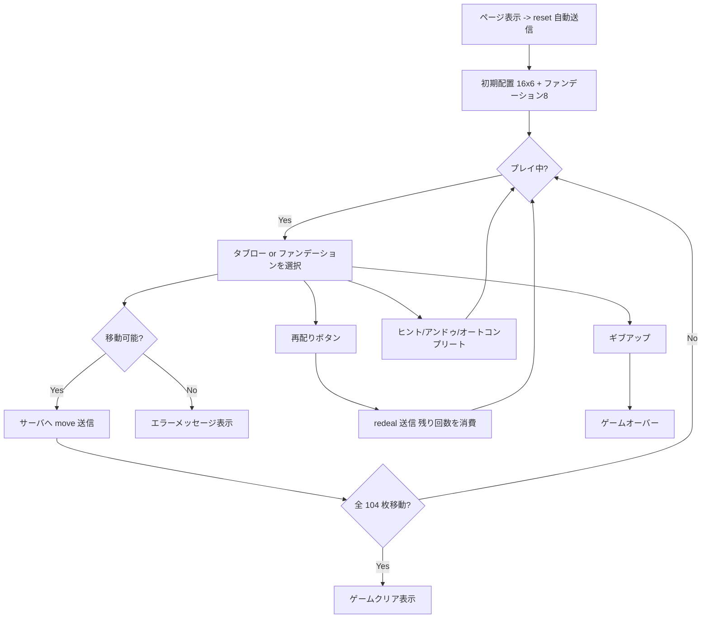

# クレセント・ソリティア（Web版）遊び方

## ゲーム概要

2 デッキ（104 枚）を使用するソリティアです。中央に並ぶ 8 つのファンデーション（A から昇順 4 列、K から降順 4 列）に、周囲を半月状に取り囲む 16 のタブロー山からカードを送り込み、全 104 枚を片付ければゲームクリアです。最大 3 回の再配り（redeal）で行き詰まりを打開できます。

## 起動方法

```sh
go run ./cmd/trumpcards web --open
# ブラウザで http://localhost:8080/crescent を開く
```

## ルール

### 基本ルール

- 2 デッキ 104 枚で遊びます。
- 開始時に各スートの A と K が 1 枚ずつ自動的にファンデーションへ配られます。
- 残り 96 枚は 16 列 × 6 枚のタブローへ表向きで配られます。
- タブロー間移動は **最上段 1 枚のみ**、同じスートで値差 ±1、A↔K の wrap-around を許可します。
- 空になったタブロー列にはカードを置けません。

### ファンデーション配置

- 上段: 昇順ファンデーション 4 列（♠ ♣ ♥ ♦、A → K）
- 下段: 降順ファンデーション 4 列（♠ ♣ ♥ ♦、K → A）

### 再配り

- 「再配り (X 残)」ボタンで実行します（最大 3 回）。
- 各タブロー列のカード順序を **反転** します。
- アンドゥで取り消せます。

### ゲーム終了

- すべてのカードをファンデーションへ移せばクリアです。
- 再配り 0 回かつ合法手が無いと手詰まり扱いになります。アンドゥ脱出ボタンが表示されます。

## ゲームの流れ



## 画面の操作方法

- **タブロー山の最上段カードをクリック** すると選択状態（黄色の枠）になります。
- 続けて移動先のタブロー山やファンデーションをクリックすると移動します。
- ドラッグ＆ドロップでも移動できます。
- フッターのボタンで「再配り」「ヒント」「オートコンプリート」「戻す」「ギブアップ」を実行できます。
- 手詰まり時には「アンドゥして脱出」ボタンが表示されます。

## 画面構成

- ヘッダー: 手数・残り再配り回数・CLI モード切り替え。
- 中央: 4×2 のファンデーション盤（上段が昇順、下段が降順）。
- ファンデーションを囲む 16 のタブロー山（モバイルでは 4×4 グリッド、デスクトップでは半月配置）。
- ヒント表示エリア（ヒント実行後に矢印で案内）。
- フッター: 操作ボタン群。

## 遊び方のコツ

- 同じスートの ±1 連結が長く繋がる列を残すと、後半でファンデーションへの送り込みが楽になります。
- A↔K wrap を活用すると一見袋小路の局面でも逃げ道ができます。
- 再配りは緊急脱出ではなく**戦術的な手段** と捉え、無効化された連結を再活性化するタイミングを見極めましょう。
- アンドゥとオートコンプリートを併用すると、ファンデーション 0 列と 7 列を同時に伸ばす戦略も狙えます。
