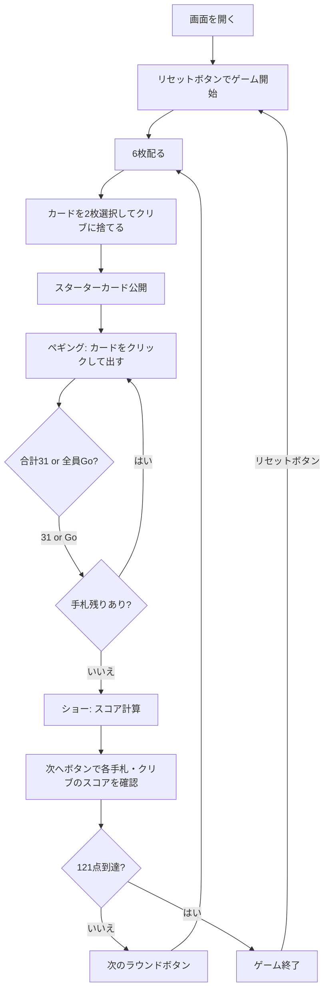

# クリベッジ（Web版）遊び方

## ゲーム概要

2人対戦のカードゲームです。52枚のカードを使い、ペギング（カードを交互に出して得点）とハンドスコアリング（手札の組み合わせで得点）を繰り返し、先に121点に到達したプレイヤーが勝利します。

## 起動方法

```sh
go run ./cmd/trumpcards web     # CLI経由でWebサーバーを起動
go run ./cmd/server              # 直接Webサーバーを起動
```

ブラウザで `http://localhost:8080` にアクセスし、ナビゲーションバーから「クリベッジ」を選択します。
ナビバーのJA/ENボタンで日本語・英語を切り替えられます。

## ルール

### 基本ルール

- 52枚のトランプ（ジョーカーなし）を使用
- 2人対戦（1人 vs CPU）
- 各ラウンドでディーラーが交互に入れ替わる
- 先に121点（設定変更可能）に到達したプレイヤーが勝利

### ラウンドの流れ

1. **ディスカード**: 各プレイヤーに6枚配り、2枚ずつクリブに捨てる
2. **カット**: 山札からスターターカードを1枚公開（Jならディーラーに2点 = His Heels）
3. **ペギング**: 非ディーラーから交互にカードを出し、合計31を目指す
4. **ショー**: 手札4枚+スターターカードの組み合わせでスコア計算

### ペギングの得点

| 条件 | 得点 |
|------|------|
| 合計が15になる | 2点 |
| ペア（同ランク2枚） | 2点 |
| ペアロイヤル（同ランク3枚） | 6点 |
| ダブルペアロイヤル（同ランク4枚） | 12点 |
| ラン（3枚以上の連番） | 枚数分 |
| 合計が31になる | 2点 |
| Go（相手が出せない） | 1点 |
| ラストカード | 1点 |

### ハンドスコアリング（ショーフェーズ）

手札4枚+スターターカードの5枚で以下を計算:

| 組み合わせ | 得点 |
|-----------|------|
| 15の組み合わせ | 各2点 |
| ペア | 各2点 |
| ラン（3枚以上の連番） | 枚数分 |
| フラッシュ（手札4枚同スート） | 4点 |
| フラッシュ（5枚同スート） | 5点 |
| ノブス（スターターと同スートのJ） | 1点 |

### CPU難易度

| 難易度 | 説明 |
|--------|------|
| Easy | ランダムにプレイ |
| Normal | 基本的な戦略でプレイ |
| Hard | 最適なディスカードとペギング戦略 |

## ゲームの流れ



## 画面の操作方法

### ディスカードフェーズ

1. 手札6枚から2枚をクリックして選択します（ハイライト表示）
2. 「捨てる」ボタンで選択したカードをクリブに送ります

### ペギングフェーズ

1. 手札のカードをクリックして出します（合計31以下になるカードのみ選択可能）
2. カードを出せない場合は「Go」ボタンをクリックします
3. CPUは自動でカードを出します

### ショーフェーズ

1. 「次へ」ボタンで各手札とクリブのスコア詳細を順に表示します
   - 非ディーラーの手札 → ディーラーの手札 → クリブ
2. スコアの内訳（15s、ペア、ラン、フラッシュ、ノブス）が表示されます

### ラウンド終了

**「次のラウンド」** ボタンで次のラウンドを開始します。

### 設定変更

設定パネルからCPU難易度と目標点数を変更できます。

### キーボードショートカット

| キー | アクション | 有効条件 |
|------|-----------|---------|

※ テキスト入力欄にフォーカスがある場合、ショートカットは無効になります。

## 画面構成

```
┌────────────────────────────────────────────┐
│              ゲーム情報                     │
│  ラウンド: 1  ディーラー: CPU              │
│  あなた: 12点  CPU: 8点                   │
├────────────────────────────────────────────┤
│           スターターカード                  │
│              [♠J]                          │
├────────────────────────────────────────────┤
│           ペギングエリア                    │
│  合計: 15  [♥3] [♦7] [♠5]               │
├────────────────────────────────────────────┤
│           手札エリア                        │
│  [♥3] [♦7] [♠9] [♣K]                    │
├────────────────────────────────────────────┤
│           クリブ                            │
│  [??] [??] [??] [??]                      │
├────────────────────────────────────────────┤
│  [捨てる] [Go] [次へ] [次のラウンド]      │
│  [リセット] [設定]                         │
└────────────────────────────────────────────┘
```

- **ゲーム情報**: ラウンド番号、ディーラー、各プレイヤーのスコア
- **スターターカード**: カットされたカード（カットフェーズ以降表示）
- **ペギングエリア**: ペギング中に出されたカードと合計値
- **手札エリア**: プレイヤーの手札（クリック可能なカードがハイライト表示）
- **クリブ**: クリブのカード（ショーフェーズまで裏向き）
- **ボタン**:
  - 「捨てる」: 選択した2枚をクリブに捨てる（ディスカードフェーズ）
  - 「Go」: Goを宣言（ペギングフェーズ）
  - 「次へ」: ショーフェーズの次のステップ
  - 「次のラウンド」: 次のラウンドを開始
  - 「リセット」: 新しいゲームを開始
  - 「設定」: CPU難易度・目標点数を変更

## 遊び方のコツ

- ディスカードでは、クリブがディーラーのものであることを意識しましょう
- 自分がディーラーならクリブに良い組み合わせを残し、非ディーラーなら避けましょう
- 15の組み合わせを作りやすいカード（5や10系カード）を手札に残すと高得点になりやすいです
- ペギングでは相手に15や31を作らせないよう注意しましょう
- ランを狙える連番のカードは手札に残しておくと有利です
