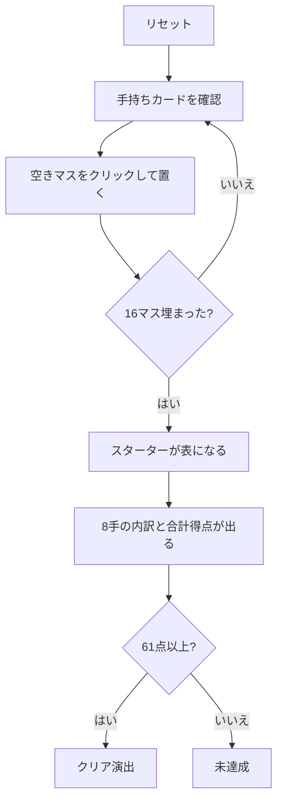

# クリベッジ・スクエアズ（Web版）遊び方

## ゲーム概要

52 枚 1 組から 17 枚だけを使う 1 人用のパズル。4×4 のマスにカードを 1 枚ずつ置いていき、置き終えてから **17 枚目の「スターター」**をめくる。4 行 + 4 列の計 8 手を、それぞれ「その 4 枚 + スターター」のクリベッジの手として採点し、合計 **61 点**以上でクリア。

置いたカードは二度と動かせず、**スターターは最後まで分からない**。8 つの手すべてを、5 枚目が何になるか分からないまま組むことになる。

## 起動方法

```sh
go run ./cmd/trumpcards web  # CLI経由でWebサーバーを起動
go run ./cmd/server          # 直接Webサーバーを起動
```

ブラウザで `http://localhost:8080` にアクセスし、ナビゲーションバーから「クリベッジ・スクエアズ」を選択します。
ナビバーのJA/ENボタンで日本語・英語を切り替えられます。

## ルール

- 52 枚 1 組。山札から 1 枚ずつめくり、**空いているマスならどこにでも**置ける
- 置いたカードは動かせない。16 マスすべて埋まるまで続ける
- 16 枚置き終えたら **17 枚目（スターター）をめくる**
- **4 行 + 4 列の計 8 手**を、それぞれ「4 枚 + スターター」の 5 枚として採点する
  - **15**: 合計 15 になる組合せ 1 つにつき 2 点
  - **ペア**: 同じランク 2 枚につき 2 点（3 枚なら 6 点、4 枚なら 12 点）
  - **ラン**: 3 枚以上の連番 1 つにつき、その枚数ぶんの点
  - **フラッシュ**: 手の 4 枚が同スートなら 4 点、スターターも同スートなら 5 点
  - **ノブズ**: 手の中の J がスターターと同スートなら 1 点
- 8 手の合計が **61 点以上でクリア**

## ゲームの流れ



## 画面の操作方法

| 操作 | 説明 |
|------|------|
| 空きマスをクリック | 手持ちのカードをそこに置く |
| ヒントボタン | 置き場所を1つ提示する |
| 元に戻すボタン | 直前の1手を取り消す（スターターも伏せ札に戻ります） |
| ギブアップボタン | 確認ダイアログのうえで投了する |
| リセットボタン | 確認ダイアログのうえで最初からやり直す |
| CLI トグル | 同じゲームをコマンド入力で操作するモードに切り替える |

## 画面構成

- **上部**: フェーズ表示（プレイ中 / 完了）、配置済み枚数、合計得点
- **中央**: 4×4 のグリッド。各行の右と各列の下にその手の得点
- **中央上**: 手持ちカードと、スターターの置き場（16 枚置き終えるまで裏向き）
- **下部**: 8 手それぞれの得点内訳、アクションログ、設定、操作ボタン

- **対局中は「途中」の内訳が出ます。**スターターは 16 枚置き終えるまでめくらないので、行・列の公式スコアはそこまで 0 のままです。その下に出る小さい数字は**スターター抜きで既に確定している点**で、スターターで増えることはあっても減りません。

## 遊び方のコツ

- **5 と 10 系（10・J・Q・K）は 15 を作る主役。** 5 が来たら 10 系の並ぶ行・列へ、10 系が来たら 5 のある行・列へ寄せる
- **同じランクを 3 枚並べると 6 点、4 枚なら 12 点。** ペアは行と列の両方で数えられるので、縦横が交わる位置に集めると効率が良い
- **フラッシュは 4 点だが 4 枚すべて同スートが必要。** 途中でスートが割れると 0 点なので、狙うなら 1 列を早めに決め打ちする
- **行スコアと列スコアはスターターがめくられるまで 0 のまま。** 4 枚だけの点を出すと本来より低い数字を途中経過だと誤解するため、意図的にそうしている
- ヒントは「その位置に置くと行と列で何点増えるか」で選んでいる。フラッシュとノブズはスターター次第なので数に入れていない

