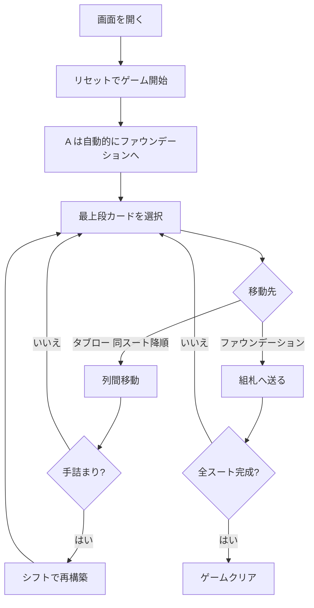

# クルーエル（Web版）遊び方

## ゲーム概要

Cruel（クルーエル）は1人用のクラシックなパズル系ソリティアです。ゲーム開始時に4枚のAは自動的に組札（ファウンデーション）へ配置され、残り48枚のカードを12列×4枚のタブローに表向きで配ります。「同スートで降順」の繋がりだけが認められ、空の列にはカードを置けないという厳しい制約があり、手詰まりになったときには独特な「シフト」アクションで盤面を再構築できます。

## 起動方法

```sh
go run ./cmd/trumpcards web   # CLI経由でWebサーバーを起動
go run ./cmd/server           # 直接Webサーバーを起動
```

ブラウザで `http://localhost:8080` にアクセスし、ナビゲーションバーから「クルーエル」を選択します。
ナビバーの JA/EN ボタンで日本語・英語を切り替えられます。

## ルール

### 配り方

- 4枚のAをファウンデーションへ自動配置
- 残り48枚を12列×4枚のタブローに表向きで配る（左から順に詰めて配布）

### 移動ルール

- **タブロー → タブロー**: 各列の**最上段カードのみ**を移動可能。移動先の最上段カードと**同スートで1つ下の値**である必要があります
- **タブロー → ファウンデーション**: 各列の最上段カードのみ。同じスートで昇順（A→K）
- **空の列にはカードを置けません**（Klondikeとは異なる）
- **シフト**: タブローに残っているカードを左から順に集め、再度12列×4枚に左詰めで配り直すアクション。手詰まり状態から脱出できる場合があります（無制限）

### ゲーム終了

- **クリア**: 4スートすべてがA→Kで揃うとクリア
- **ギブアップ**: いつでもギブアップ可能
- **手詰まり**: 有効な手がない場合、手詰まりと判定されますが、シフトで再構築すれば続行できます

## ゲームの流れ



## 画面の操作方法

### カードの移動

1. 移動したい列の**最上段カード**をクリック（選択状態になる）
2. 移動先の列または組札をクリック
3. ドラッグ&ドロップでも移動可能（最上段カードのみドラッグ可）

### シフト

- フッターの「シフト」ボタンを押すと、残カードを集めて12×4の盤面に並べ直します
- いつでも実行可能。手詰まり時の脱出手段として活用してください

### キーボードショートカット

| キー | アクション | 有効条件 |
|------|-----------|---------|
| S | シフト | プレイ中 |
| H | ヒント | プレイ中 |
| A | オートコンプリート | プレイ中 |
| G | ギブアップ | プレイ中 |
| Z | 元に戻す | アンドゥ可能時 |

## 画面構成

```
┌──────────────────────────────────────────────────────────┐
│   ♠ Foundation   ♣ Foundation   ♥ Foundation   ♦ Foundation │
├──────────────────────────────────────────────────────────┤
│  0   1   2   3   4   5   6   7   8   9  10  11           │
│ [♠5][♥3][♣J][♦Q][♣A][♦7][♠2][♥10][♦8][♣6][♠Q][♥4]       │
│ [♥9][♠Q][♦4][♥6][♠8][♣K][♥J][♠5][♣10][♥7][♦9][♣3]       │
│ [♣7][♦8][♠6][♣4][♥4][♠10][♦3][♣Q][♥K][♠7][♥5][♦J]       │
│ [♦K][♣2][♥10][♠8][♦2][♥Q][♣5][♦6][♠J][♣9][♦10][♥2]      │
├──────────────────────────────────────────────────────────┤
│  [リセット]  [シフト]  [ヒント]  [自動完成]              │
│  [元に戻す]  [ギブアップ]                                │
└──────────────────────────────────────────────────────────┘
```

## 遊び方のコツ

- 各列で動かせるのは**最上段のカードだけ**。Klondikeのように下のカードを掘り出す発想は通用しません
- 序盤はファウンデーションに送れる2のカードを優先的に探しましょう
- 手詰まりになったら「シフト」を試してみてください — 列順序を保ったまま再配置されるため、新しい繋がりが生まれることがあります
- ただしシフトでも必ず解決するとは限りません。シフト前にいくつか異なる手を試して、最も有利な状態を作ってからシフトすると効果的です
- 「元に戻す」でいつでも巻き戻せます。シフトもアンドゥの対象です
