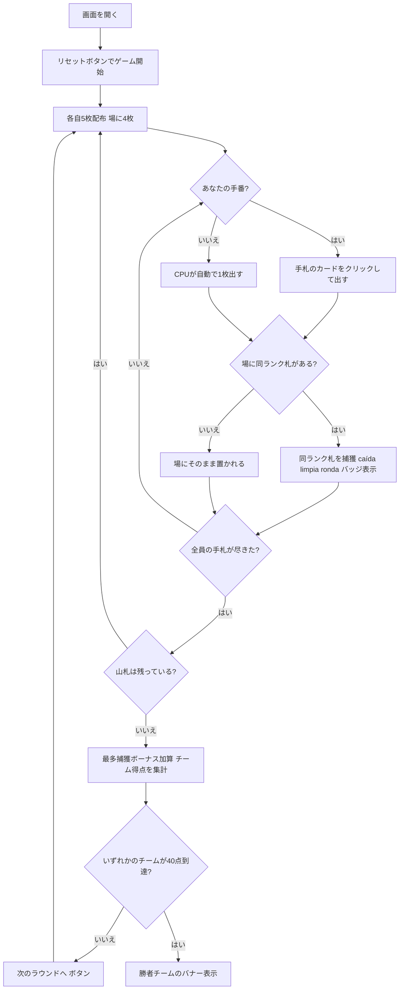

# クアレンタ（Web版）遊び方

## ゲーム概要

Cuarenta（クアレンタ）はエクアドル生まれの4人2チーム制（座席 {0,2}=チームA 対 {1,3}=チームB）の**捕獲（フィッシング）系カードゲーム**です。8・9・10を除いた40枚のスペイン式デッキを使い、各自5枚ずつ配って中央の場に4枚を置きます。自分の手番ではカードを1枚出し、場のカードと**同じランク**があればその同ランク札をすべて捕獲します（同ランクが3枚以上並ぶ「ronda」では連鎖して追加捕獲できます）。捕獲できなければそのカードは場に置かれます。捕獲には caída・limpia・ronda などのボーナスがあり、ラウンド終了時には全40枚の過半数（20枚超）を捕獲したチームに「最多捕獲」ボーナスが入ります。先に目標点（デフォルト40点）に到達したチームの勝利です。

## 起動方法

```sh
go run ./cmd/trumpcards web  # CLI経由でWebサーバーを起動
go run ./cmd/server          # 直接Webサーバーを起動
```

ブラウザで `http://localhost:8080` にアクセスし、ナビゲーションバーから「クアレンタ」を選択します。
ナビバーのJA/ENボタンで日本語・英語を切り替えられます。

## ルール

### デッキと配布

- **デッキ**: 40枚（8・9・10を除いたスペイン式デッキ）
- **プレイヤー**: 4人2チーム（あなた + CPU3人）。座席 {0,2}=チームA、{1,3}=チームB。
- **配布**: 各プレイヤーに5枚ずつ。さらに場の中央に4枚を置きます。
- 手札が全員尽きたら、山札から5枚ずつ配り直します。

### カードを出す・捕獲する

- 自分の番になると、フッターの手札からカードをクリックして出します。
- 出したカードが**場のカードと同じランク**なら、その同ランク札をすべて捕獲します。
- 同ランクが**3枚以上**並んでいる場合（ronda）は、連鎖してまとめて捕獲できます。
- 捕獲できなかった場合、出したカードはそのまま場に置かれます。

### ボーナス（すべて加点）

| 項目 | 内容 | 得点 |
|------|------|------|
| caída（カイダ） | 直前のプレイヤーが置いたカードを即座に捕獲 | +2 |
| limpia（リンピア） | 場のカードをすべて捕獲して空にする | +1 |
| ronda（ロンダ） | 同ランク3枚以上の連を捕獲（2枚を超える1枚ごと） | +1/枚 |

### 最多捕獲ボーナス

- ラウンド終了時、全40枚のうち**過半数（20枚超）**を捕獲したチームに **+6点**。

### ゲーム終了

- 先に**目標点（デフォルト40点）**に到達したチームの勝利です。

### CPU難易度

- **Easy（0）**: ランダムな合法手を選びます。
- **Normal（1）**: 捕獲できる手を優先します。
- **Hard（2）**: caída や ronda など高得点の捕獲を狙います。

## ゲームの流れ



## 画面の操作方法

### プレイフェーズ

- あなたの番になると、フッターの手札カードがクリックできるようになります。
- カードをクリックすると、そのカードを場に出します。場に同ランク札があれば捕獲します。
- 捕獲時には caída・limpia・ronda の結果バッジが表示されます。

### ゲーム終了・結果

- 山札がなくなり全員の手札が尽きると、最多捕獲ボーナスを加算してチーム得点を集計します。
- いずれかのチームが40点に到達すると、勝者チームのバナーが表示されます。
- まだ決着していなければ「**次のラウンドへ**」ボタンで次のラウンドを始められます。

### キーボードショートカット

| キー | アクション | 有効条件 |
|------|-----------|---------|
| （なし） | マウス／タップ操作のみ | — |

## 画面構成

```
┌────────────────────────────────────────────┐
│  クアレンタ        [フェーズ] [CLI切替]      │
├────────────────────────────────────────────┤
│  山札: 16枚    チームA: 0  チームB: 0        │
│                                            │
│  プレイヤー                                 │
│   あなた  (チームA) 捕獲0枚                  │
│   CPU 1  (チームB) 捕獲0枚                   │
│   CPU 2  (チームA) 捕獲0枚                   │
│   CPU 3  (チームB) 捕獲0枚                   │
│                                            │
│  場 — 4枚                                   │
│   [♣7] [♦K] [♠5] [♥7]                      │
├────────────────────────────────────────────┤
│  あなたの手札                               │
│   [♠5] [♥J] [♦A] [♣Q] [♥7]                 │
│  あなたの番です — 手札を1枚選んで出してください│
│  [リセット]                                 │
└────────────────────────────────────────────┘
```

- **上部バー**: ゲーム名・現在のフェーズ・CLIモード切替。
- **情報行**: 山札の残り枚数とチームA・チームBの累計得点（先に40点で勝利）。
- **プレイヤー一覧**: 各プレイヤーの所属チーム・捕獲枚数・手番の状態。
- **場**: 中央の場に出ているカードと枚数。捕獲時には caída・limpia・ronda のバッジが表示されます。
- **フッター**: あなたの手札（クリックで出す）・次のラウンドへ／リセットの各ボタン。

## 遊び方のコツ

- **caída を狙う**: 直前のプレイヤーが置いたカードと同ランクの札を出すと +2点。相手の捨て札をよく観察しましょう。
- **limpia で一掃**: 場のカードをすべて捕獲すると +1点に加え、相手の caída の機会も奪えます。
- **ronda の連鎖**: 同ランクが3枚以上並んだら、まとめて捕獲して追加点を稼ぎましょう。
- **最多捕獲を意識**: ラウンドで20枚超を捕獲すると +6点と大きいので、終盤は枚数も意識しましょう。
- **難易度で調整**: Hard のCPUは caída や ronda を狙ってきます。慣れないうちは Easy で練習しましょう。
