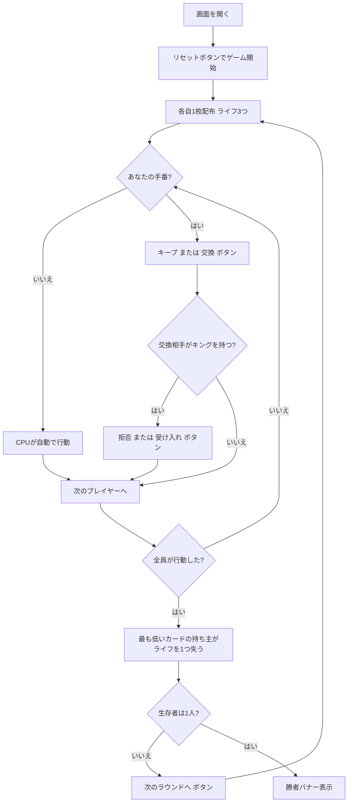

# カッコー（Web版）遊び方

## ゲーム概要

Cuckoo（カッコー、別名 **Chase the Ace** / **Ranter-Go-Round**）は4人で遊ぶ**ライフ・サバイバルゲーム**です。各プレイヤーは1枚のカードと3つの**ライフ**を持ちます。自分の手番では、手札をそのまま**キープ**するか、**隣のプレイヤーと交換**します（親は山札と交換します）。**キング**を持っていれば、隣からの交換を**拒否**できます（キングを公開します）。全員が行動したあと、**最も低いカード**の持ち主がライフを1つ失います（同点なら全員）。ライフが0になると**脱落**し、最後まで生き残ったプレイヤーが勝者です。

## 起動方法

```sh
go run ./cmd/trumpcards web  # CLI経由でWebサーバーを起動
go run ./cmd/server          # 直接Webサーバーを起動
```

ブラウザで `http://localhost:8080` にアクセスし、ナビゲーションバーから「カッコー」を選択します。
ナビバーのJA/ENボタンで日本語・英語を切り替えられます。

## ルール

### デッキと配布

- **デッキ**: 52枚（標準デッキ）
- **プレイヤー**: 4人（あなた + CPU3人）
- **ライフ**: 各自3つ（初期ライフは設定で変更可能）
- **配布**: 各プレイヤー1枚。残りは山札になります。

### 手番と拒否

- **手番フェーズ**: 自分の番になると、手札をそのまま残す「キープ」か、隣のプレイヤーと交換する「交換」を選びます。**親**のときは山札と交換します。ボタンの横に**誰と交換するか**が表示されます（脱落者は飛ばされるので、席順の隣とは限りません）。
- **拒否フェーズ**: 交換を仕掛けられた側が**キング**を持っている場合、「拒否（キングを見せる）」で交換を防ぐか、「受け入れる」で交換を許します。

### ラウンド解決

- 全員が行動したあと、**最も低いカード**の持ち主がライフを1つ失います（同点なら全員）。
- ライフが0になったプレイヤーは脱落します。

### 勝利条件

- 脱落せずに最後まで生き残ったプレイヤーの勝利です。

### CPU難易度

- **Easy（0）**: 弱気でやや不利な判断をしがち。
- **Normal（1）**: 標準的な判断。
- **Hard（2）**: 手堅く有利な判断をする。

## ゲームの流れ



## 画面の操作方法

### 手番フェーズ

- あなたの番になると、フッターに「**キープ**」と「**交換**」のボタンが現れます。
- **親**のときは「交換」が「**山札と交換**」になります。

### 拒否フェーズ

- あなたがキングを持っていて交換を仕掛けられると、「**拒否（キングを見せる）**」と「**受け入れる**」のボタンが現れます。

### ラウンド終了・結果

- ラウンドが終わると、最も低いカードを持っていてライフを失ったプレイヤーが表示され、「**次のラウンドへ**」ボタンが現れます。
- 生存者が1人になるとゲーム終了。勝者バナーが表示されます。

### キーボードショートカット

| キー | アクション | 有効条件 |
|------|-----------|---------|
| （なし） | マウス／タップ操作のみ | — |

## 画面構成

```
┌────────────────────────────────────────────┐
│  カッコー          [フェーズ] [CLI切替]     │
├────────────────────────────────────────────┤
│  ラウンド 1   親: CPU 3   山札: 47枚         │
│                                            │
│  プレイヤー                                 │
│   あなた  ♥♥♥                              │
│   CPU 1  ♥♥♥                               │
│   CPU 2  ♥♥♥                               │
│   CPU 3  ♥♥♥                               │
├────────────────────────────────────────────┤
│  あなたのカード                             │
│   [5♠]                                     │
│  あなたの番です — キープか交換を選んでください│
│  [キープ] [交換] [リセット]                 │
└────────────────────────────────────────────┘
```

- **上部バー**: ゲーム名・現在のフェーズ・CLIモード切替。
- **情報行**: ラウンド数・親・山札の枚数。
- **プレイヤー一覧**: 各プレイヤーのライフ（♥）・脱落／手番の状態・キング公開の有無。
- **フッター**: あなたのカード・キープ／交換／拒否／受け入れ／次のラウンド／リセットの各ボタン。

## 遊び方のコツ

- **低いカードは交換**: 低いランクを持っていたら積極的に交換を狙いましょう。
- **キングは盾**: キングを引いたら交換を拒否できます。生き残りの切り札です。
- **親は山札頼み**: 親のときは隣ではなく山札と交換するため、結果が読みにくくなります。
- **難易度で調整**: Hard のCPUは手堅い判断をします。慣れないうちは Easy で練習しましょう。
