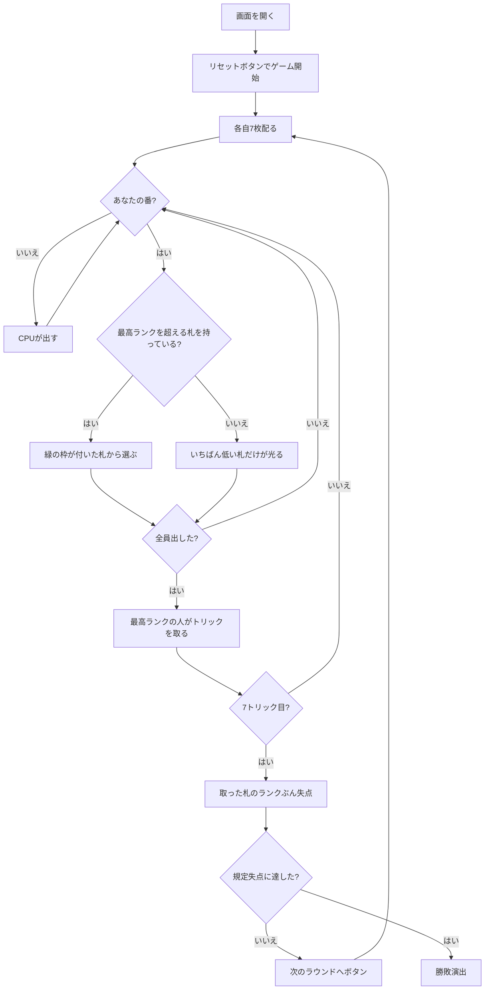

# キューカンバー（Web版）遊び方

## ゲーム概要

スウェーデン・フィンランドの**変則トリックテイキング**（グルカとも）。**スートは一切関係ありません。** いま出ている最高ランクより高い札を持っていれば必ずそれを出し、無ければ手札のいちばん低い札を出します。**失点が付くのは最終トリックを取った1人だけ**で、そのトリックを取った札のランクぶん失点します。3〜6人で遊べます。

## 起動方法

```sh
go run ./cmd/trumpcards web  # CLI経由でWebサーバーを起動
go run ./cmd/server          # 直接Webサーバーを起動
```

ブラウザで `http://localhost:8080` にアクセスし、ナビゲーションバーから「キューカンバー」を選択します。
ナビバーのJA/ENボタンで日本語・英語を切り替えられます。

## ルール

- **各自7枚固定。** 52枚は3人・5人・6人で割り切れないので、人数で割らずに7枚配ります（3〜6人で21/28/35/42枚を使用）
- リードの人は**どの札でも**出せます
- 以降の人は、**いま出ている最高ランクより高い札を持っていれば必ずそれを出します**（スート不問）
- **1枚も持っていなければ、手札のいちばん低い札を出します**
- 選べるのは「どの高い札を出すか」だけ。出さない自由も、低い札を温存する自由もありません
- ランクは A がいちばん強く（14）、K・Q・J・10…2 と下がります
- トリックは**最高ランクを出した人**が取ります。同ランクなら先に出したほうが勝ちです
- **失点が付くのは最終トリック（7トリック目）を取った1人だけ**で、そのトリックを取った札のランクぶん
- 途中のトリックは何枚取っても**0点**。危険なのは**終盤に高い札が残っていること**だけです
- 誰かが規定の失点（既定30点）に達したら終了。**失点がいちばん少ない人の勝ち**

## ゲームの流れ



## 画面の操作方法

| 操作 | 説明 |
|------|------|
| 手札のカードをクリック | そのカードを出す（出せる札には緑の枠が付きます） |
| 次のラウンドへボタン | ラウンド終了の結果を読んだあとに押す |
| 人数（設定） | 3〜6人。リセットすると反映されます |
| 終了失点（設定） | 20 / 30 / 50 点。誰かが到達したらゲーム終了です |
| ヒントボタン | 出すべき札を提示する |
| ギブアップボタン | 投了する |
| リセットボタン | 確認ダイアログのうえで最初からやり直す |
| CLI トグル | 同じゲームをコマンド入力で操作するモードに切り替える |

**更新できないときは、いちばん低い札1枚だけに緑の枠が付きます。** 選択の余地がないことが見て分かります。

## 画面構成

```
┌────────────────────────────────────────────┐
│ ラウンド 3   トリック 5/7   30点で終了      │
├────────────────────────────────────────────┤
│ スートは一切関係ない。最高ランクを超えるか、 │
│ 超えられなければ最低札を切る                │
├────────────────────────────────────────────┤
│           超えるべきランク: 9               │
├────────────────────────────────────────────┤
│  あなた: 手札3枚 / 失点12点                 │
│  CPU1 [最終トリックで11点]: 手札3枚 / 失点11点│
│  CPU2: 手札3枚 / 失点0点                    │
│  CPU3: 手札3枚 / 失点5点                    │
├────────────────────────────────────────────┤
│              現在のトリック                 │
├────────────────────────────────────────────┤
│ 9 より高い札を出してください                │
├────────────────────────────────────────────┤
│  あなたの手札（出せる札に緑の枠）           │
└────────────────────────────────────────────┘
```

- **上部**: ラウンド数、`トリック 5/7`（現在番号と1ラウンドの総数）、終了失点。**失点が付くのは最終トリックだけ**なので、あと何回で判定かはここで読みます
- **規則帯**: このゲームの核心。**スートが関係ない**ことを常に出します
- **超えるべきランク**: **これが盤面の全て**です。スートが無いので、これ以外に手掛かりはありません
- **席の行**: 手札の枚数と失点。**失点がそのまま順位**なので、得点表示はありません
- **`[最終トリックで N 点]`**: 直前のラウンドで失点を負った席。盤面に痕跡が残らないので明示します
- **促しの行**: 「N より高い札」「いちばん低い札を出すことになります」「リードです」を言い分けます
- **下部**: 自分の手札。**出せる札だけ**に緑の枠が付きます

## 遊び方のコツ

- **高い札は早めに使う。** 最終トリックに A や K が残っているのがいちばん危険です
- **更新は最小限で。** 9 を超えるのに A を使う必要はありません。10 で足りるなら 10 です
- **終盤に手札が弱いほど安全。** 更新できなければ低い札を捨てるだけで、失点は付きません
- **相手の失点を見る。** 上限に近い相手が居るなら、そのまま押し切ればゲームが終わります
- **途中のトリックは何枚取っても0点。** 取ること自体を怖がる必要はありません
