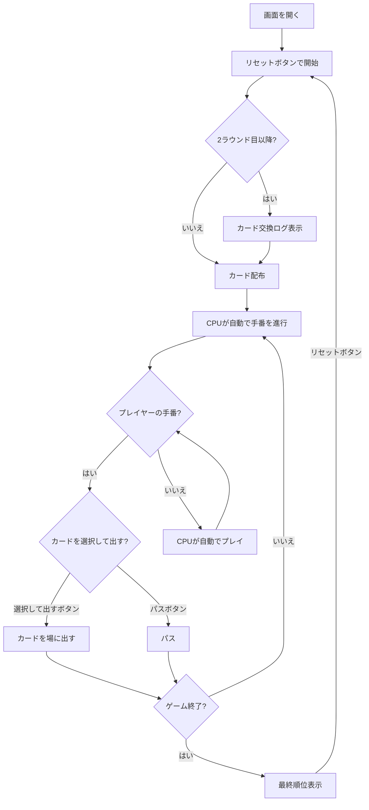

# 大富豪（Web版）遊び方

## ゲーム概要

4人（プレイヤー1人 + CPU 3人）で遊ぶカードゲームです。手札を場に出していき、最初に手札をなくしたプレイヤーが「大富豪」、最後まで残ったプレイヤーが「大貧民」になります。

## 起動方法

```sh
go run ./cmd/cli web        # CLI経由でWebサーバーを起動
go run ./cmd/server         # 直接Webサーバーを起動
```

ブラウザで `http://localhost:8080` にアクセスし、ナビゲーションバーから「Daifugo」を選択します。

## ルール

### カードの強さ（通常時）

```
弱い ← 3 < 4 < 5 < 6 < 7 < 8 < 9 < 10 < J < Q < K < A < 2 → 強い
```

ジョーカーは常に最強です。

### デッキ

52枚の標準トランプ + ジョーカー2枚（合計54枚）

### 順位

| 順位 | 称号 |
|------|------|
| 1位 | 大富豪 |
| 2位 | 富豪 |
| 3位 | 平民 |
| 4位 | 大貧民 |

### ローカルルール（全て有効）

| ルール | 説明 |
|--------|------|
| 8切り | 8を出すと場が流れ、出したプレイヤーが続けて出せる |
| スート縛り | 同じスートが2連続で出ると、以降そのスートのカードしか出せない |
| 11バック | Jを出すとカードの強さが一時的に逆転する |
| 階段 | 同じスートの連続3枚以上を一度に出せる |
| カード交換 | 2ラウンド目以降、大富豪⇔大貧民で2枚、富豪⇔平民で1枚を交換 |
| 革命 | 4枚同時出しでカードの強さが永続的に逆転（再度4枚出しで元に戻る） |

## ゲームの流れ



## 画面の操作方法

### カードの選択と出し方

1. 自分の手札からカードをクリックして選択します（黄色枠で強調）
2. 複数枚出す場合は複数枚をクリックして選択します
3. **「選択して出す」** ボタンをクリックしてカードを場に出します

### パス

- **「パス」** ボタンをクリックしてパスします

### その他のボタン

- **「リセット」** ボタン: 新しいラウンドを開始

### 操作の制限

- プレイヤーの手番以外はカードのクリックとボタンが無効化されます
- プレイヤーのターンのCPUパネルには「考え中...」が表示されません

## 画面構成

```
┌────────────────────────────────────────────┐
│            CPU プレイヤーエリア             │
│ ┌──────────┐ ┌──────────┐ ┌──────────┐   │
│ │ CPU 1    │ │ CPU 2    │ │ CPU 3    │   │
│ │ 13枚     │ │ 上がり   │ │ 13枚     │   │
│ │          │ │大富豪    │ │考え中... │   │
│ └──────────┘ └──────────┘ └──────────┘   │
├────────────────────────────────────────────┤
│  【革命中】 【スート縛り: SPADE】          │
│  【11バック】 【階段】                      │
├────────────────────────────────────────────┤
│         場札: [♠10] [♠J]                  │
│       (出したプレイヤー: CPU 1)            │
├────────────────────────────────────────────┤
│  カード交換ログ:                           │
│    大貧民 → 大富豪: JOKER, 2              │
│    大富豪 → 大貧民: 3, 4                  │
├────────────────────────────────────────────┤
│  [リセット] [パス] [選択して出す]          │
├────────────────────────────────────────────┤
│            プレイヤーの手札                 │
│  [♠3] [♣5] [♥8] [♦K] [JOKER] ...        │
└────────────────────────────────────────────┘
```

- **ルールバッジ**: 「革命中」（赤）、「11バック」（黄）、「スート縛り」（青 + スート名）、「階段」（紫）がリアルタイムで表示
- **場札**: 現在場に出ているカードが表向きで表示
- **カード交換ログ**: 2ラウンド目以降のカード交換内容
- **CPU行動ログ / プレイヤー行動ログ**: 直近の行動が表示

## カード交換（2ラウンド目以降）

ラウンド開始時に前ラウンドの結果に基づいてカード交換が自動で行われ、ログに表示されます:

- 大貧民 → 大富豪: 最も強いカード2枚
- 大富豪 → 大貧民: 最も弱いカード2枚
- 平民 → 富豪: 最も強いカード1枚
- 富豪 → 平民: 最も弱いカード1枚
