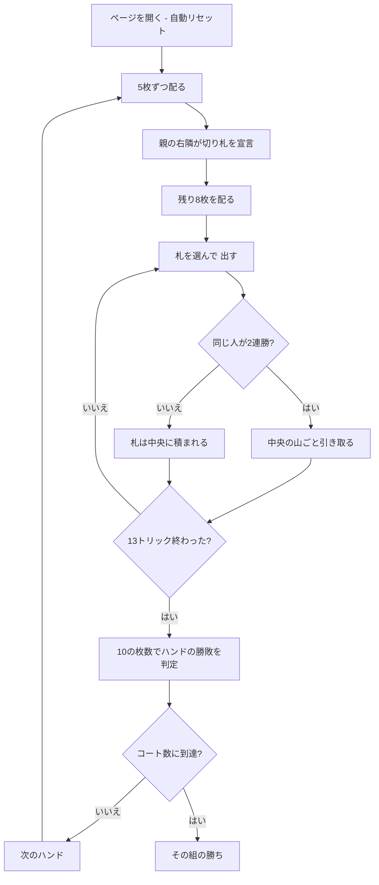

# デーラ・パカド（Web版）遊び方

## ゲーム概要

デーラ・パカド（Dehla Pakad、「**10 を掴む**」）はインド・パキスタンで広く遊ばれているトリックテイキングです。52 枚を 4 人・2 対 2 で使い、あなたは席 0、**相方は向かいの CPU 2** です（隣は必ず相手）。

勝敗を決めるのはトリック数ではなく、**各スートの 10（デーラ）を何枚取ったか**です。そして一番の特徴は ── **トリックを取っても札はもらえません**。

## 起動方法

```sh
go run ./cmd/trumpcards web
# または
go run ./cmd/server
```

ブラウザで `http://localhost:8080` にアクセスし、ナビゲーションバーから「デーラ・パカド」を選択します。
ナビバーのJA/ENボタンで日本語・英語を切り替えられます。

## ルール

### 配りは 2 回に分かれる

まず **5 枚だけ**配り、**親の右隣**がその 5 枚だけを見て**切り札を宣言**します。宣言してから残り 8 枚を配ります。13 枚全部を見てから決められるわけではない、というのがこの手順の意味です。あなたが宣言する番なら、スートのボタンが並びます。

### 札の強さ

A > K > Q > J > 10 > 9 > … > 2。リードスート必従で、切り札は台札スートより常に強くなります。出せる札はフッターでハイライトされます。

### **札は 2 連勝ではじめて手に入る**

これがこのゲームの心臓部です。

- トリックを取っても、その 4 枚は**中央に積まれるだけ**です。
- **同じ人が 2 トリック続けて取った**とき、はじめてその人が**山ごと**引き取ります。
- ただし**最終（13 番目）のトリック**の勝者は、連勝でなくても山を引き取ります。

画面中央には「中央の山」が常に出ていて、**何枚あって、うち 10 が何枚か**、そして**誰が次のトリックも取れば山を持っていくか**が分かります。

### ハンドの勝敗（左右非対称）

| 10 の枚数 | 結果 |
|-----------|------|
| どちらかが 4 枚 | **コート（Kot）**を 1 つ獲得 |
| 親でない組が 2 枚か 3 枚 | 親でない組の勝ち |
| 親側が 3 枚 | 親側の勝ち |

**2 対 2 は親でない組の勝ち**です。親側だけが 3 枚を要求される、この非対称が判定の要になります。

### 親の移動と 7 連勝

**親が動くのは親側が勝ったときだけ**で、親でない組が勝つと親は据え置きです。だからこそ同じ組が勝ち続けることが起こり、**7 連勝でもコートを 1 つ**獲得します。規定のコート数（既定 2、1〜5）に先に届いた組がマッチの勝者です。

## ゲームの流れ



## 画面の操作方法

- **切り札を宣言**: あなたが親の右隣のハンドでは、4 つのスートのボタンが出ます。見えているのは最初の 5 枚だけです。
- **出す**: 手札から札を選び「出す」を押します。**出せる札だけがハイライト**されます。
- **次のハンド**: 10 の枚数が確定したら押して次へ進みます。
- **設定**: CPU難易度、勝利に必要なコート数（1〜5）、ヒントの ON/OFF を切り替えられます。

## 画面構成

- **ヘッダー**: ゲーム名・フェーズ表示・**ハンド番号と切り札**・CLI 切り替え
- **中央**: 現在のトリックと、**中央の山**（枚数・うち 10 の枚数・次に取れば誰が持っていくか）
- **情報サイドバー**: 各席の組・親バッジ・**チーム別の 10 の枚数とコート数**・連勝数・ハンド履歴
- **フッター**: あなたの手札（出せる札がハイライト）・アクションボタン

## 遊び方のコツ

- **「取れるか」ではなく「取って、次も取れるか」。** 1 回取るだけでは何も手に入りません。中央に 10 が乗っているときこそ、連勝の形を作りにいきましょう。
- **相手が王手をかけているときは、必ず割り込む。** 相手が直前のトリックを取っているなら、次を取らせた瞬間に山ごと持っていかれます。
- **味方が王手のときは 10 を乗せる。** 山が味方に渡るのが確実なら、抱えている 10 はそこで放すのが得です。
- **2 対 2 は親でない組の勝ち。** 自分が親側のハンドでは、10 を 3 枚取らないと勝てません。1 枚重い勝負だと意識してください。
