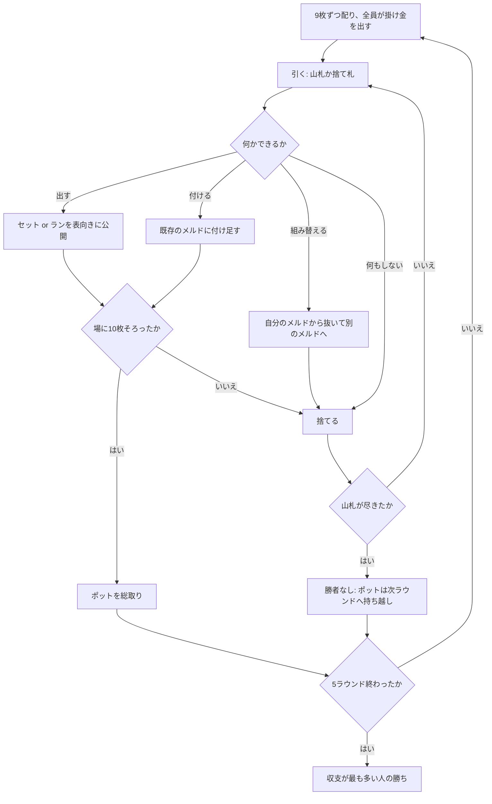

# デスモチェ（Web版）遊び方

## ゲーム概要

ニカラグアのラミー。52 枚を使い、**ちょうど 10 枚**（配札 9 枚 + 引いた 1 枚）をメルドに組み切った人がポットを取ります。

**役の強さは一切関係ありません。**名前とポットのせいでポーカーの親戚に見えますが、勝敗を決めるのは「先に組み切ったか」だけです。

出典: [Wikipedia: Desmoche](https://en.wikipedia.org/wiki/Desmoche) / [gambiter](https://gambiter.com/rummy/Desmoche.html)

## 起動方法

1. `go run ./cmd/trumpcards web` でサーバーを起動します
2. ブラウザで `http://localhost:8080` を開きます
3. ゲーム一覧から **デスモチェ** を選ぶか、`/desmoche` へ直接アクセスします

## ルール

- **デッキ**: 52 枚（ジョーカーなし）
- **人数**: 4 人（原典は 2〜4 人）
- **配札**: 各自 **9 枚**。1 枚を表にして捨て札の起点にし、残りが山札
- 全員が同額の掛け金を出してポットを作ります

### 手番

1. **引く** — 山札から 1 枚、または捨て札の一番上を取る
2. **出す・付ける・組み替える**（任意）
3. **捨てる** — 1 枚捨てて手番終了

### メルドは 2 種類

| 種類 | 条件 |
|---|---|
| **セット** | 同じランク 3 枚以上 |
| **ラン** | 同じスートの 3 枚以上の並び。A は上（Q-K-A）か下（A-2-3）の一方だけで、K-A-2 のように跨げません |

メルドは**表向きに場へ出します**。伏せて溜め込む形ではありません。

### 上がりは「ちょうど 10 枚」

引いた直後の手札は 10 枚です。**その 10 枚すべてをメルドにできた時点で上がり**、ポットを総取りします。捨てる札が残らないので、上がった手番に捨て札はありません。

3 + 3 + 3 の 9 枚で手札が尽きても**上がりではありません**。10 枚に届いていないので、次の手番に引き直して付け足す必要があります。

### desmoche — この game の名前になっている手

**「desmoche」は上がりの宣言ではありません。**自分が場に出したメルドから 1 枚を抜き、別のメルドに使い回す手のことです。

- 抜けるのは**自分のメルドから**だけです
- 抜いたあとのメルドが 3 枚未満になったり、種別として壊れたりする場合は認められません
- 移す先のメルドとして成立しない札も動かせません

`♥4-5-6-7` と `♠7 ♣7 ♦7` が場にあるとき、`♥7` をランから抜いてセットに回せます。ランは `♥4-5-6` として有効なまま残ります。

### 誰も上がらなかったら

**山札が尽きるまで誰も 10 枚を組めなければ、そのラウンドは勝者なしです。**ポットはそのまま次のラウンドへ持ち越され、全員が新たに掛け金を足します。ポットは膨らんでいきます。

5 ラウンド戦い、収支が最も多い人が勝ちです。

## ゲームの流れ

## 操作

| 操作 | 説明 |
|------|------|
| **山札から引く** / **捨て札を取る** ボタン | 手番の最初に押します |
| 手札のカードをクリック | 選択します（複数選べます） |
| **メルド** ボタン | 選択中の札をメルドとして出します |
| **付ける** ボタン | 選択中の 1 枚を、選んだメルドに付けます |
| **組み替え** ボタン | 自分のメルドから選んだ 1 枚を、別のメルドへ移します |
| **捨てる** ボタン | 選択中の 1 枚を捨てて手番を終えます |
| **次のラウンド** ボタン | 精算を読んだあと、次のラウンドへ進みます |
| **ヒント** トグル | 推奨する手をハイライトします |
| **CLI** トグル | ターミナル風の操作に切り替えます |

## 画面構成

- **ヘッダー**: ラウンド数、山札の残り、**ポット**
- **ルール表示**: 常時表示します。「ちょうど 10 枚」と「ポーカーの役は使わない」が最も誤解されやすい 2 点です
- **捨て札**: 一番上の 1 枚。取るかどうかの判断材料です
- **場のメルド**: 種類（セット／ラン）と出した席、札の並び。付け札と組み替えの対象として選べます
- **プレイヤー**: 収支と「場に n/10 枚」。メルドは表向きなので、誰が何枚届いていないかは全員に見えます
- **手札**: 自分の手札。CPU の手札は裏向きで枚数のみ
- **アクションログ**: 進行を後から追えます

## 遊び方のコツ

- **9 枚で止まらないように組む。**3+3+3 で綺麗に収めると 1 枚足りません。3+3+4 か 3+7 のように、10 枚で割り切れる形を狙ってください
- **組み替えは詰めの手です。**あと 1 枚足りないとき、既存のランから端の札を抜いてセットに回すと届くことがあります
- 捨てるときは、**どこにも繋がらない札**から。同ランクや同スートの近いランクは残しておくと次のメルドに育ちます
- **持ち越しポットは全員に効きます。**誰も上がれない硬直したラウンドのあとは、多少無理でも先に組み切る価値が上がります
