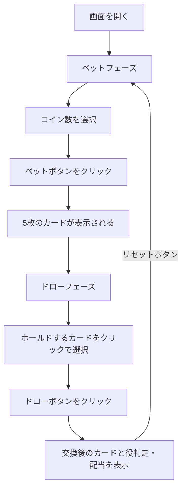

# デューシーズワイルド（Web版）遊び方

## ゲーム概要

1人用カジノカードゲームです。52枚のトランプを使い、5枚のカードでポーカーの役を作ります。すべての2がワイルドカードとして扱われ、他の任意のカードの代わりになります。Deuces Wild専用のペイテーブルに基づいて配当が支払われます。

## 起動方法

```sh
go run ./cmd/trumpcards web        # CLI経由でWebサーバーを起動
go run ./cmd/server                # 直接Webサーバーを起動
```

ブラウザで `http://localhost:8080` にアクセスし、ナビゲーションバーから「デューシーズワイルド」を選択します。
ナビバーのJA/ENボタンで日本語・英語を切り替えられます。

## ルール

### 基本ルール

- 52枚のトランプ（ジョーカーなし）を使用
- すべての2（デュース）がワイルドカード
- 1〜5コインをベットしてゲーム開始
- 5枚のカードが配られる
- 残したいカード（ホールド）を選び、残りを交換
- 最終的な5枚の手札で役を判定し、配当を支払い

### 配当表（Deuces Wild）

| 役 | 1コイン | 2コイン | 3コイン | 4コイン | 5コイン |
|----|---------|---------|---------|---------|---------|
| ナチュラルロイヤルフラッシュ | 250 | 500 | 750 | 1000 | 4000 |
| フォーデュース | 200 | 400 | 600 | 800 | 1000 |
| ワイルドロイヤルフラッシュ | 25 | 50 | 75 | 100 | 125 |
| ファイブカード | 15 | 30 | 45 | 60 | 75 |
| ストレートフラッシュ | 9 | 18 | 27 | 36 | 45 |
| フォーカード | 5 | 10 | 15 | 20 | 25 |
| フルハウス | 3 | 6 | 9 | 12 | 15 |
| フラッシュ | 2 | 4 | 6 | 8 | 10 |
| ストレート | 2 | 4 | 6 | 8 | 10 |
| スリーカード | 1 | 2 | 3 | 4 | 5 |

### ワイルドカード

- すべての2（デュース）は任意のカードとして扱える
- ナチュラルロイヤルフラッシュ: ワイルドなしのロイヤルフラッシュ（最高配当）
- ワイルドロイヤルフラッシュ: ワイルドを含むロイヤルフラッシュ
- フォーデュース: 4枚の2が揃う特別役
- ファイブカード: ワイルドを使って同じランク5枚

## ゲームの流れ



## 画面の操作方法

### ベットフェーズ

1. **コイン数選択**: コインセレクター（1〜5）でベット額を設定
2. **「ベット」ボタン**: クリックでベットを確定し、5枚のカードが配られる

### ドローフェーズ

1. **カード選択**: ホールドしたいカードをクリックして選択（選択したカードはハイライト表示）
2. **再クリック**: 選択を解除
3. **「ドロー」ボタン**: ホールドしていないカードを交換し、役を判定

### 結果フェーズ

1. 最終的な5枚のカードと役名が表示されます
2. 配当額が表示されます
3. **「リセット」ボタン**: 新しいラウンドを開始
4. **「棋譜を見る」ボタン**: アクションログを表示

### キーボードショートカット

| キー | アクション | 有効条件 |
|------|-----------|---------|
| `b` | ベット | ベットフェーズのみ |
| `d` | ドロー | ドローフェーズのみ |
| `r` | リセット | 結果フェーズのみ |
| `1`〜`5` | 各カードのホールド切替 | ドローフェーズのみ |

※ テキスト入力欄にフォーカスがある場合、ショートカットは無効になります。

## 画面構成

```
┌────────────────────────────────────────────┐
│           チップ: 100                       │
├────────────────────────────────────────────┤
│  配当表                                     │
│  ナチュラルロイヤルフラッシュ 250 500 750 1000 4000 │
│  ...                                       │
│  スリーカード              1   2   3   4    5    │
├────────────────────────────────────────────┤
│                                            │
│  [♠A] [♥2] [♦K] [♣3] [♠J]               │
│  HOLD  HOLD  HOLD                          │
│                                            │
│  スリーカード  配当: 9                       │
├────────────────────────────────────────────┤
│  [ドロー] [棋譜を見る]                      │
└────────────────────────────────────────────┘
```

## 遊び方のコツ

- 5コインベットでナチュラルロイヤルフラッシュの配当が大幅に増える（250→4000）ため、可能なら最大ベットがお得
- 2（デュース）は常にホールドする
- デュースを持っている場合、より高い役を狙いやすい
- デュースなしの場合はJacks or Betterより最低配当条件が厳しい（スリーカード以上が必要）
