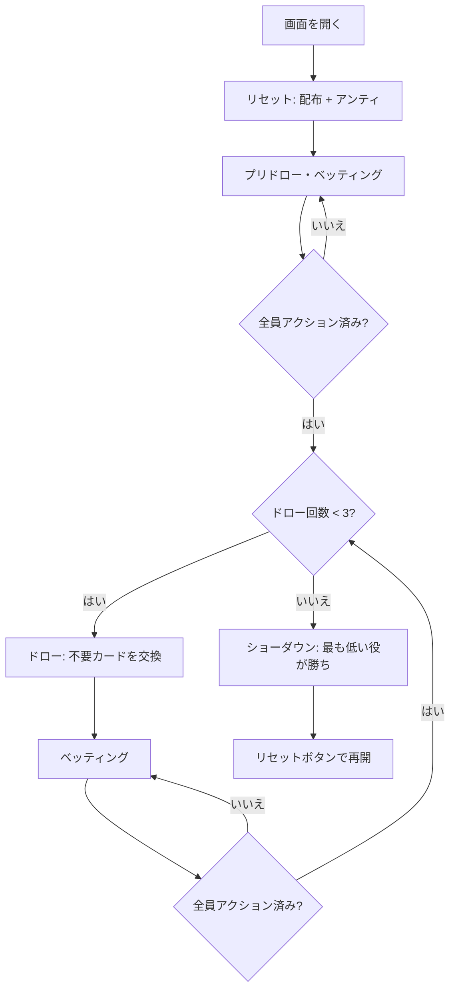

# デューストゥセブン（Web版）遊び方

## ゲーム概要

2-7 トリプルドロー（Deuce to Seven Triple Draw）は WSOP でも人気のローボールドローポーカーです。各プレイヤーに5枚が配られ、3回のドロー（交換）と4回のベッティングラウンドを経て、**ストレートやフラッシュを含まない、最も数字の低い5枚**を目指します。エースは常にハイカードとして扱われ、ストレート・フラッシュはローでは不利に働きます。最強の手は **7-5-4-3-2（セブンロー）** です。

## 起動方法

```sh
go run ./cmd/trumpcards web        # CLI経由でWebサーバーを起動
go run ./cmd/server                # 直接Webサーバーを起動
```

ブラウザで `http://localhost:8080` にアクセスし、ナビゲーションバーから「デューストゥセブン」を選択します。ナビバーのJA/ENボタンで日本語・英語を切り替えられます。

## ルール

### 基本ルール

- 52枚のトランプを使用（ジョーカーなし）
- 各プレイヤーに5枚配布
- 最大3回のドロー（交換）
- ベッティングラウンドは計4回（ディール後・各ドロー後）
- ショーダウンでは通常のポーカー役として読み、最も弱い（低い）役が勝ち
- エースは常にハイ。A-2-3-4-5 はストレートにならず「エースハイ」のハイカード
- ストレート・フラッシュは成立し、ローでは不利（最悪クラス）
- 同じ役カテゴリ内ではカードを高い方から比較し、低い方が勝ち

### ハンドの強さ（弱い役ほど強いロー）

| 強さ | 例 | 説明 |
|------|----|------|
| 最強 | 7-5-4-3-2 | ペア・ストレート・フラッシュなしの最小手（ナッツ） |
| 強 | 8-6-4-3-2 | 8以下のメイドロー |
| 中 | 10-7-5-3-2 | ハイカードが9〜J |
| 弱 | ペア / Q+ ハイ | ワンペアやクイーン以上のハイカード |
| 最弱 | ストレート / フラッシュ | ローでは負け札 |

### ベッティングアクション

| アクション | 説明 |
|-----------|------|
| フォールド | 手札を捨ててラウンドから降りる |
| チェック | ベットせずにパスする（未ベット時のみ） |
| コール | 現在のベット額に合わせる |
| ベット | 新たにベットする（未ベット時のみ） |
| レイズ | 現在のベット額を上げる |
| オールイン | 全チップを賭ける |

### リミット

Fixed Limit / Pot Limit / No Limit の3種類から設定できます。Fixed Limit ではラウンド1〜2はスモールベット、ラウンド3〜4はビッグベット（= 2×）が適用されます。

## ゲームの流れ



## 画面の操作方法

### ベッティングフェーズ

自分の手番が来ると、画面下部にアクションボタンが表示されます。

**ベットが出ていない場合:**
- **「ベット」**: ベット額を入力してベットする
- **「チェック」**: パスする

**ベットが出ている場合:**
- **「コール」**: 現在のベット額に合わせる
- **「レイズ」**: ベット額を入力してレイズする
- **「フォールド」**: 降りる

### ドローフェーズ

- 交換したいカードをクリックして選択（選択中は金色のボーダーが付く）
- **「交換」** ボタンで選択枚数ぶんカードを引き直す
- **「スタンド」** ボタンは交換なし（スタンドパット）。8以下のローが完成しているとスタンド推奨バナーが表示されます

### 設定

画面下部の「設定」パネルから次の項目を変更できます。変更後は「リセット」ボタンを押して新しい設定で開始してください。

- **ベッティングリミット**: Fixed / Pot Limit / No Limit
- **メタAI**: CPUがあなたのプレイスタイルを学習
- **ヒント**: 推奨アクションを表示

### キーボードショートカット

| キー | アクション | 有効条件 |
|------|-----------|---------|
| 数字 1-5 | カードの選択 | ドローフェーズ |
| Enter | 「交換」実行 | ドローフェーズ |
| Escape | 選択をクリア | ドローフェーズ |

## 画面構成

```
┌──────────────────────────────────────────────────────┐
│  フェーズインジケータ: ポット / ディーラー / ドロー #  │
├──────────────────────────────────────────────────────┤
│  CPU プレイヤー (1〜3) + 行動ログ                      │
│                                                      │
│  (ショーダウン時にCPUの手札と役が公開される)          │
├──────────────────────────────────────────────────────┤
│  あなたの手札 (5枚)                                    │
│  [メッセージ領域]                                      │
│  [ベットコントロール or 交換/スタンドボタン]           │
│  [設定パネル] [リセットボタン]                         │
└──────────────────────────────────────────────────────┘
```

## 遊び方のコツ

- 8以下のメイドロー（例: 8-6-4-3-2）が完成したら迷わずスタンドパット
- ペア・ストレート・フラッシュは負け札。ドローで崩して低い手を狙う
- エースは常にハイ。A入りの手はローとしては弱い
- CPU の交換枚数は強さのシグナル — 0枚交換はメイドハンド、複数枚は未完成のドロー
- Fixed Limit では後半（ラウンド3〜4）がビッグベット。前半で仕掛け過ぎると苦しくなる
