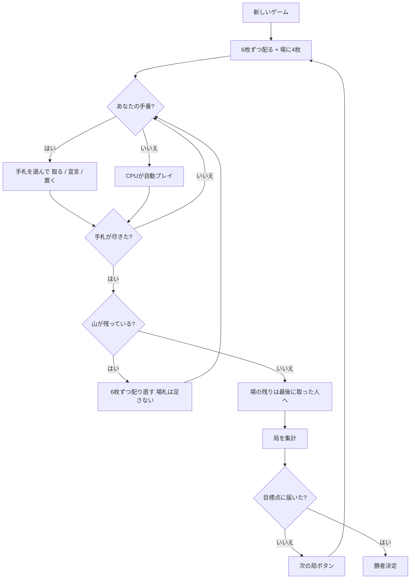

# ディロティ（Web版）遊び方

## ゲーム概要

ディロティ（Diloti / Δηλωτή）はギリシャの**フィッシング**系カードゲームです。**52 枚**の標準デッキを使い、あなたと CPU の 2 人で戦います。

名前はギリシャ語の **δηλώνω（宣言する）** から来ていて、**宣言**でカードの束を作れるのがこのゲームの中心です。そして **1 枚で場を払い切る「クセリ（ξερή）」は 10 点** ── 1 局の固定点が 11 点しかないので、クセリを取れるかどうかで局が決まります。

## 起動方法

```sh
go run ./cmd/trumpcards web
# または
go run ./cmd/server
```

ブラウザで `http://localhost:8080` にアクセスし、ナビゲーションバーから「ディロティ」を選択します。
ナビバーのJA/ENボタンで日本語・英語を切り替えられます。

## ルール

### 配りと場

各プレイヤーに **6 枚**ずつ配り、場に **4 枚**を表向きに置きます。両者の手札が尽きたら山から **6 枚ずつ配り直します**が、**場札は足しません**。山が尽きたらその局は終わりです。

先に打つのは**親でないほう**です。この実装では最初の親を CPU にしてあるので、あなたが先に打てます。

### 札の値

- A は **1**
- 2〜10 はそのままの数
- **J・Q・K は値を持ちません**（合計には一切参加しません）

### 捕獲

出した札の**ランクと同じ合計**になる場札の組を取ります。

1. **同じ値の 1 枚** — 5 を出して場の 5 を取る
2. **合計が一致する組** — 5 を出して場の 2 と 3 を取る
3. **1 手で複数の組** — 10 を出して「3+5」と「2」と「10」を同時に取る

**「合計 10 に固定」ではありません。** 基準は出した札のランクです。

### 絵札の特別扱い

**絵札（J・Q・K）はちょうど 1 枚しか取れません。** 場に J が 2 枚あっても、J で取れるのは片方だけです。絵札は合計にも参加しません。

そして **同じランクの絵札が場にあるときは、その絵札を場に置けません。** 取るしかありません。

### 宣言（このゲームの名前）

出した札と場の緩い札をまとめ、**2〜10 の値**を宣言して 1 つの束にします。

- **裏付けが要ります。** 宣言した値と同じ札を手札に残していなければ宣言できず、**取り切るまでその札を他に使えません**
- **宣言を抱えている間は場に置けません**（取るか、宣言を取り切るか）
- **単一宣言**は相手が札を足して**値を上げられます**（上限は 10）。上げた側が新しい約束を負います
- **グループ宣言**（同じ値の束を 2 つ以上にしたもの）は**上げられず**、値ちょうどの **1 枚で丸ごとしか取れません**（部分的には取れません）

絵札は宣言に使えません。

### クセリ（ξερή）

**1 枚で場の札と宣言をすべて払い切ると「クセリ」で 10 点。**

- **その局の初手はクセリになりません**（配った直後の 4 枚を払っても数えません）
- **山が尽きたときの取り残しの回収もクセリではありません**

### 局の集計

| 項目 | 点 |
|------|-----|
| 最多枚数 | 4（26 対 26 ならどちらにも入りません） |
| エース | 1 枚につき 1（合計 4） |
| 10♦ | 2 |
| 2♣ | 1 |
| クセリ | 1 回につき **10** |

固定点は **11 点**だけです。クセリが乗るぶんだけ差が開きます。

### 勝敗

**61 点**（設定で 21〜101）に先に届いた側の勝ちです。同点のまま並んだら次の局へ持ち越します。

## ゲームの流れ



## 画面の操作方法

- **手札を選ぶ**: 出す札を 1 枚選びます。選ぶと、その札で**取れる組**と**宣言できる値**が候補として並びます。
- **取る**: 候補の組を押すとその組を取ります。場札と宣言をまとめて指す候補もあります。
- **宣言する**: 宣言の候補を押すと、その値で束を作ります。**宣言値と同じ札は取り切るまで使えません。**
- **場に置く**: 取る手も宣言も選ばないときに押します。**宣言を抱えている間と、同ランクの絵札が場にあるときは押せません。**
- **次の局**: 集計を読んだら押して次へ進みます。
- **設定**: CPU難易度、目標点（21〜101）、ヒントの ON/OFF を切り替えられます。

## 画面構成

- **ヘッダー**: ゲーム名・フェーズ表示・**局と山の残り**・CLI 切り替え
- **中央**: 場札（番号付き）と宣言の束、選んだ手札で取れる組・宣言できる値の候補
- **情報サイドバー**: 各席の取り札枚数・**クセリ回数**・通算得点、局の集計の内訳
- **フッター**: あなたの手札・アクションボタン

## 画面の見方（CLI モード）

```
局 1（61 点勝負）
山の残り: 36 枚
あなた （子）: 取り札 0 枚　クセリ 0　得点 0
[0]♣4  [1]♥10  [2]♠6  [3]♠J  [4]♥4  [5]♦K
CPU 1  （親）: 取り札 0 枚　クセリ 0　得点 0
----------
場: [0]♣9  [1]♠9  [2]♥K  [3]♣2
宣言[0] 8（単一 / CPU 1 ）: ♠3+♥5
手番: あなた
  [0]♣4 で宣言できる: 6:(3)
  [5]♦K で取れる: (2)
```

**場札にも宣言にも番号が付いています。** 取る対象はこの番号で指します ── 場札はそのまま `1`、宣言は `d` を前置して `d0` です。

「で取れる」「で宣言できる」の行が要点です。同ランク・合計一致・宣言が混ざるので、どの札で何ができるかを端末が並べます。CLI モードでは `take 5 2` で手札 5 番（♦K）が場の 2 番（♥K）を取り、`declare 0 6 3` で手札 0 番（♣4）と場の 3 番（♣2）が 6 を宣言します。通常モードでは同じことをボタンで選びます。

**絵札は A/J/Q/K と表示されます。** 絵札は合計に参加しないので、11・12・13 と数字で出ると「足せそう」に見えてしまうためです。
