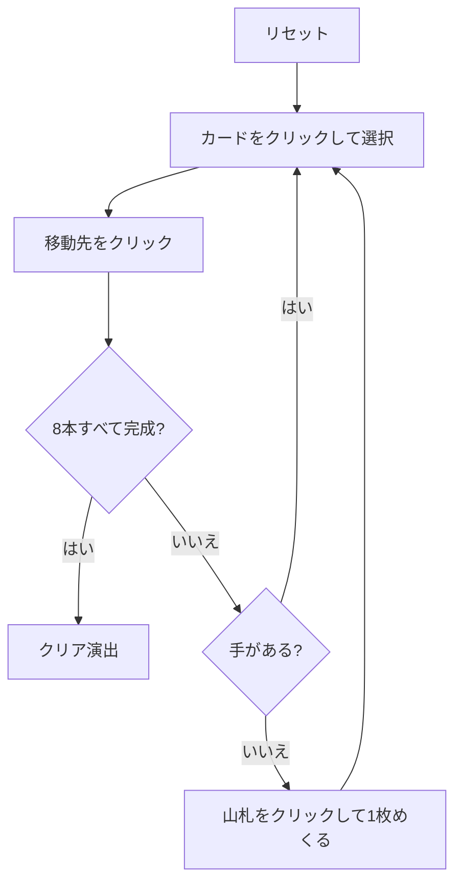

# ディプロマット（Web版）遊び方

## ゲーム概要

アメリカ発祥の 2 デッキソリティア。8 列に 4 枚ずつ配り、8 本の組札に A から K まで積み上げる。

Forty Thieves 系の「易しい版」と呼ばれる理由はひとつ — **タブローがスートを問わない**こと。あちらは同スートの降順しか繋げないが、こちらは数字さえ 1 つ下なら何でも重ねられる。それでも動かせるのは各列の一番上 1 枚だけで、まとめ移動は無い。

## 起動方法

```sh
go run ./cmd/trumpcards web  # CLI経由でWebサーバーを起動
go run ./cmd/server          # 直接Webサーバーを起動
```

ブラウザで `http://localhost:8080` にアクセスし、ナビゲーションバーから「ディプロマット」を選択します。
ナビバーのJA/ENボタンで日本語・英語を切り替えられます。

## ルール

- 52 枚 2 組（104 枚）。**8 列に 4 枚ずつ、計 32 枚**を表向きで配り、残り 72 枚が山札
- **組札は 8 本**（スートごとに 2 本）。最初は空で、A が出たらそこへ置き、同スートで K まで積む
- **タブローはスートを無視した降順**。9 の上には数字 8 のカードなら何でも置ける
- 動かせるのは各列の**一番上 1 枚だけ**
- **空いた列にはどのカードでも置ける。** 別の列か捨て札から 1 枚を移す（山札から直接は置けない）
- 山札は 1 枚ずつ捨て札へめくる。**めくり直しは無い（1 巡のみ）**
- 8 本すべてが K まで揃えばクリア

## ゲームの流れ



## 画面の操作方法

| 操作 | 説明 |
|------|------|
| 山札をクリック | 1枚めくって捨て札に置く |
| 捨て札・列をクリック | 移動元として選択する（もう一度押すと解除） |
| 組札をクリック | 選択中のカードをその組札に置く |
| 列をクリック（選択中に） | 選択中のカードをその列に置く（空き列も可） |
| ヒントボタン | 打てる手を1つ提示する |
| 元に戻すボタン | 直前の1手を取り消す |
| オートコンプリートボタン | 送れるカードを自動で組札へ送る |
| リセットボタン | 確認ダイアログのうえで最初からやり直す |
| CLI トグル | 同じゲームをコマンド入力で操作するモードに切り替える |

## 画面構成

- **上部**: フェーズ表示（プレイ中 / クリア）、手数
- **中央上**: 8 本の組札と、山札の残り枚数・捨て札の一番上
- **中央**: 8 列のタブロー。各列は重ねて表示され、一番下（手前）が動かせるカード。**列頭が A になった列には「行き止まり」の帯**が付きます（A の上には何も置けないため。その A 自体は組札へ送れます）
- **下部**: アクションログ、設定、操作ボタン

## 遊び方のコツ

- **スートを気にしない代わりに、数字の並びだけを見る。** 同じ数字が 8 枚あるので置き先は思ったより多くあります
- **空き列は最強の資源。** どのカードでも置けるので、埋めるのは急がず、詰まったときの逃げ場として温存する
- **A と 2 は見つけ次第すぐ組札へ。** 埋もれると掘り出す手数が跳ね上がります。列頭に残した A は「行き止まり」の帯が付き、その列は組札へ送るか空にするまで受け皿になりません
- **深い列の下に沈んだ札は、上の札を全部どかさないと出てきません。** 序盤に長い列を作りすぎないこと
- 山札はめくり直しが無いので、捨て札に流す前に置ける場所がないか毎回確認する

