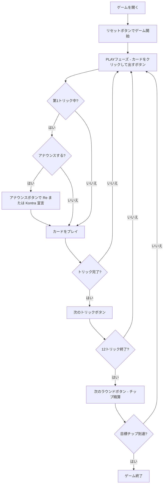

# ドッペルコップ（Web版）遊び方

## ゲーム概要

Doppelkopf（ドッペルコップ）はドイツで広く親しまれているトリックテイキングゲームです。48枚の二重デッキ（9,10,J,Q,K,A × 4スート × 各2枚）を4人（1人の人間 + 3人のCPU）でプレイします。切り札が26枚と非常に多く、Q♣2枚の持ち主が秘密裏に「Reチーム」を形成するチップ賭け形式です。相手チームのメンバーはラウンド終了まで隠されています。Reチームが240点満点中121点以上を獲得すれば勝利です。

## 起動方法

```sh
go run ./cmd/trumpcards web        # REST API + Web GUI サーバを起動
go run ./cmd/trumpcards web --open # 起動してブラウザを開く
```

ブラウザで `/doppelkopf` にアクセスします。

## ルール

### デッキと配布

- **デッキ**: 48枚（9,10,J,Q,K,A × ♠♣♥♦ × 各2枚）
- **プレイヤー**: 4人（あなた = プレイヤー0、CPU1〜3）
- **配布**: 各プレイヤー12枚

### 固定切り札（26枚）

強い順: **♥10（Dulle）> Q♣ > Q♠ > Q♥ > Q♦ > J♣ > J♠ > J♥ > J♦ > A♦ > 10♦ > K♦ > 9♦**

各カードは2枚ずつあります。同じカードが2枚出た場合、**先に出した方が勝ちます（ドゥッレのルール）**。

### フェイルスート（♣♠♥）

Q・J・♥10を除くカードで構成。強さ: **A > 10 > K > 9**（♥スートは♥10が切り札のためA,K,9のみ）

### チームの決定

Q♣（♣クイーン）2枚の持ち主2人が **Reチーム**、残り2人が **Kontraチーム** になります。1人が両方のQ♣を持つ場合はソロRe（1対3）です。あなたは自分のチームを知っていますが、相手のチームはラウンド終了まで非公開です。

### カード点数と勝利条件

| カード | 点数 |
|--------|------|
| A | 11点 |
| 10 | 10点 |
| K | 4点 |
| Q | 3点 |
| J | 2点 |
| 9 | 0点 |

全カードの合計は240点。Reチームは **121点以上** で勝利（Kontraは120点以上）。

### アナウンスメント

第1トリック中に **Re** または **Kontra** を宣言するとチップが×2になります（両方宣言で×4）。

## ゲームの流れ



## 画面の操作方法

### PLAYフェーズ

- あなたの手番のとき、手札のカードをクリックして選択します。
- **「出す」ボタン**: 選択したカードをプレイします。リードスートに従う義務があります（切り札は切り札スート扱い）。
- **「アナウンス」ボタン**: 第1トリック中のみ有効。クリックするとReまたはKontraを宣言します（チップ賭け金×2）。
- **「次のトリック」ボタン**: トリックが解決したら次へ進みます。
- **「次のラウンド」ボタン**: 12トリック終了後にチップを精算して次のラウンドへ進みます。

### キーボードショートカット

| キー | アクション | 有効条件 |
|------|-----------|---------|

## 画面構成

```
┌─────────────────────────────────────────────┐
│  Doppelkopf (ドッペルコップ) [JA/EN] [CLI]  │
├─────────────────────────────────────────────┤
│  ラウンド: 1  トリック: 1  フェーズ: PLAY    │
├──────────┬──────────────────────────────────┤
│  CPU1    │                                   │
│  CPU2    │     現在のトリック表示エリア       │
│  CPU3    │     （各プレイヤーの出したカード）  │
│          │                                   │
├──────────┼──────────────────────────────────┤
│  チップ表 │  メッセージ / 結果表示            │
│  各PL得点 │  チーム情報（Reチームは公開後）   │
├──────────┴──────────────────────────────────┤
│  あなたの手札（クリックで選択）               │
│  [♥10][Q♣][Q♣][J♠][A♠][10♠]...           │
│  [出す] [アナウンス] [次のトリック] [次のラウンド] │
└─────────────────────────────────────────────┘
```

- **ヘッダー**: ゲーム名・フェーズ表示・言語切り替えトグル・CLI切り替えトグル。
- **ラウンド／トリック表示**: 現在のラウンド番号とトリック番号。
- **プレイヤー表示エリア（左）**: CPU各プレイヤーの手札枚数・チップ残高・チーム（ラウンド終了後に公開）を表示。
- **トリック表示エリア（中央）**: 場に出ているカードと出したプレイヤー名。
- **チップ表（左下）**: 各プレイヤーのチップ残高。
- **メッセージボックス**: フェーズ・勝敗・チーム公開・得点の案内。アナウンスメント宣言の結果もここに表示されます。
- **フッター（手札エリア）**: あなたの手札と操作ボタン（出す/アナウンス/次へ）。

## 遊び方のコツ

- **Q♣の枚数確認**: ゲーム開始時に手札のQ♣を確認しましょう。2枚持っていれば確実にReチームです。Q♣が1枚ならパートナーが誰かを探しながらプレイします。
- **ドゥッレ（♥10）の活用**: 最強の切り札♥10は2枚あります。相手の♥10に対して2枚目を温存して奪取できると大きな優位になります。
- **アナウンスのタイミング**: 第1トリック中のみ宣言できます。手が強いと確信したときにReを宣言するとチップが2倍になります。ただし弱い手での宣言は大きなリスクです。
- **切り札の温存**: 強いQ系・J系は高得点トリックの奪取やラストトリック狙いに取っておきましょう。
- **フェイルスートのリード**: 相手の切り札を消費させてからトランプを枯らすのが基本戦術です。
- **パートナーの把握**: 相手がQ♣を出したときやReアナウンスをしたときにパートナーが判明します。それまでは全員が敵の可能性があるため、高得点カードの扱いに注意しましょう。
- **点数管理**: A（11点）と10（10点）を多く取ることが勝利への近道です。240点中121点以上がReチームの目標です。
- **ソロReへの対処**: 相手がソロReの場合は3人協力して切り札を温存し、高得点カードを守ることが重要です。
