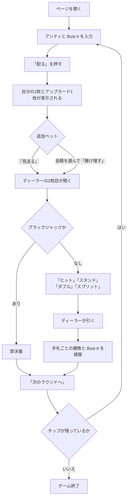

# 追加ベット・ブラックジャック（Web版）遊び方

## ゲーム概要

追加ベット・ブラックジャックは、アメリカ・アトランティックシティ発祥のブラックジャック派生です。**10 を抜いた 48 枚のスパニッシュデッキ**を 8 組（384 枚）使います。

最大の特徴は**情報が届く順番**です。ディーラーはまずアップカードを 1 枚だけ見せ、それを見てからプレイヤーは**アンティと同額まで賭け増し**できます。ディーラーの 2 枚目が配られるのは、その決定の後です。

その有利さの対価として、**プレイヤーのブラックジャックは 1:1**（通常の 3:2 ではありません）。

> このゲームの商品名は日本で商標登録されているため、本プロジェクトでは機能を表す名前で呼んでいます。詳細は [`TRADEMARKS.md`](../../../TRADEMARKS.md) を参照してください。

## 起動方法

```sh
go run ./cmd/trumpcards web  # CLI経由でWebサーバーを起動
go run ./cmd/server          # 直接Webサーバーを起動
```

サーバ起動後、ブラウザで `http://localhost:8080/doubleattack` を開きます。

## ルール

- デッキは **10 を除いた 48 枚 × 8 組**。絵札（J・Q・K）は残っています。
- アンティを置きます。任意で **Bust It** サイドベットも置けます。
- プレイヤーに 2 枚、ディーラーに**アップカード 1 枚**を配ります。
- アップカードを見て、**アンティと同額まで追加ベット**できます（0 で見送り）。
- 追加ベットを決めた後に**ディーラーの 2 枚目**が配られます。
- 以降は通常のブラックジャック進行です。
  - ヒット / スタンド
  - ダブル（最初の 2 枚のときだけ）
  - スプリット（同じ数字 2 枚。4 手まで。**エースを割ったら 1 枚ずつで打ち止め**）
- **ディーラーはソフト 17 でヒット**します。
- **プレイヤーのブラックジャックは 1:1**。通常勝利も 1:1、引き分けはプッシュです。
- **自分が全部バストしても、ディーラーは引き切ります。** Bust It が生きているためです。
- Bust It はディーラーがバストしたときだけ、**バスト時の手札枚数**に応じて払われます。

## ゲームの流れ



## 画面の操作方法

| 操作 | 説明 |
|------|------|
| アンティ入力 | 10〜500 で指定します |
| Bust It 入力 | 任意のサイドベット。0 のままなら置きません |
| 「配る」 | アンティを確定して配ります |
| 追加ベット入力 ＋「賭け増す」 | **アンティと同額まで**。上限はサーバが返す値に従います |
| 「見送る」 | 追加ベットを置かずに進みます（0 を送ります） |
| 「ヒット」 | 1枚引きます |
| 「スタンド」 | 打ち止めにします |
| 「ダブル」 | 最初の2枚のときだけ押せます |
| 「スプリット」 | 同じ数字2枚のときだけ押せます |
| 「次のラウンドへ」 | 決着後、次のラウンドを始めます |
| ヒントボタン | いまの場面の定石を表示します |
| 棋譜ボタン | これまでの行動ログを表示します |
| リセットボタン | ゲームを最初からやり直します |

**ダブルとスプリットの可否、追加ベットの上限はサーバが決めています。** 画面はその値に従うだけなので、押せないときはボタンが出ません。

## 画面構成

- **フェーズ表示**: `BET`（賭け）/ `ATTACK`（追加ベット）/ `PLAY`（プレイ）/ `RESULT`（決着）
- **ディーラー**: `ATTACK` の間は**アップカード 1 枚だけ**で、点数も出ません。これは伏せているのではなく、**サーバがまだ 2 枚目を持っていない**ためです（1 枚だけの点数も 2 枚目の手掛かりになるので出しません）
- **自分の手札**: スプリットすると複数行になり、操作中の手札が強調されます。各行に点数と賭け金が出ます
- **賭けの表示**: アンティ / 追加ベット / Bust It
- **決着**: 手札ごとの勝敗、そのラウンドの収支、そして **Bust It に賭けた回はその当たり外れ**（`Bust It 的中: +60` / `Bust It: 外れ`）。**外れた回も行を出します**——何も出ないと、賭けたこと自体が無かったように見えるためです
- **チップ**: 現在の持ちチップ

## 遊び方のコツ

- **アップカードが弱い（2〜6）ときが賭け増しどころ**です。ディーラーがバストしやすいので、追加ベットが活きます。
- 逆に**強いアップカード（7〜A）では見送る**のが基本です。10 が抜けているぶんディーラーはバストしにくく、賭け増しは損になりがちです。
- **ブラックジャックが 1:1 である**ことを忘れないでください。通常のブラックジャックの感覚で強気に賭けると期待値が合いません。
- Bust It は**ディーラーが何枚でバストしたか**で配当が変わります。3 枚バストは約 15% 起きるので配当は控えめ、7 枚以上は極めて稀です。ハウスエッジは 5.21% です。
