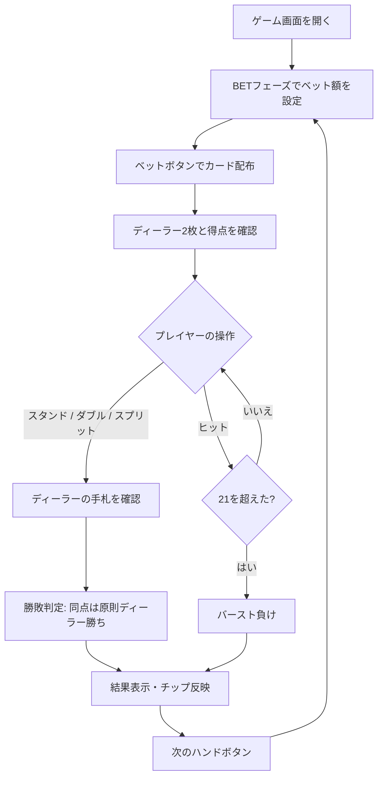

# ダブルエクスポージャー・ブラックジャック（Web版）遊び方

## ゲーム概要

ダブルエクスポージャー・ブラックジャックは、1979年に考案されたアメリカのカジノゲームです。ディーラーの2枚のカードが最初から両方とも表向きになるため、手札と得点を完全に確認してプレイできます。その代わり、通常の同点負けとブラックジャックの等倍配当が適用されます。

## 起動方法

```sh
go run ./cmd/trumpcards web  # CLI経由でWebサーバーを起動
go run ./cmd/server          # 直接Webサーバーを起動
```

ブラウザで `http://localhost:8080` にアクセスし、ナビゲーションバーから「ダブルエクスポージャー・ブラックジャック」を選択します。ナビバーのJA/ENボタンで日本語・英語を切り替えられます。

## ルール

### ブラックジャックとの3つの違い

- ディーラーの2枚は最初から両方とも表向きで、得点も表示されます。
- 同点は原則としてディーラーの勝ちです。ただし、ナチュラルブラックジャック同士だけはプレイヤーの勝ちです。
- プレイヤーのナチュラルブラックジャックは3:2ではなく1:1（等倍）で配当されます。

### 共通ルール

6〜8組のデッキを使用します。ヒット、スタンド、スプリット、ダブルは標準ブラックジャックと同じで、21を超えた手は即座にバースト負けになります。完全情報という利点と、同点負け・配当切り下げを交換してバランスを取ったゲームです。

## ゲームの流れ



## 画面の操作方法

### ベットフェーズ

ベット額を入力またはスライダーで設定し、ベットボタンを押します。カード配布後はディーラーの2枚と得点が表示されます。

### プレイフェーズ

ヒット、スタンド、ダブル、スプリットのボタンで操作します。ディーラーの手札が常に公開されているため、得点とバースト可能性を確認しながら選択できます。

### 結果フェーズ

勝敗、同点負け、またはナチュラルブラックジャックの1:1配当を確認し、次のハンドボタンで続けます。

### キーボードショートカット

| キー | アクション | 有効条件 |
|------|-----------|---------|
| `h` | ヒット | プレイフェーズ |
| `s` | スタンド | プレイフェーズ |
| `d` | ダブル | プレイフェーズ |
| `sp` | スプリット | プレイフェーズ（ペア時） |

## 画面構成

```
┌────────────────────────────────────────────┐
│ Double Exposure Blackjack   [JA] [EN]      │
├────────────────────────────────────────────┤
│ Dealer: ♠K ♥6   Score: 16                  │
│ Player: ♦10 ♣7  Score: 17                  │
│ [Hit] [Stand] [Double] [Split]              │
├────────────────────────────────────────────┤
│ Bet: [ slider ] [Bet]   Phase: ACTION       │
└────────────────────────────────────────────┘
```

ディーラーエリアには2枚の表向きカードと得点、プレイヤーエリアには手札と得点、下部にはフェーズに応じた操作ボタンとベット操作が表示されます。

## 遊び方のコツ

- ディーラーの2枚を見て、通常のブラックジャックより具体的にバーストや勝敗を見積もります。
- 同点は負けなので、同点になりそうな手を安全な結果と考えないようにします。
- ブラックジャックの配当は1:1であるため、完全情報の利点だけでなく配当の低下も考慮します。
