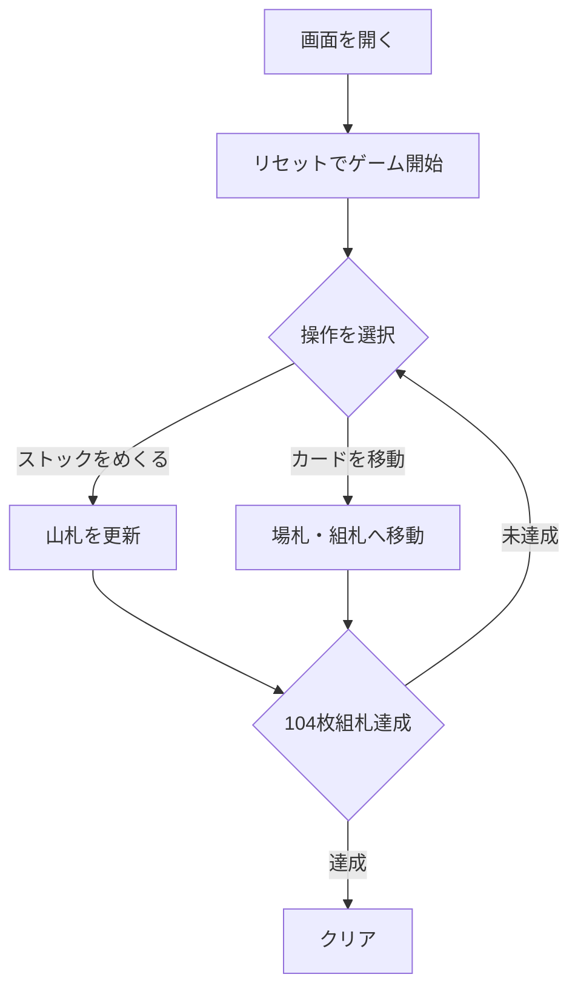

# ダブル・クロンダイク（Web版）遊び方

## ゲーム概要

ダブル・クロンダイク（Double Klondike）は、定番のクロンダイクを **2 デッキ 104 枚** で遊ぶ拡張版です。**9 列の場札**、**8 つの組札（各スート 2 組）**、そして **3 枚めくりのストック** を使います。場札は色違いの降順に重ね、組札はスートごとに A→K で積み上げ、**104 枚すべてを組札に上げるとクリア** です。

## 起動方法

```sh
go run ./cmd/trumpcards web  # CLI経由でWebサーバーを起動
go run ./cmd/server          # 直接Webサーバーを起動
```

ブラウザで `http://localhost:8080` にアクセスし、ナビゲーションバーから「ダブル・クロンダイク」を選択します。
ナビバーのJA/ENボタンで日本語・英語を切り替えられます。

## ルール

1. **めくる**: ストックをクリックすると 3 枚を山札にめくります。ストックが空のときは山札を戻して再利用します。
2. **移動**: 山札または場札の最上位カードを選択し、移動先（場札の列または組札）をクリックします。場札の表向き連番列はまとめて移動できます。
3. **配置**: 場札は色違いで 1 つ小さいランク、空列には K のみ置けます。組札はスートごとに A→K の昇順です。
4. **勝敗**: 104 枚すべてを組札に上げればクリア。合法手がなくなると失敗です。

## ゲームの流れ



## 画面の操作方法

- 上段にストック・山札・8 つの組札、下段に 9 列の場札が並びます。
- ストックをクリックして 3 枚めくり、山札や場札のカードを選択して移動先をクリックします。
- 裏向きカード（##）は表向きになるまで操作できません。
- フッターの「めくる」「オートコンプリート」「元に戻す」「ヒント」「ギブアップ」で操作します。

## 遊び方のコツ

- 2 デッキあるため、同じカードが 2 枚あります。組札を均等に育てると手詰まりを避けやすくなります。
- 裏向きカードを早く表に返すため、長い列から先に崩しましょう。
- 「オートコンプリート」は終盤の取りこぼしを防ぐのに便利です。
